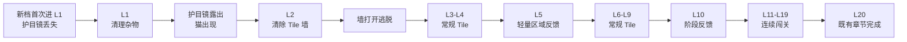

# Chapter0 前期剧情与 Tile 玩法承接需求方案

> [!abstract] 一句话定义
> 为新档玩家在 Chapter0 的前两关建立一条可感知的因果链：**角色遇到问题 → 玩家以标准 Tile 三消解决问题 → 场景即时变化 → 产生下一关动机**；L3 起回到连续闯关，L20 保持既有章节闭环。

## 1. 文档定位与评审方式

本文是面向策划、客户端、美术/动画、数据和 QA 的需求主档，不是剧情脚本、资源清单或技术实现方案。它定义玩家体验、流程边界、交付接口与验收；具体 Prefab 路径、FlowItem 注册和资源加载方式应由实施方案承接。

| 角色    | 需要从本文确认的内容                        |
| ----- | --------------------------------- |
| 策划    | 玩家问题、关卡节奏、每个剧情节点的目标与取舍            |
| 客户端   | 节点触发/结束、与既有结算和 Home 流程的衔接、降级与异常行为 |
| 美术/动画 | 每段画面要传达的因果、首尾构图、时长与不可改变的游戏状态      |
| 数据    | 漏斗节点、分母、事件边界与首轮判读问题               |
| QA    | 新档主路径、重复进入和中断/缺资源等回归范围            |

## 2. 背景、问题与设计思路

### 2.1 要解决的问题

新玩家刚进入 Tile 时，广告/剧情中的角色目标、实际三消操作、以及通关后的世界变化容易被感知为三件无关的事：玩家知道如何点牌，却不知道为什么继续；或看见剧情，却无法感到是自己的操作促成结果。

### 2.2 设计目标

1. **建立核心操作认知**：L1 内理解“点击 → 收集 → 三张相同 → 消除”的标准 Tile 循环。
2. **建立因果认知**：在 L1、L2 各完成一次“清除牌面导致可见场景问题被解决”。
3. **保护心流**：L3 起不再用长剧情切断连续闯关；L5/L10 仅作轻量章节反馈。
4. **保护既有闭环**：L20 的宝箱、地图/区域推进与下一章入口保持现有职责和体验。

### 2.3 设计原则

| 原则 | 需求含义 |
| --- | --- |
| 剧情只提一个可立即行动的问题 | L1 前只交代“护目镜不见了”，不预告猫、追逐与 Tile 墙。 |
| Tile 只用原有规则解决问题 | 不新增收集目标、攻击、血量、特殊点击或独立小游戏。 |
| 结果必须先于系统打断被看见 | L1/L2 通关后先给 2 秒左右的剧情结果，再衔接下一步。 |
| 同一因果连续强化两次即可 | L1 找到护目镜；L2 打开墙逃脱。L3 后不重复强剧情教学。 |
| 表现可降级，流程不可断裂 | 首版允许全屏动画替代局内无缝棋面表现，但不得卡住进度、输入或结算。 |

### 2.4 非目标

- 不改变 Chapter0/Chapter1 的关卡范围、Forest 地图拆分或 L20 奖励结构。
- 不调整 Tile 基础规则、关卡难度、步数、关卡奖励或存档字段。
- 不在本期新增主题、下载包、线上工作簿或专用 Tile 元素。
- 不承诺剧情一定提升留存；其有效性需以后续数据观察确认。

## 3. 玩家旅程总览

| 阶段 | 玩家当下理解 | 体验强度 | 对既有流程的要求 |
| --- | --- | --- |
| L1 前至 L2 后 | “我消除 Tile 能帮助角色脱困。” | 强引导、短关、强结果反馈 | L1/L2 结算表现可替换，但底层通关与进度必须完整执行。 |
| L3-L10 | “继续闯关是核心，章节会随之推进。” | 连续闯关为主，低频反馈 | 从 L3 恢复标准结算；L5/L10 不得拦截返回、输入或奖励。 |
| L11-L20 | “完成一段关卡会进入新阶段。” | 常规 Chapter0 节奏 | L20 完全沿用既有章节完成链路。 |

## 4. 节点需求明细

### N01｜首次 L1 开场：提出护目镜问题

| 项目 | 需求 |
| --- | --- |
| 触发 | 新档首次即将进入 L1；同账号后续重进 L1 不重复播放。 |
| 前置 | 正常进入 L1 的资源和关卡加载已完成；若无法播放，直接进入 L1。 |
| 画面/文案 | 老鼠准备出发，护目镜不见；镜头最终停在杂物区。可见热气球/装备作为冒险语境，但不出现猫或 Tile 墙。 |
| 玩家操作 | 5–7 秒期间屏蔽棋盘输入；不提供跳过按钮作为本期必需项。 |
| 完成条件 | 动画自然结束或安全超时后，进入 L1 可操作状态。 |
| 玩家获得 | 明确、单一且无需文字解释的问题：“去清理杂物找护目镜。” |
| 异常/降级 | 资源缺失、加载失败或中断恢复时跳过此节点，进入可玩的 L1；不得遗留输入锁。 |

### N02｜L1：用标准 Tile 清理杂物

| 项目 | 需求 |
| --- | --- |
| 触发 | N01 正常结束，或首次开场被降级跳过后。 |
| 棋盘语义 | 使用标准 Tile 牌面与规则；牌面/背景体现杂物主题。护目镜是牌堆下方逐渐可见的场景物，不是需收集或点击的功能性 Tile。 |
| 教学节奏 | 首组提供点击引导；第二组减弱提示；之后由玩家完成。具体引导由既有 Tile 教学能力承接。 |
| 完成条件 | 仍以关卡原有胜利条件判定；不得以“护目镜出现”替代胜利。 |
| 玩家获得 | 第一次“清掉牌堆后，场景物显现”的结果联系。 |
| 约束 | 不新增特殊目标、关卡规则或奖励；短关的具体步数/牌组仍由关卡设计另行定义。 |

### N03｜L1 通关反馈与追逐：把结果变成下一关目标

| 项目 | 需求 |
| --- | --- |
| 触发 | L1 已完成既有胜利、进度写入及必要结算逻辑后。 |
| 子段 A：护目镜露出 | Tile 消失/镜头拉远，护目镜完整露出，老鼠拾取；目标时长约 2 秒。 |
| 子段 B：猫出现与追逐 | 猫出现，老鼠逃向通道，前方为 Tile 墙；目标时长 3–4 秒。最后一帧构图明确指向 L2 的墙面。 |
| 玩家操作 | 剧情播放期间无棋盘和 Home 交互；完成后自动进入 L2。 |
| 系统衔接 | 本节点可隐藏传统 L1 结算页，但不能跳过通关结果、进度、奖励或后续 Home/关卡状态更新。 |
| 成功判据 | 玩家无需额外说明即可理解“前面的墙就是接下来要清掉的对象”。 |
| 异常/降级 | 任一子段缺失时直接继续到 L2；不要求补播，不得退回 L1 或卡在 Home。 |

### N04｜L2：清除 Tile 墙并逃脱

| 项目 | 需求 |
| --- | --- |
| 触发 | N03 结束或被降级跳过后进入 L2。 |
| 棋盘语义 | L2 仍为标准 Tile 关；Tile 的排列、轮廓、背景或首帧构图应与 N03 末尾墙面连续，让玩家识别为同一个问题。 |
| 玩家操作 | 仅使用标准点击/收集/三消；不要求点击墙体、不引入破墙进度条。 |
| 通关反馈 | 墙打开或坍塌，老鼠通过，猫扑空；目标时长约 2 秒。 |
| 系统衔接 | L2 的底层通关与进度逻辑必须完整执行；表现层可不展示传统结算。结束后进入 L3。 |
| 成功判据 | 玩家感到“我刚刚消除的 Tile 让墙打开”，而非观看了一段与操作无关的过场。 |
| 异常/降级 | 资源缺失/播放中断时安全完成流程并进入 L3；不得重复播放或锁住输入。 |

### N05｜L3-L4：恢复核心循环

| 项目 | 需求 |
| --- | --- |
| 触发 | L2 剧情反馈完成或降级完成。 |
| 表现 | 恢复既有 Tile 棋盘、标准结算和连续进入下一关的节奏。 |
| 目的 | 让玩家从“剧情帮助”平滑过渡到“持续闯关是游戏核心”。 |
| 验收 | L3 起不残留 L1/L2 的输入门禁、特殊结算替换或强制剧情。 |

### N06｜L5 与 L10：低频章节进度反馈

| 节点 | 触发与内容 | 时长 | 强制约束 |
| --- | --- | --- | --- |
| L5 | 正常通关后，展示一次小范围区域推进/小事件。 | 约 1.5 秒 | 保留标准结算；失败/缺资源时直接回原流程。 |
| L10 | 正常通关后，展示一次中段阶段达成反馈。 | 约 2 秒 | 不开启新玩法说明；不得改变 L11 进入条件。 |

### N07｜L20：既有章节完成边界

L20 不经过本需求的特殊剧情分支。既有宝箱、区域/地图、章节切换和 Chapter1 入口均为回归对象；任何前期剧情节点都不得抢占、替换或延后 L20 的职责。

## 5. 视觉承接规格与版本选择

### 5.1 必须达成的体验结果

| 承接点 | 必须可读的信息 | 不可接受的结果 |
| --- | --- | --- |
| 开场 → L1 | 镜头停在的杂物，与 L1 的清理对象属于同一空间/问题。 | 开场与棋盘毫无关联，只能靠文字解释。 |
| L1 → 追逐 | 护目镜是清理后的直接结果，猫是新的即时压力。 | 先出现通用结算，再出现无因果的剧情。 |
| 追逐 → L2 | 玩家能把 Tile 墙识别为下一关棋盘的叙事来源。 | 墙在动画中，L2 完全换成无关联的通用牌面。 |
| L2 → L3 | 墙已被解决，玩家回到常规持续闯关。 | L2 结果没有收束，或强剧情继续打断后续关卡。 |

### 5.2 视觉承接等级（待确认）

| 等级 | 定义 | 本期实现影响 | 适用判断 |
| --- | --- | --- | --- |
| A：全屏叙事承接 | 过场末帧与下一关首帧在主体、构图和色彩上连续；棋盘本身无需动态变形。 | 可沿用全屏 Prefab 流程，是 P0 的最低正式标准。 | 资源和客户端周期有限时优先采用。 |
| B：局内视觉连续 | 护目镜随 Tile 清理显现，Tile 墙以棋盘/场景表现直接对应；允许局内相机或元素表现配合。 | 需要额外客户端与关卡表现设计，不是当前临时链路自动具备的能力。 | 仅在明确授权新增局内表现工作后进入范围。 |

## 6. 需求包与交付边界

| 包 | 内容 | 依赖 | 最小验收 |
| --- | --- | --- | --- |
| R1：流程接入 | N01、N03、N04 与既有关卡胜利/Home/下一关链路的衔接、一次性门禁、异常恢复。 | 当前临时 Flow、关卡进度链路 | 新档可完成 L1→L2→L3，无锁死、无丢进度。 |
| R2：P0 美术 | 开场、护目镜露出、猫追逐三段全屏动画/Prefab 与可选音频。 | 确认视觉等级 A/B | 首尾构图满足 5.1，时长内不改游戏状态。 |
| R3：L2 及中段表现 | L2 逃脱、L5 区域反馈、L10 阶段反馈。 | R1、R2 的主链验收通过 | L5/L10 不干扰标准结算；L20 不受影响。 |
| R4：数据与验证 | 漏斗事件核对、看板口径、首轮观察与异常日志。 | 现有事件与数据负责人确认 | 能回答本需求是否影响早期进入、通关与 20→21 转化。 |

## 7. 资源需求接口

资源只负责画面、动画和可选音频，不自行切场景、写入关卡状态、跳关或循环播放。具体临时 Prefab 路径、加载包和命名仍以 [[00-INBOX/2026-09-20 - Chapter0前期剧情临时资源需求|Chapter0 前期剧情临时资源需求]] 为准。

| 优先级 | 资源 | 对应节点 | 时长 | 首尾关键画面 |
| --- | --- | --- | --- |
| P0 | 开场 | N01 | 5–7 秒 | 结束停在杂物区。 |
| P0 | 护目镜露出 | N03-A | 约 2 秒 | 露出、拾取，接猫出现。 |
| P0 | 猫追逐 | N03-B | 3–4 秒 | 结束对准 Tile 墙。 |
| P1 | 破墙逃脱 | N04 | 约 2 秒 | 墙开/坍塌，老鼠通过，猫扑空。 |
| P2 | 区域推进 | N06-L5 | 约 1.5 秒 | 单一、低干扰的区域变化。 |
| P2 | 阶段反馈 | N06-L10 | 约 2 秒 | 清晰的中段达成。 |

## 8. 数据与效果验证

### 8.1 先确认口径，不预设结论

本需求的判断问题是：剧情承接是否使新玩家更顺畅地进入核心循环，而没有提高首局流失、时长或异常率。上线前必须确认事件来源、用户范围、分母、观察周期和对照组；未确认前不把任何指标数值写为目标承诺。

| 指标 | 事件边界 / 分母 | 用途 |
| --- | --- | --- |
| 开场完成率、L1 开局率 | 符合首次 L1 条件的新档用户 | 识别开场是否造成首局前流失。 |
| L1→L2、L2→L3 到达率 | 完成前一关的用户 | 判断两次因果承接是否形成或损伤早期漏斗。 |
| L1/L2 时长、失败率、重试率 | 开始对应关卡的用户 | 识别表现阻塞或短关难度异常。 |
| L5/L10 到达率 | 新档进入 Chapter0 的用户 | 判断中段反馈覆盖范围。 |
| Chapter0 完成率、20→21 Start Rate | 开始 L1 / 完成 L20 的用户，口径待定 | 验证首次章节闭环后的继续意愿。 |
| 剧情异常/降级率 | 触发剧情节点的用户 | 发现加载失败、退后台、重复播放和输入门禁问题。 |

## 9. 验收与回归

### 9.1 P0 主路径验收

- [ ] 新档进入 L1：N01 只播放一次，结束后棋盘可操作。
- [ ] L1：按既有胜利条件通关；底层进度/奖励正确，表现上先播放护目镜与追逐，再进 L2。
- [ ] L2：按既有胜利条件通关；播放破墙逃脱或安全降级，再进 L3。
- [ ] L3：恢复标准结算与连续闯关，不残留特殊门禁。
- [ ] L1→L2 与 L2→L3 的首尾构图满足第 5.1 节可读性要求。

### 9.2 P1/P2 与 Chapter0 回归

- [ ] L5/L10 的反馈不阻断标准结算、Home、输入恢复和后续关卡进入。
- [ ] L20 的宝箱、地图/区域、章节解锁与 Chapter1 入口符合现有流程。
- [ ] 资源缺失、加载失败、退后台/恢复、重复进入、重连/中断均可安全继续，且不锁输入、不丢进度、不重复获得奖励。
- [ ] 数据事件能按第 8 节的分母和节点采集；异常率可定位到具体节点。

## 10. 实施与评审顺序

1. **体验定稿**：确认视觉承接等级、N01/N03/N04 的分镜/首尾构图与不在范围项。
2. **R1 + R2 最小闭环**：先完成 P0 与 L1→L2→L3 新档手动验收；不等待 L5/L10。
3. **评审断点**：如玩家无法读出墙与 L2 的关系，优先修正构图/过场和流程衔接，不通过增加玩法规则解决。
4. **R3 完整化**：补 L2 逃脱、L5、L10 后，进行 L1→L20 回归。
5. **R4 验证**：确认数据口径后观察首轮数据，再决定缩短、保留或弱化节点。

## 11. 待决策与风险

| 项 | 需要确认 | 未确认时的处理 |
| --- | --- | --- |
| 视觉等级 | A 全屏承接，或 B 局内视觉连续。 | 以 A 作为 P0 基线，B 不默认进入开发范围。 |
| L1/L2 关卡内容 | 短关的具体牌组、步数、教学强度。 | 保持标准规则，仅记录体验约束。 |
| 跳过策略 | 是否需要用户主动跳过剧情。 | 本期不作为必需功能；先保证系统降级和中断恢复。 |
| 奖励表现 | 隐藏传统结算页时奖励如何可见/可感知。 | 客户端方案需证明底层奖励链路未被跳过。 |
| 数据 | 事件现状、负责人、观察周期与对照。 | 未确认时只保留指标问题，不写效果 KPI。 |

## 关联

- [[00-INBOX/2026-09-20 - Chapter0前期剧情临时资源需求|Chapter0 前期剧情临时资源需求]] — Prefab/资源接口与占位替换任务。
- [[00-INBOX/2026-09-18 - 首章50关拆分为20+30的初始章节设计|Chapter0/Chapter1 拆分设计]] — 1–20 / 21–50 的章节边界。
- [[02-PROJECTS/TileScape/_MOC|TileScape 知识库 MOC]] — 项目长期入口；本方案确认后应迁入 `02-PROJECTS/TileScape/游戏逻辑/` 并补 MOC。
