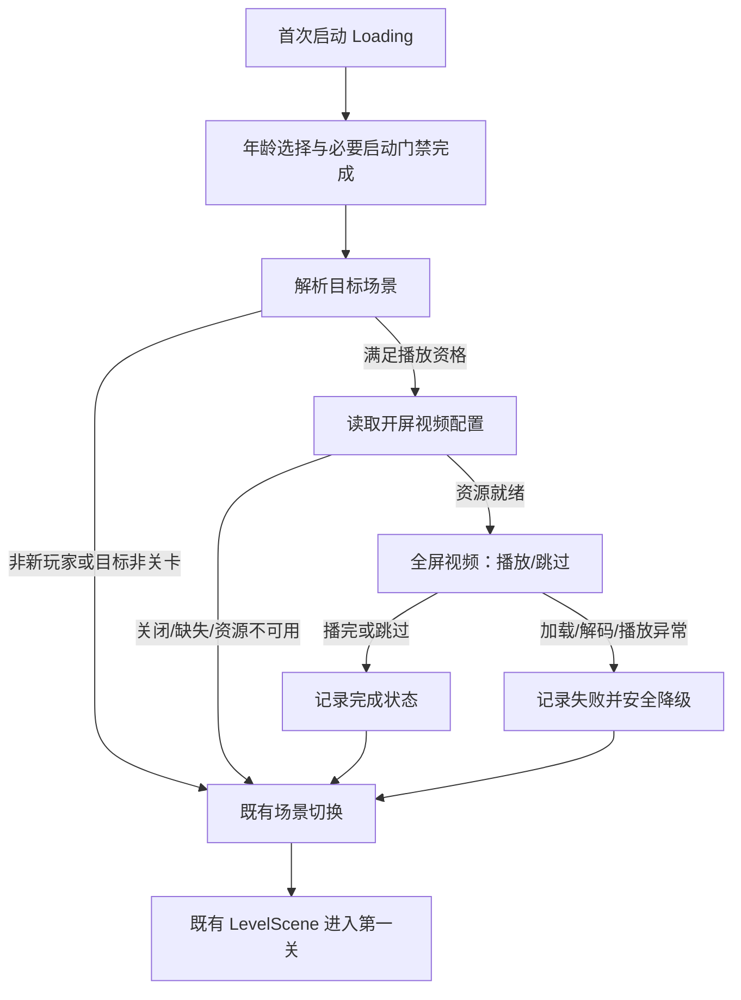

# 开屏视频（买量承接）功能需求方案

> [!abstract] 一句话定义
> 对符合条件的新玩家，在首次启动完成必要 Loading 和年龄选择后、进入第一关前，播放一段与买量创意一致的全屏视频；视频播完、跳过或安全降级后，均沿用既有场景链路进入第一关。

## 1. 背景、问题与目标

### 要解决的问题

买量素材已向玩家展示特定剧情和场景，但当前启动后直接进入 Tile 关卡，存在“广告承诺—首次游戏操作”断层。玩家可能会感到落地内容与广告无关，也无法将首关 Tile 操作理解为对剧情问题的回应。

### 设计目标

- 让符合条件的新玩家在进入首关前看见与买量素材一致的剧情动机。
- 视频结束后无额外确认、无状态断裂地进入第一关。
- 不因视频加载、下载、解码、杀端或跳过阻断首关进入。
- 通过视频与首关花色/场景的一致性，完成“看见问题 → 进入关卡解决”的承接。
- 为后续按素材、AB 组、跳过时机评估买量承接效果保留数据接口。

### 非目标

- 不改老用户、回流用户、进入 Home 的既有路径。
- 不做视频库、回放入口、第二关及之后的剧情/结算改造。
- 不改变基础 Tile 规则、奖励、存档字段或首关胜利条件。
- 不在本期承诺视频必然提升留存；效果以后续对照数据判断。

## 2. 已知基线与约束

> [!warning] 证据边界
> 下表来自 TS 静态代码核查与本地细化备查；尚未完成 VideoPlayer、首帧耗时、设备兼容性及完整启动回归验证。它是需求的实现约束，不是已上线能力。

| 项 | 已知情况 | 需求含义 |
| --- | --- | --- |
| 启动分流 | 新玩家会进入关卡路径，其他用户可能进入 Home。 | 仅在“新玩家 + 目标为 LevelScene”时评估开屏视频。 |
| 年龄选择 | 在启动流程中先于进游戏完成。 | 视频必须在年龄选择之后，不能绕过合规门禁。 |
| 视频播放 | Unity Video 模块已启用，但项目无现成播放实现/资源。 | 视频能力需要独立接入与设备验证。 |
| DLC | 有下载、校验、重试和无网降级体系。 | 可复用，但首启视频不能依赖不可控网络而卡住。 |
| AB | 有登录后配置覆盖能力。 | 通过替换视频配置实现分组，不在业务代码写硬分支。 |
| 打点 | 有统一事件上报出口与启动漏斗。 | 复用命名/上报约定，补视频生命周期事件。 |
| 花色 | 可在单关收敛，但无“前 N 关统一”机制。 | 首关一致性先用关卡配置保障；范围化机制另立实现决策。 |

## 3. 玩家流程与系统状态

### 主路径

| 节点 | 触发与表现 | 玩家操作 | 系统结果 |
| --- | --- | --- | --- |
| 启动准备 | 既有 Loading、登录、年龄选择与必要门禁完成。 | 无新增操作。 | 不改变原有启动顺序。 |
| 播放资格 | 新玩家且目标场景为 `LevelScene`，未完成当前视频版本，且配置开启。 | 无感。 | 任一条件不满足，直接走既有进场。 |
| 资源准备 | 获取包内视频或已就绪远程版本；独立超时。 | 无感，不展示无尽加载。 | 资源不可用直接降级进关。 |
| 视频播放 | 全屏播放，约 20 秒；无 Loading 遮挡。 | 在指定时机可跳过。 | 首帧成功后记“开始”。 |
| 结束 | 自然播完或玩家跳过。 | 无额外确认。 | 先落盘完成状态，再走既有场景切换。 |
| 首关承接 | 第一关正常进入。 | 标准 Tile 操作。 | 视频末帧/剧情问题与首关花色、场景或任务语义可读地相连。 |

### 不变路径

老用户、回流用户、AB 对照组、已完成当前版本视频的玩家，以及目标为 `HomeScene` 的玩家，不展示视频且不新增等待或 UI；其路径应与改造前行为一致。

## 4. 功能需求

### 播放资格与幂等

- P0：仅当服务端新玩家标记为真、目标场景为 `LevelScene`、视频开关开启时尝试播放。
- P0：同一账号、同一视频版本只成功播放一次；本地完成状态用于会话和重启幂等。
- P0：仅自然播完或玩家主动跳过才写入完成状态。
- P1：预留 QA/运营强制播放开关，不得默认影响正式用户。
- P1：卸载重装后以服务端新玩家逻辑为主，本地状态为辅助；优先级由技术评审确认。

### 插入点与场景衔接

- 视频位于既有 Loading 关闭、年龄选择完成、目标场景已确定之后，`LevelScene` 场景切换之前。
- 视频结束后必须复用既有场景状态机进入第一关，不得为视频另建进关旁路。
- 视频播放期间不允许玩家操作 Loading、Home 或关卡 UI；结束或异常后必须恢复到唯一的既有进关出口。

### 资源来源与加载

- P0：默认采用**包内首发资源**，保证无网新玩家仍可播放；视频资源体积须在立项时明确预算。
- P1：DLC/远程替换仅作为后续 AB 与素材迭代能力，不得成为首次进关的硬阻塞条件。
- P0：资源准备有独立超时；超时、缺失、下载失败或存储不足均直接降级进关。
- P0：记录资源来源、加载耗时和失败阶段，用于评估首启成本。

> [!question] 待拍板：资源来源
> 若发行侧无法接受包内视频体积，才切换为 DLC 优先；届时需接受无网/下载失败时不播视频，且不能让 Loading 等待视频。

### 播放、分段与跳过

- P0：视频目标时长约 20 秒；时长、版本和分段信息由配置控制。
- P0：全屏播放，适配安全区、刘海/挖孔和当前分辨率规则；不与 Loading UI 重叠。
- P0：分段仅服务于可记录的跳过机会，是否采用分段由内容方案决定。
- P0：默认在首个允许跳过点显示按钮；点击结束**整个**视频并直接进关，连点只生效一次。
- P0：内容评审明确首个跳过点（建议首段结束）和按钮位置；不默认全程不可跳过。
- P1：资源交付前确认音频、游戏静音和系统音量的关系。

> [!note] 与 Chapter0 方案的边界
> 本卡中的“可跳过”仅指启动后的开屏视频；它不改变 [[00-INBOX/2026-09-20 - Chapter0前期剧情与Tile玩法承接正式需求方案|Chapter0 剧情承接方案]] 对 L1/L2 局内剧情跳过策略的待决状态。

### 结束、完成与中断

| 场景 | 期望行为 | 完成状态 |
| --- | --- | --- |
| 自然播完 | 自动进入第一关。 | 写完成。 |
| 玩家点击跳过 | 立即停止视频，自动进入第一关。 | 写完成。 |
| 资源/解码/播放失败 | 上报失败并直接进第一关。 | 不写完成；后续是否重试由恢复策略决定。 |
| 杀端/闪退 | 下次启动检查未闭合会话。 | 不写完成。 |
| 切后台/系统中断 | 暂停并保留当前播放状态；回前台策略待确认。 | 不写完成。 |

- P0：场景切换前同步持久化完成状态，避免跳过后立即杀端导致重复播放。
- P0：持久化未闭合会话；下次启动补发中断事件并清理记录。
- P0：任何视频异常都不得阻断第一关进入。
- P1：切后台回前台默认暂停；自动续播、点击继续或直接进关待拍板。
- P0：杀端后建议重播一次，第二次中断后直接进关，避免死循环。

### 配置与 AB

| 配置项 | 说明 | P0/P1 |
| --- | --- | --- |
| `enabled` | 视频功能总开关；关闭/空配置即完全回退原流程。 | P0 |
| `video_id` / `version` | 素材与版本标识，随打点上报。 | P0 |
| `resource_path` / `source` | 包内或 DLC 资源定位。 | P0 |
| `duration` / `segments` / `skip_after` | 时长、分段与首个跳过点。 | P0 |
| `package_id` | DLC 资源对应包，仅 DLC 方案需要。 | P1 |
| `force_play` | QA/运营验证开关。 | P1 |

- 配置必须支持空态回滚；空态行为等价于未接入视频。
- AB 对照组可关闭视频，实验组可指定不同配置；AB 通过既有配置覆盖实现，而非业务代码分支。
- AB 分组只对符合新玩家资格的用户有效；分组信息沿用 SDK 已有公共字段，额外事件不重复造字段。

### 数据与效果验证

| 事件 | 触发口径 | 必填字段 |
| --- | --- | --- |
| `opening_video_start` | 视频第一帧实际渲染成功。 | `video_id`、`version`、`source`、`load_cost`、`segment_total` |
| `opening_video_progress` | 每个分段结束。 | `video_id`、`segment_index`、`played_time`、`progress_percent` |
| `opening_video_skip_click` | 玩家点击跳过，停止前立即上报。 | `video_id`、`segment_index`、`played_time`、`progress_percent` |
| `opening_video_end` | 自然播完或主动跳过后。 | `video_id`、`end_type`、`total_play_time`、`segment_reached` |
| `opening_video_fail` | 加载、解码或播放确认失败。 | `video_id`、`fail_stage`、`fail_reason`、`fallback_action` |
| `opening_video_interrupt` | 下次启动发现 start 无对应 end。 | `video_id`、`last_progress`、`resume_action` |

首轮只回答五个问题：是否真正触达新玩家、完播/跳过集中在哪个节点、视频是否拉低“视频结束→首关开始”转化、失败是否集中于特定资源/设备、不同素材/AB 组是否有明显差异。分母、看板负责人、观察周期和对照组须另行确认。

### 首关花色与剧情承接

- P0：视频中重点展示的 Tile 花色、场景物或问题，应与第一关实际可见内容一致。
- P0：前期花色收敛的范围、上限和具体牌组由关卡策划定义；不得低于既有最小花色约束。
- P1：首期优先按现有配置逐关收敛；“前 N 关统一机制”是独立技术任务。
- P1：特殊牌与障碍牌不应因普通 Tile 花色收敛而产生语义冲突。

### 视频形态

| 方案 | 适用性 | 主要风险/待验证 |
| --- | --- | --- |
| 真视频（Unity `VideoPlayer`） | 最接近买量原片，是当前首选。 | Android 解码兼容性、首帧耗时、编码基线、包体体积。 |
| Spine / 实时演出 | 2D 卡通内容、需较小包体时可选。 | 无法等价还原视频创意，需额外演出资源。 |
| 序列帧 | 仅作为兼容性备选。 | 内存与体积风险高。 |

P0 推荐先以真视频做最小技术验证：明确 H.264/AAC 编码基线、低端 Android 覆盖、首帧耗时和无音频轨道的兼容情况，再决定是否需要原生播放器或降级方案。

## 5. 异常与回归矩阵

| 场景 | 期望行为 |
| --- | --- |
| 配置关闭/为空、AB 对照组、老用户、目标为 Home | 不播视频，直接完全复用原流程。 |
| 无网 + 包内资源 | 正常播放。 |
| 无网/下载失败 + DLC 资源 | 跳过视频直接进关，记录失败。 |
| 资源加载超时、缺失、存储不足 | 直接进关，绝不等待。 |
| 解码失败、黑屏、首帧未到 | 停止视频、上报失败、直接进关。 |
| 跳过连点 | 只结束一次，不重复场景跳转/奖励。 |
| 跳过后立即杀端 | 已完成状态不丢；重启不重播。 |
| 播放中杀端 | 补发中断；按已确认策略重播一次或直接进关。 |
| 切后台、来电、系统弹窗 | 暂停；回前台按已确认策略恢复，不能重置进关状态。 |
| 强制更新 | 保持既有更新优先级，视频不介入。 |

## 6. 验收标准与分期

### P0：可用的买量承接最小闭环

- [ ] 符合资格的新玩家：Loading/年龄选择完成后，播放包内视频并自动进入第一关。
- [ ] 视频可在已确认的首个跳过点跳过，跳过后只进入一次第一关。
- [ ] 视频自然结束、跳过、无资源、超时、解码失败均不阻断进关。
- [ ] 老用户、回流用户、Home 分流与功能关闭时路径无变化。
- [ ] 完成、失败、跳过与首关开始可按 `video_id` 关联；首帧而非 API 调用作为开始口径。
- [ ] 第一关的关键 Tile/场景与视频末尾承诺一致。

### P1：可运营与可迭代能力

- [ ] AB 可控制是否播放、选择素材并安全回滚。
- [ ] DLC 替换素材在资源就绪时可用，未就绪时安全回退。
- [ ] 杀端、后台、不同码率/设备级别和视频音频策略完成专项验证。
- [ ] 前 N 关花色收敛机制是否开发，按独立任务结论接入。

## 7. 实施顺序与待决策

- **体验拍板**：视频末帧与首关承接画面、时长、首个跳过点、音频策略。
- **技术 Spike**：用一条包内真视频验证加载、首帧、跳过、场景衔接和低端设备兼容。
- **P0 联调**：完成资格判定、状态落盘、失败降级、生命周期打点与首关回归。
- **效果验证**：确认事件口径和对照组后观察首轮数据；不达标先调整素材/时长/承接，再扩展 DLC/AB。

| 待决项 | 建议 | 未确认时的默认边界 |
| --- | --- | --- |
| 资源来源 | 包内首发，DLC 仅作后续替换。 | 不让网络阻断首关。 |
| 视频形态 | 先验证真视频。 | 未通过设备验证不承诺上线。 |
| 跳过 | 首段后可跳过，点击结束整段视频。 | 不与 L1/L2 剧情跳过策略混同。 |
| 杀端恢复 | 重播一次，第二次直接进关。 | 不得死循环。 |
| 后台恢复 | 暂停，恢复动作待定。 | 不自动重置场景。 |
| 花色范围 | 由关卡策划指定首关/前 N 关。 | 不默认开发统一收敛机制。 |

## 关联

- [[00-INBOX/2026-09-20 - Chapter0前期剧情与Tile玩法承接正式需求方案|Chapter0 前期剧情与 Tile 玩法承接需求方案]] — 上位的首次体验与局内剧情承接；本卡只覆盖启动后、首关前的视频节点。
- [[00-INBOX/2026-09-20 - Chapter0前期剧情临时资源需求|Chapter0 前期剧情临时资源需求]] — 全屏资源与占位替换接口；视频资源若采用不同形态，需在此处另补交付约定。
- `TileScape/Docs/Knowledge/Local/Inbox/2026-09/开屏视频_细化备查_2026-09-20.md` — 启动链路、代码入口和静态技术核查细节，仅作本机参考。
- [[02-PROJECTS/TileScape/_MOC|TileScape 知识库 MOC]] — 方案定稿后迁入项目正式目录并补入口。
