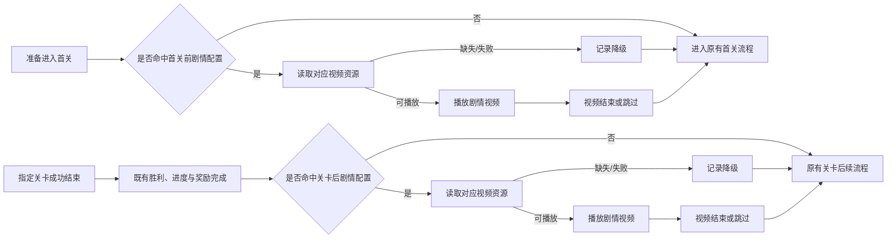

# Chapter0 关卡后可配置视频剧情方案

> [!abstract] 当前结论
> 剧情不再固定绑定 L1/L2。每段剧情由配置决定在“首关开始前”或“哪一关成功结束后”接入哪段视频；没有配置时，首关与关卡完成后均完全沿用原有流程。

## 目标与范围

目标是在不改变 Tile 关卡规则、胜利结算、奖励、章节链路的前提下，为 Chapter0 提供可调整的剧情接入能力。剧情可在首关进入前或关卡完成后触发；首期呈现形式暂按视频考虑，但内容、具体节点和视频数量均未确定。

- 配置可指定一段剧情的触发节点和对应视频。
- 首关前剧情在首次进入指定首关前判定；关卡后剧情只在指定关卡**成功结束**后接入，失败、退出或未完成不触发。
- 视频完成、跳过或安全降级后，回到该关原本应进入的后续流程。
- 无配置、配置关闭或资源不可用时，行为等价于改造前；首关前不插入剧情，关卡后直接进入原有后续流程。

不在范围：新增 Tile 玩法、改写关卡胜利条件、重做 Chapter0/1 划分、固定剧情内容或将 L20 章节完成替换为视频。

## 可配置流程

| 流程节点 | 规则 | 结果 |
| --- | --- | --- |
| 首关进入前 | 在准备进入配置指定的首关时判定，尚未创建或开始该关。 | 未命中、关闭或资源不可用时直接进入原有首关流程。 |
| 关卡成功结束 | 仍以既有胜利条件判定，先完成进度、奖励与必要结果写入。 | 只有成功关卡可进入关卡后剧情判定。 |
| 剧情配置判定 | 以“触发时点 + 对应关卡 + 启用状态 + 已播放状态”为条件查找剧情。 | 未命中时完全走对应的原有流程。 |
| 视频资源准备 | 根据配置的剧情 ID 取得对应视频。 | 资源可用则播放；不可用则安全降级。 |
| 视频播放 | 播放指定剧情；跳过策略待确认。 | 视频不能改写关卡结果或章节状态。 |
| 后续流程恢复 | 视频播完、跳过或降级后继续原有流程。 | 不重复结算、不重复奖励、不锁输入。 |

## 配置模型

配置表达的是需求事实，而不是具体表结构。首期每个关卡默认最多命中一段剧情；若未来需要多段连续剧情，应另定义顺序规则。

| 配置项 | 含义 | 当前规则 |
| --- | --- | --- |
| `trigger_timing` | 剧情触发时点。 | 取值为 `before_first_level` 或 `after_level_complete`。 |
| `trigger_level` | 与触发时点对应的关卡。 | `before_first_level` 时为将要进入的首关；`after_level_complete` 时为已完成的关卡。 |
| `story_id` | 剧情的唯一标识。 | 用于关联视频、状态与数据。 |
| `presentation_type` | 剧情呈现形式。 | 首期预期为 `video`，保留后续扩展空间。 |
| `asset_id` | 对应视频资源标识。 | 资源与剧情分离，替换视频不改关卡映射。 |
| `enabled` | 是否启用该剧情。 | 关闭或空配置即无剧情。 |
| `play_once` | 是否同一账号只播放一次。 | 首期建议为是；重复规则待确认。 |
| `skip_policy` | 视频是否可跳过、何时可跳过。 | 待内容方案确认。 |
| `priority` | 同关冲突时的选择顺序。 | 首期不应出现冲突；存在冲突视为配置错误。 |

### 配置示例

| 触发时点 | 关联关卡 | 剧情 ID | 视频资源 | 当前状态 |
| --- | --- | --- | --- |
| 待定 | 待定 | 待定 | 待定 | 剧情内容与首关前/关卡后映射尚未确定。 |

## 模块与资源依赖

| 模块 | 在流程中的作用 | 必须遵守的规则 |
| --- | --- | --- |
| 首关进入流程 | 提供“进入首关前”的判定时点和原有进入路径。 | 视频完成、跳过或降级后，只能进入一次原有首关流程。 |
| 关卡完成结果 | 提供“哪一关成功结束”的判定时点。 | 剧情不能替代胜利、进度或奖励。 |
| 剧情配置 | 建立关卡、剧情和视频资源的映射。 | 无配置等价于无功能；同关冲突须可识别。 |
| 已播放状态 | 判断是否需要再次播放。 | 状态写入与失败/中断是否算完成需明确。 |
| 视频表现 | 呈现具体剧情内容。 | 只表现剧情，不切场景、不写进度、不改变关卡状态。 |
| 流程续接 | 将视频结果送回既有后续流程。 | 播完、跳过、缺失、失败均只能续接一次。 |
| 输入与异常 | 保证播放时无误操作、失败时可继续。 | 任何异常不得阻断后续关卡/章节流程。 |
| 数据记录 | 验证剧情是否被触达及其影响。 | 以 `story_id`、触发关卡、播放结果与降级原因作为基本维度。 |

## 视频资源规则

视频内容未定，当前只定义资源与流程的接口。

| 资源信息 | 需求 |
| --- | --- |
| 内容 | 每段视频只表达一个明确结果或下一步动机，避免在关卡结算后叠加多重信息。 |
| 首尾衔接 | 首帧承接已完成关卡的结果；结束后回到原流程时不造成叙事或画面断裂。 |
| 时长 | 由单段剧情配置；不在需求中预设固定时长。 |
| 控制 | 视频不循环，不自行跳关、切场景、改写奖励或章节状态。 |
| 加载失败 | 跳过视频并继续原流程；失败信息可用于后续排查。 |
| 交付标识 | 每段需提供 `story_id`、`asset_id`、版本、时长、音频说明和首尾帧说明。 |

## 规则与边界

- 首关前剧情只在准备进入配置指定的首关前触发，且不能被视为已开始或已完成关卡。
- 关卡后剧情只在“指定关卡成功结束，且既有结果已完成”之后触发。
- 未配置剧情的关卡、剧情关闭的关卡、资源失败的关卡都不改变原有后续流程。
- 首关前和一次关卡完成默认各最多播放一段剧情；配置冲突时不应随机选择。
- L20 的章节完成优先级高于普通关卡后剧情；首期不配置 L20，是否支持须单独确认。
- 视频播放期间应避免重复触发关卡后续流程；结束、跳过和降级只能产生一次续接。
- 视频中断后是否重播、是否标记已播放、是否允许跳过，均为待确认产品规则，不在本方案中擅自固定。

## 验收与待确认

### 最小验收

- [ ] 可配置一个指定关卡在成功结束后播放指定视频。
- [ ] 可配置在指定首关开始前播放指定视频；播完、跳过、缺失或失败后正常进入该关。
- [ ] 未配置/关闭配置时，该关完成后的流程与改造前一致。
- [ ] 视频播完、跳过、资源缺失或播放失败后，均只继续一次原有后续流程。
- [ ] 关卡进度、奖励、结算与 Chapter0/1 章节链路不受影响。
- [ ] 可区分剧情触发、播放完成、跳过、降级及对应的 `story_id` 与触发关卡。

### 待确认

| 项 | 需要确认的问题 |
| --- | --- |
| 首批映射 | 哪些关结束后接剧情，每关对应哪一段内容。 |
| 首关前 | 是否需要首关开始前剧情；若需要，关联哪一关及对应哪段内容。 |
| 视频内容 | 视频主题、时长、音频、首尾承接画面与资源制作规格。 |
| 重复播放 | 同一剧情是否只播一次；中断/失败是否计为已播。 |
| 跳过 | 是否可跳过、何时可跳过、跳过后是否计为已播。 |
| 多剧情 | 同一关是否允许多段；若允许，顺序和中断规则是什么。 |
| L20 | 是否永远排除，或在保留章节完成链路的前提下支持额外剧情。 |

## 关联

- [[02-PROJECTS/TileScape/游戏逻辑/任务-买量承接与章节拆分长期任务|买量承接与章节拆分长期任务]] — 当前跨天主档。
- [[05-ARCHIVE/TileScape/2026-09-20 - Chapter0固定剧情与Tile玩法承接方案|固定 L1/L2 剧情方案（历史稿）]] — 旧的固定节点方案，仅供追溯。
- [[00-INBOX/2026-09-20 - Chapter0前期剧情临时资源需求|Chapter0 前期剧情临时资源需求]] — 旧全屏 Prefab 资源卡；是否复用或改为视频资源待本方案确认。
- [[00-INBOX/2026-09-20 - 开屏视频买量承接功能需求方案|开屏视频买量承接功能需求方案]] — 视频播放、跳过与资源加载的通用参考；具体边界需与本方案对齐。
