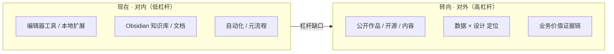

# 个人职业与发展诊断

> 一句话收束：**你已经把"能干"证明到极致了，接下来 3 年唯一值得赌的是"被看见"。**

---

## 0. 核心判断

把"对内生产力"做到极致、却几乎没把能力"对外变现"的工程师。护城河不浅，但被锁死在 TileMatch 单一项目里，且不可见、不可迁移、不可议价。未来 3–5 年的分水岭，不在多会一个工具，而在能不能把已经过剩的"工具/流程能力"转化成**可迁移、可被看见、可度量业务价值**的资产。

- 对内特征：不可见 · 不可迁移 · 不可议价
- 对外特征：可迁移 · 可被看见 · 可度量

---

## 1. 依据与盲区（诊断前提）

- 对工作方式、技术栈、工具链、风险偏好的判断置信度高。
- **缺失信息**：薪资、职级、年龄、婚育、资产规模、可支配时间——这些决定"投资/创业"类建议的现实可行性。
- 因此涉及创业的，刻意不展开成具体动作，只给一条对所有约束都成立的主线。若资金/时间预算与默认假设（大厂在职、现金流稳定但时间被工作占满）不符，部分优先级要调。

---

## 2. 按重要性排序的 5 个瓶颈 / 风险 / 机会

| 序 | 类型 | 一句话本质 |
|---|---|---|
| 1 | 最大机会=最大风险 | AI+工具链能力稀缺且领先，但全部指向内部，且不可见、不可迁移 |
| 2 | 风险 | 职业定位被锁死在"单一项目内部工具工程师"，业务价值叙事缺失 |
| 3 | 盲点 | 文档/知识管理/自动化已从"杠杆"退化为"舒适区"，在挤占高杠杆时间 |
| 4 | 风险 | "确认驱动"的执行模式保护了不犯错，也封顶了上行空间 |
| 5 | 机会(被掩盖) | "数据×游戏设计"交叉定位，是比"纯工具"更硬的一张牌，但一直当副业 |

---

## 3. 没意识到的 3 个盲点

1. **在"维护系统"上的时间已过收益拐点**。知识库健康检查、Notion 同步、归档、模板、分类体系精修、周度自动化——曾经是杠杆，现在是精致的拖延：让人感觉在进步，但不产生可迁移资产或可度量业务价值。
2. **把代码层的谦逊套到了职业上**。"只扩展不改动原逻辑""LocalExtensions gitignored""本地草稿不进 git"——公司代码需要这种克制，但职业不需要。在刻意让自己不可见，而不可见 = 不可议价。
3. **没意识到"会写 SQL 的关卡工程师"有多稀缺**。Presto/Trino 数据分析 + 关卡逻辑双重能力，却把它当工具的一部分；这其实是一张最难被复制的王牌。

---

## 4. 立刻停止的 4 件事

1. 停止新增/精修任何元流程（健康检查项、分类体系、同步/归档机制）。边际收益已趋零。
2. 停止在**个人成长类**决策上套用"先出差异报告、反复确认再动手"的公司代码安全模式——它保护代码，却冻结人生下注。
3. 停止把产出藏在 gitignore、本地、私人仓库。停止做"隐形工程师"。
4. 停止用"我在做工具、没碰业务"定义自己——这条自我叙事正在让晋升和外部议价时自动降价。

---

## 5. 5 条核心建议

### 建议 1（最高杠杆）——把 AI 原生游戏工具链能力对外产品化，建立第一个可被看见、可迁移的资产

- **为什么重要**：AI 正在商品化通用编码；唯一对冲是"不可替代性 × 可被发现性"。能力强但不可见，等于资产持续贬值。
- **为什么适合**：已跑通 WorkBuddy/CodeBuddy/MCP/自动化/模型选型，比 95% 游戏工程师更早掌握 AI 原生工作流，且有真实项目素材（关卡工具、数据 pipeline）可抽象。
- **怎么做**：30 天内选定 1 个最小可发布物——一个开源 Unity 编辑器工具，或一篇"AI 如何自动化关卡设计"的深度文——公开发布。
- **不做的代价**：若项目收缩或行业下行，可迁移信号近乎为零，只能靠内部口碑，谈判筹码极弱。

### 建议 2——把职业叙事从"工具工程师"重写为"数据驱动关卡设计 / 工具链 owner"，并让业务价值可度量

- **为什么重要**：晋升和外部机会靠"可量化的业务影响"，不靠"我做了多少工具"。
- **为什么适合**：有数据技能 + 游戏逻辑，能自己把工具和业务指标连起来（已定义"难度>5=体验差"，缺的是把它变成证据链）。
- **怎么做**：每个工具/功能，记录它影响的指标（编辑器耗时、关卡产出量、留存变化），在述职/晋升材料里用数据讲价值。
- **不做的代价**：继续当"幕后英雄"，升职与外部议价双重吃亏。

### 建议 3——给"数据×游戏设计"一个正式的战略身份，主动认领"用数据反推设计"的任务

- **为什么重要**：这个组合稀缺、难复制，是比"会写编辑器工具"更硬的护城河。
- **怎么做**：主动争取 DDA、难度曲线、留存分析的活，而不是只承接工具需求；在 TileScape 迁移里把这个定位带过去。

### 建议 4——在个人成长类决策上切换到"下注模式"，保留"确认模式"只给公司代码

- **为什么重要**：3–5 年轨迹由少数几个不对称决定塑造；默认模式会系统性错过它们。
- **怎么做**：每年至少一次"高上行、损失可承受、有明确退出条件"的尝试，设定时间盒（如 3 个月）和止损点，直接试，不再无限分析。
- **不做的代价**：技能扎实但天花板可见，靠工龄线性积累，跟不上非线性时代。

### 建议 5——给知识管理系统设硬上限，把省下的时间定向投给"对外产出"

- **为什么重要**：Obsidian/自动化已进入"为维护而维护"。
- **怎么做**：知识管理每周封顶 ≤2 小时，冻结新增元流程；释放的时间全部投给建议 1。
- **不做的代价**：一年后系统更精致，但个人资产零增长。

---

## 6. 行动重点

| 时间 | 重点 |
|---|---|
| **30 天** | ①冻结一切元流程；②选定并动笔/动手第一个公开作品；③列"我做的 5 个工具 × 各自业务指标"清单，补齐缺失证据 |
| **90 天** | ①发布第一个对外作品到可被搜索处（GitHub/掘金/公众号）；②认领一个"数据反推设计"任务，拿一次可量化结果；③在季度述职里用数据重讲价值故事 |
| **1 年** | ①完成 3–4 个对外作品，形成清晰个人标签（"AI 原生游戏工具链 / 数据驱动关卡设计"）；②用一年指标证据链，做一次"内部晋升"或"外部市场验证（面试/报价）"二选一；③评估这个标签在 TileMatch 之外的哪些公司/行业有定价权 |

---

## 7. 如果只能做一个改变

**把"对内工具/文档/自动化"这条已投入过度的主线，整体转向"对外可迁移、可被看见的资产"；第一动作是 30 天内发布第一个公开作品（再小都行），并同步停止一切新增元流程。** 这是唯一能同时撬动可迁移性、可见性、业务价值、上行空间四个维度的改变。

---

## 8. 未来 3 年主线 + 决策原则

### 主线

从"某个项目里最会做工具的人"，变成"游戏行业里被认可的『AI 原生工具链 + 数据驱动关卡设计』专家"——这条线可迁移、可议价、随年复利。

### 决策原则（判断工作 / 投资 / 创业 / 学习）

1. **可迁移性优先**：一个机会的价值 = 它能否摆脱单一项目/单一公司锁定。只在此项目生效的技能按"消费"计，不按"投资"计。
2. **可见性杠杆**：能力等价时选"会被看见"的（公开 > 私下，可搜索 > 本地）。
3. **下注原则**：高上行 + 损失可承受 + 有退出条件 → 时间盒直接试；低上行 + 高机会成本（元流程优化）→ 一律不做。
4. **可度量门槛**：任何投入先问"三个月后能拿出什么可量化结果"，拿不出的视为消费。
5. **反共识**：别人在"多学一个框架/多做一个工具"时，该做的是"把已有能力对外定价"——护城河不在多会一个工具，而在稀缺的交叉定位。

---

## 关联

- [[HOME|LibraryG 主入口]]
- [[02-PROJECTS/Agent/Memory|Agent Memory]]
- [[工作空间总纲|工作空间总纲]]
