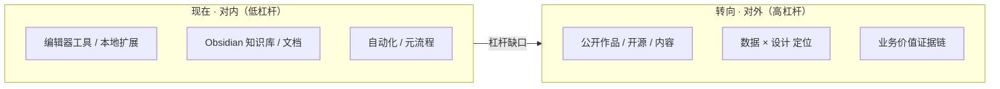

# 个人职业与发展诊断

> [!important] 2026-10-09 事实校正（本次用户确认）
> 用户岗位为**策划**，决策权限中等，未来三年目标为提升自身价值与竞争力。第 10 节为修正后的职业建议，第 11 节为近期任务事实，第 12 节为个人创作意向与本轮收尾。第 0–9 节保留为历史 AI 分析，不视为已证实的人物画像。其中“内部工具工程师”“大厂在职”“比 95% 游戏工程师领先”“能力过剩”“知识管理收益趋零”“职业风险偏好保守”等没有足够证据；未检索到公开成果也不等于没有成果。工程操作谨慎不能推出职业或投资风险偏好。

> 一句话收束：**你已经把"能干"证明到极致了，接下来 3 年唯一值得赌的是"被看见"。**

---

## 0. 核心判断

把"对内生产力"做到极致、却几乎没把能力"对外变现"的工程师。护城河不浅，但被锁死在 TileMatch 单一项目里，且不可见、不可迁移、不可议价。未来 3–5 年的分水岭，不在多会一个工具，而在能不能把已经过剩的"工具/流程能力"转化成**可迁移、可被看见、可度量业务价值**的资产。

```mermaid
flowchart LR
  subgraph 对内[现在 · 对内（低杠杆）]
    A1[编辑器工具 / 本地扩展]
    A2[Obsidian 知识库 / 文档]
    A3[自动化 / 元流程]
  end
  subgraph 对外[转向 · 对外（高杠杆）]
    B1[公开作品 / 开源 / 内容]
    B2[数据 × 设计 定位]
    B3[业务价值证据链]
  end
  对内 -->|杠杆缺口| 对外
```

- 对内特征：不可见 · 不可迁移 · 不可议价
- 对外特征：可迁移 · 可被看见 · 可度量

---

## 1. 依据与盲区（诊断前提）

- 对工作方式、技术栈、工具链、风险偏好的判断置信度高。
- **缺失信息**：薪资、职级、年龄、婚育、资产规模、可支配时间——这些决定"投资/创业"类建议的现实可行性。
- 因此涉及创业的，刻意不展开成具体动作，只给一条对所有约束都成立的主线。若资金/时间预算与默认假设（大厂在职、现金流稳定但时间被工作占满）不符，部分优先级要调。

---

## 2. 按重要性排序的 5 个瓶颈 / 风险 / 机会

| 序 | 类型 | 一句话本质 |
|---|---|---|
| 1 | 最大机会=最大风险 | AI+工具链能力稀缺且领先，但全部指向内部，且不可见、不可迁移 |
| 2 | 风险 | 职业定位被锁死在"单一项目内部工具工程师"，业务价值叙事缺失 |
| 3 | 盲点 | 文档/知识管理/自动化已从"杠杆"退化为"舒适区"，在挤占高杠杆时间 |
| 4 | 风险 | "确认驱动"的执行模式保护了不犯错，也封顶了上行空间 |
| 5 | 机会(被掩盖) | "数据×游戏设计"交叉定位，是比"纯工具"更硬的一张牌，但一直当副业 |

---

## 3. 没意识到的 3 个盲点

1. **在"维护系统"上的时间已过收益拐点**。知识库健康检查、Notion 同步、归档、模板、分类体系精修、周度自动化——曾经是杠杆，现在是精致的拖延：让人感觉在进步，但不产生可迁移资产或可度量业务价值。
2. **把代码层的谦逊套到了职业上**。"只扩展不改动原逻辑""LocalExtensions gitignored""本地草稿不进 git"——公司代码需要这种克制，但职业不需要。在刻意让自己不可见，而不可见 = 不可议价。
3. **没意识到"会写 SQL 的关卡工程师"有多稀缺**。Presto/Trino 数据分析 + 关卡逻辑双重能力，却把它当工具的一部分；这其实是一张最难被复制的王牌。

---

## 4. 立刻停止的 4 件事

1. 停止新增/精修任何元流程（健康检查项、分类体系、同步/归档机制）。边际收益已趋零。
2. 停止在**个人成长类**决策上套用"先出差异报告、反复确认再动手"的公司代码安全模式——它保护代码，却冻结人生下注。
3. 停止把产出藏在 gitignore、本地、私人仓库。停止做"隐形工程师"。
4. 停止用"我在做工具、没碰业务"定义自己——这条自我叙事正在让晋升和外部议价时自动降价。

---

## 5. 5 条核心建议

### 建议 1（最高杠杆）——把 AI 原生游戏工具链能力对外产品化，建立第一个可被看见、可迁移的资产

- **为什么重要**：AI 正在商品化通用编码；唯一对冲是"不可替代性 × 可被发现性"。能力强但不可见，等于资产持续贬值。
- **为什么适合**：已跑通 WorkBuddy/CodeBuddy/MCP/自动化/模型选型，比 95% 游戏工程师更早掌握 AI 原生工作流，且有真实项目素材（关卡工具、数据 pipeline）可抽象。
- **怎么做**：30 天内选定 1 个最小可发布物——一个开源 Unity 编辑器工具，或一篇"AI 如何自动化关卡设计"的深度文——公开发布。
- **不做的代价**：若项目收缩或行业下行，可迁移信号近乎为零，只能靠内部口碑，谈判筹码极弱。

### 建议 2——把职业叙事从"工具工程师"重写为"数据驱动关卡设计 / 工具链 owner"，并让业务价值可度量

- **为什么重要**：晋升和外部机会靠"可量化的业务影响"，不靠"我做了多少工具"。
- **为什么适合**：有数据技能 + 游戏逻辑，能自己把工具和业务指标连起来（已定义"难度>5=体验差"，缺的是把它变成证据链）。
- **怎么做**：每个工具/功能，记录它影响的指标（编辑器耗时、关卡产出量、留存变化），在述职/晋升材料里用数据讲价值。
- **不做的代价**：继续当"幕后英雄"，升职与外部议价双重吃亏。

### 建议 3——给"数据×游戏设计"一个正式的战略身份，主动认领"用数据反推设计"的任务

- **为什么重要**：这个组合稀缺、难复制，是比"会写编辑器工具"更硬的护城河。
- **怎么做**：主动争取 DDA、难度曲线、留存分析的活，而不是只承接工具需求；在 TileScape 迁移里把这个定位带过去。

### 建议 4——在个人成长类决策上切换到"下注模式"，保留"确认模式"只给公司代码

- **为什么重要**：3–5 年轨迹由少数几个不对称决定塑造；默认模式会系统性错过它们。
- **怎么做**：每年至少一次"高上行、损失可承受、有明确退出条件"的尝试，设定时间盒（如 3 个月）和止损点，直接试，不再无限分析。
- **不做的代价**：技能扎实但天花板可见，靠工龄线性积累，跟不上非线性时代。

### 建议 5——给知识管理系统设硬上限，把省下的时间定向投给"对外产出"

- **为什么重要**：Obsidian/自动化已进入"为维护而维护"。
- **怎么做**：知识管理每周封顶 ≤2 小时，冻结新增元流程；释放的时间全部投给建议 1。
- **不做的代价**：一年后系统更精致，但个人资产零增长。

---

## 6. 行动重点

| 时间 | 重点 |
|---|---|
| **30 天** | ①冻结一切元流程；②选定并动笔/动手第一个公开作品；③列"我做的 5 个工具 × 各自业务指标"清单，补齐缺失证据 |
| **90 天** | ①发布第一个对外作品到可被搜索处（GitHub/掘金/公众号）；②认领一个"数据反推设计"任务，拿一次可量化结果；③在季度述职里用数据重讲价值故事 |
| **1 年** | ①完成 3–4 个对外作品，形成清晰个人标签（"AI 原生游戏工具链 / 数据驱动关卡设计"）；②用一年指标证据链，做一次"内部晋升"或"外部市场验证（面试/报价）"二选一；③评估这个标签在 TileMatch 之外的哪些公司/行业有定价权 |

---

## 7. 如果只能做一个改变

**把"对内工具/文档/自动化"这条已投入过度的主线，整体转向"对外可迁移、可被看见的资产"；第一动作是 30 天内发布第一个公开作品（再小都行），并同步停止一切新增元流程。** 这是唯一能同时撬动可迁移性、可见性、业务价值、上行空间四个维度的改变。

---

## 8. 未来 3 年主线 + 决策原则

### 主线

从"某个项目里最会做工具的人"，变成"游戏行业里被认可的『AI 原生工具链 + 数据驱动关卡设计』专家"——这条线可迁移、可议价、随年复利。

### 决策原则（判断工作 / 投资 / 创业 / 学习）

1. **可迁移性优先**：一个机会的价值 = 它能否摆脱单一项目/单一公司锁定。只在此项目生效的技能按"消费"计，不按"投资"计。
2. **可见性杠杆**：能力等价时选"会被看见"的（公开 > 私下，可搜索 > 本地）。
3. **下注原则**：高上行 + 损失可承受 + 有退出条件 → 时间盒直接试；低上行 + 高机会成本（元流程优化）→ 一律不做。
4. **可度量门槛**：任何投入先问"三个月后能拿出什么可量化结果"，拿不出的视为消费。
5. **反共识**：别人在"多学一个框架/多做一个工具"时，该做的是"把已有能力对外定价"——护城河不在多会一个工具，而在稀缺的交叉定位。

---

## 9. 2026-10-09 复核：从“被看见”升级为“被市场验证”

本次复核没有新增薪资、资产、可支配时间、职级或家庭约束等信息，不能据此给出投资金额、离职或创业时点建议。但 09-13 至今的工作记录继续显示：高质量的代码地图、任务主档、证据边界与 Agent 工作流在持续产出；未见已公开的作品、外部用户、付费、面试反馈或可归因业务指标。因此原诊断成立，但执行目标要收紧：

- 不是“发一篇内容”就完成，而是在 90 天内交付一个脱离公司私有代码和数据、可被陌生同行实际使用或评价的最小资产。
- 最优首选不是泛 AI 内容，而是一个能展示完整闭环的公开样本：`问题 → Unity/关卡工具或数据诊断方案 → 可运行演示 → 使用说明 → 用户/同行反馈`。
- 内部工作只选取能转化为该资产、可量化业务影响或可迁移案例的部分；其余知识库维护按既定上限处理。

这不是鼓励鲁莽创业。它是在不牺牲在职现金流的前提下，先用 90 天得到职业市场的真实信号，再决定是否扩大投入。

---

## 10. 2026-10-09 基于岗位确认的重新诊断

### 依据与边界

- 用户本次直接确认：策划，决策权限中等，未来三年提升自身价值与竞争力；未提供职级、薪资、家庭负担、储蓄、业余时间或创业意愿。
- 历史直接表述：在“检查当前分支任务与进度”对话中明确“我这边出方案，交给程序开发”，本地尝试用于摸索和提前发现问题、完善需求；对应 [[02-PROJECTS/TileScape/游戏逻辑/任务-买量承接与章节拆分长期任务]] 第 1 节。
- 可见任务覆盖买量承接、章节与剧情、DDA、留存与 SQL、资源和代码定位、LG 工作流。能证明持续参与这些问题，不能直接证明独立实现水平、业务增量、管理能力或市场稀缺程度。
- 读取现有聊天列表、部分实际对话、项目 MOC、阶段汇总、既有诊断及降噪计划；不是完整人生档案或全量历史审计。工作记录偏向 AI 辅助任务，不能按聊天数量推算实际工时。
- 四项判断均为发展假设，需以结果、工时、组织反馈和外部反馈验证。仅确认事实与本次建议已入库，不把建议写成用户已承诺任务。

### 按重要性排序的四项建议

1. **争取一个业务问题的结果责任与必要权限。** 首选从现有买量承接/首局体验中挑选一个可控制的环节，不另开工具产品。与负责人明确问题、主指标、护栏、最小研发/数据支持及复盘时间。成功包括可靠证伪、停止无效投入，不要求每次正向。适合原因是已经承担方案并跨程序、美术、数据协作；不做的风险是长期承担协调和补洞工作，职责扩大但决策权与评价标准不变。
2. **给代码探索、AI 与知识维护设置停止条件。** 本地探索必须回答当前需求中的一个问题；能改变需求决策、提供复现或形成清楚交接后就停。先记录两周自主支配工作时间，试行四周将纯工具/流程维护压在该时间的 10% 左右；这是试行预算，不是测得的最优值。只保留一个主动推进的改进主线，交付与必要维护照常。适合原因是已有策划与技术接口优势，也有大量辅助工作入口；不做的风险是个人成为默认技术中转站，AI 节省时间被新增任务全部吸收。
3. **把数据解释与实验判断做成专业深度。** SQL 取数、读 DDA 源码和判断机制是否改善体验是不同能力。选当前方案练习可证伪假设、随机分组/人群口径、主指标与护栏、样本量与不确定性、推广/回滚决策。买量承接案例可围绕首局完成率展开，检查首次可操作等待、崩溃和后续留存；视频完播率只作诊断指标。具体实验须与数据同事共同确认，不把合成样本或相关性当业务提升。适合原因是已有数据和游戏机制问题输入；不做的风险是得到更多报表，却不能可靠地决定下一次产品投入。
4. **将贡献转化为评价与市场证据。** 先用现有任务形成一个简短案例：问题、本人决策、协作边界、结果与反例、下一步。两周内与负责人对齐“何种结果对应何种职责/职级评价”，90 天用案例找 2–3 位相关负责人或资深策划做岗位能力校准。可私下、脱敏、获准展示，无需默认公开公司材料或另做开源项目。陌生人称赞不等于市场需求，具体职责邀请、后续面谈或付费试点才是更强信号。若连续两个季度争取不到最小验证资源与明确发展路径，将平台限制作为外部机会评估依据。不做的风险是能力提升没有转成权责、回报或可迁移选择。

### 立刻停止

- 把“能让 AI 做”当作“值得做”的充分理由；新主线必须明确挤掉哪项旧投入。
- 对已足以支持需求判断的问题继续追求全链路完整掌握；正式程序交付仍由研发承担。
- 为未来可能需要而新增工具、模板、巡检和流程层；必要维护与知识复用继续保留。
- 将 AI 旧评价当个人事实，或用反复职业诊断替代外部反馈；下一轮诊断需要新证据。

### 30 天、90 天、1 年

| 时间 | 行动重点 | 可检查结果 |
|---|---|---|
| 30 天 | 选定一个现有业务问题；对齐最小权限/资源与评价口径；记录两周时间；停止一个无明确收益的自主事项 | 一项已获支持的验证计划、可信基线、明确个人贡献；若无资源，记录具体限制 |
| 90 天 | 完成一轮有效验证与推广/继续/停止决策；形成一个案例；完成 2–3 次内部或外部能力校准 | 能说明改变了什么决策和为什么，未显著/无效结果也如实记录；有下一步职责反馈 |
| 1 年 | 在同一业务方向形成 2–3 个相互关联案例，让他人能复用方法；谈更大范围或用外部机会校准 | 至少出现职责、评价/回报、外部选择中的一种实质改善；否则复查平台和方向 |

计划优先嵌入本职工作；没有业余时间与现金流信息，不默认新增副业负担或要求离职。

### 一个改变与三年主线

只做一个改变：**每季度选一个你能影响的业务问题，对“如何验证、据此做什么决定”负责，并事先对齐权限与评价。**

三年主线：成为能把玩家体验问题、数据证据与实现约束连起来，并推动有效产品决策的休闲游戏策划。第一年建立可信结果，第二年扩大到一段体验或系统并让协作者复用，第三年根据权责、回报和外部反馈选择当前平台、更大岗位或有真实需求的产品试点；这不是既定晋升预测。

### 机会判断原则

- 工作：是否增加关键决策范围、验证能力或可归因成果？只有责任增加而没有资源/权限，要谈范围。
- 学习：是否能改变当前主线中的具体决策？优先实验判断、玩家行为解释和跨职能推动；工程与工具按具体缺口补充。
- 创业：先确认具体用户、重复痛点和愿意付出的成本，再做窄试点；能开发不等于有购买需求。无资源信息，不推断适合创业。
- 投资：职业专注与金融集中押注不能混同；按目标、用钱期限、流动性和承受能力判断，不能由“懂游戏/AI”推出证券估值优势。没有财务画像，不给仓位或产品建议。
- 共通：说明预期收益、最坏损失、放弃的替代项、下一次可获得证据的时间和退出条件。90 天适用于本次职业试验反馈，不是长期金融投资回报期限。

### 来源

- 本次用户岗位与目标确认；对话“检查当前分支任务与进度”（thread `01a0c8c8-6a7b-7e11-96e4-a61f6078a486`）中的方案/研发分工；“AB实验看活跃留存”中的用户提问（不将 AI 示例数据视为真实指标）。
- [[02-PROJECTS/TileScape/游戏逻辑/任务-买量承接与章节拆分长期任务]]、[[01-DAILY/summaries/阶段工作汇总-2026-07-02至2026-08-14]]、[[02-PROJECTS/Agent/工作流/计划-知识库维护降噪与Obsidian深化-2026-08-26]]。
- [Microsoft：实验前的可信性设计](https://www.microsoft.com/en-us/research/articles/patterns-of-trustworthy-experimentation-pre-experiment-stage/)：支持假设、指标、分组、样本与偏差检查的方法；不证明个人能力或业务结果。
- [Investor.gov：资产配置与分散](https://www.investor.gov/introduction-investing/getting-started/asset-allocation)：支持投资期限、风险承受能力与分散原则；不是针对个人财务情况的配置。

## 11. 2026-10-09 近期目标与任务性质确认

### 用户直接确认

- 近期团队目标为留存，对应正式任务为 TS 买量承接与章节。
- 元素牌属于偏创意的探索；Chuzzle 当前只是整理项目，不据此推断承担玩法立项或产品验证。
- 手头还包括连胜测试、前期承接/拆章节、MT 染色牌等事项；用户感到任务较杂，方向未定也是明显困扰。方向、研发/美术排期、数据验证与零碎打断均有一定影响，尚未量化主次。
- 连胜测试是功能验收还是线上 AB、MT 染色牌具体交付范围及期限，尚未确认。MT 染色牌不自动等同于 Tile 超彩任务。

### 据此调整的建议（未视为已批准排期）

- 将买量承接/章节作为同一留存主线管理，但分别说明广告预期兑现与章节节奏的假设；如需辨别单项效果，避免不加区分地同时改动两者。
- 方向讨论先回答“哪段玩家体验最可能造成流失、目前有什么证据”，再选一个最小方案。漏斗和试玩用于定位/形成假设，不能直接证明因果；现有数据不足则明确缺口。
- 连胜测试优先明确当前阶段与下一次结论条件：功能验收需要通过/失败与修复边界；线上试验需要观测口径、时间及保留/迭代/停止判断，不预判结果。
- MT 染色牌按真实交付承诺限定范围并集中处理，未确认期限前不擅自降级；元素牌保留有上限的创意探索；Chuzzle 按已有整理范围收尾，不主动扩大为研发/玩法项目。
- 建议下周产出为一个可评审、可被否定的留存改进假设和首版验证安排；不再以“完善所有方案”作为目标。优先复用既有任务主档，不新增管理体系。

### 下次真正需要补充的信息

用于具体排序：连胜测试阶段与结果时间、买量承接/章节本轮版本窗口、MT 染色牌已承诺范围/期限，以及谁能对首版方向拍板。无需先补完整个人经历或财务信息。

## 12. 2026-10-09 个人创作意向与对话存档

### 本轮确认与保留线索

- 用户希望利用现有资源和框架搭建自己想要的东西，可能是 Demo 或偏展示的作品，借此体现能力与认知。
- 在选项询问中表达“先满足自己的创作，再考虑展示”，并选择过“系统设计：把关卡、难度和策略做得可解释”。后者只作为兴趣线索保留，不能据此确定作品类型或实施范围。
- 用户随即明确纠正：“不要依据选项就全照着所选的思考”；随后表示具体想法“一时我也说不清楚”。
- 本轮结束指令为“之后再说吧，整理一下存档”。讨论暂缓，未确定作品主题、目标受众、载体、时间预算、交付期或使用哪个项目框架。

### 已撤回的过早收敛

- “可玩的关卡策略实验室”是 AI 根据选项提出的构想，未经用户认可，不能写成用户需求或待执行项目。
- 不能把个人创作一律纳入留存工作、职业展示或业务验证目标。工作任务排序建议与个人创作意愿应分别理解。
- 熟悉 Tile、DDA 或编辑器不意味着作品必须围绕它们；现有框架只是可选材料。
- “安排一小时自由试做”只是讨论中的探索建议，用户未承诺执行，不创建待办、提醒或自动化。

### 后续继续入口

用户主动重启时，从具体想改的体验、感兴趣的现象、场景或已有草稿展开；可以先试做再明确形态，不强迫先给职业标签或在预设选项中定方向。只有当用户认可某个具体构想后，再确定最小范围、资源与实施任务。

### 归档边界

- 来源：本次对话（`01a120d0-e11e-7d72-a248-c471f0aaf246`）中的用户直接陈述、纠正与暂缓指令。
- 本文保存讨论及建议，不证明业务效果、能力排名、风险偏好或项目已经立项。
- 本轮仅整理 LG 文档与导航；未创建 Demo、修改项目代码、调整项目排期或执行 Git 提交。

## 关联

- [[HOME|LibraryG 主入口]]
- [[02-PROJECTS/Agent/Memory|Agent Memory]]
- [[工作空间总纲|工作空间总纲]]
