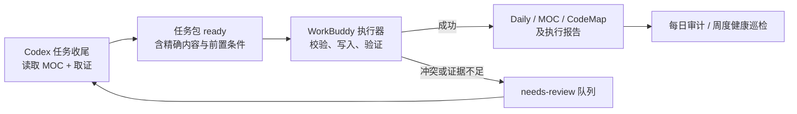

# WorkBuddy 日志知识闭环自动化实施方案

> 目标：把“理解对话和代码”与“重复执行日志/导航维护”分开。Codex 负责判断、取证和生成精确任务包；WorkBuddy 只在规则允许的范围内执行、验证并报告。任何无法由证据包消除的判断都退回人工 / Codex，不由 WorkBuddy 猜测。

> [!warning] 当前状态
> 本文是休眠方案，不会启用、停用或替换既有自动化。只有用户明确要推进 WorkBuddy 交接时才读取和执行。旧 `.workbuddy/` 脚本和 TileMatch 的 v1 自动化规范仅作历史参考，不能直接复用。

## 一、职责与授权边界

| 角色 | 可以做什么 | 不可以做什么 |
|---|---|---|
| Codex（预处理者） | 读取 MOC/项目规则；核验来源；判断 MT / TS / LG 归属；提炼逻辑或代码定位；生成包含精确写入内容的任务包；把不确定项标为 `needs-review`。 | 用文件 mtime、团队提交或猜测补写个人工作；把未验证结论交给执行器写入稳定文档。 |
| WorkBuddy（执行者） | 校验任务包；按白名单目标创建或追加内容；检查锚点、幂等标记和链接；生成执行报告；把冲突任务转入待确认。 | 重新解释对话/代码；自行分类；移动/删除历史材料；改业务代码；commit/push；处理无证据任务。 |
| 用户（裁决者） | 确认冲突、归类、批量整理及自动化启停；审阅周报。 | 无。 |

这不是把知识判断外包给 WorkBuddy，而是把**确定性的落盘、验证与提醒**交给它。

## 二、运行架构



### 目录约定

```text
.workbuddy/knowledge-closure/
├── README.md                         # 执行器唯一操作入口
├── queue/
│   ├── ready/                        # Codex 已核验、可执行的任务包
│   ├── processing/                   # 执行期间的锁定状态
│   ├── needs-review/                 # 需要 Codex / 用户决定的任务
│   ├── failed/                       # 技术失败，保留现场
│   └── processed/YYYY-MM/            # 已完成任务包，只读审计留档
├── reports/YYYY-MM/                  # WorkBuddy 每次执行报告
└── templates/                        # 任务包、报告模板
```

- 队列是运行状态，不作为 Obsidian 知识正文；可复用结论必须仍写入 LG 正式位置。
- 目录下的文件一律保留，不自动删除。任务状态通过**原子移动**变更，避免重复执行。
- WorkBuddy 仅可写 `/Users/dean/LibraryG` 中的上述运行目录、`01-DAILY/`、`02-PROJECTS/`、`03-KNOWLEDGE/`、`04-TEMPLATES/`；不得写 MT/TS 代码仓库。

## 三、Codex 预处理：任务包契约

每个任务包是一份 Markdown 文件，文件名为 `KC-YYYYMMDD-序号-主题.md`。只有 `status: ready` 的包可执行；`needs-review`、`draft`、`blocked` 一律只报告。

### 必填元信息

| 字段 | 规则 |
|---|---|
| `id` | 全局唯一，例如 `KC-20260817-001-lasttile-codemap`。 |
| `status` | `ready` / `needs-review` / `draft` / `blocked`。 |
| `projects` | `TileMatch`、`TileScape`、`LibraryG` 的非空列表。 |
| `source_evidence` | 每条事实的来源类型、路径/对话标识、摘要与验证状态。 |
| `risk` | `low`、`medium`、`high`；仅 `low` 可由 WorkBuddy 自动写入。 |
| `actions` | 精确目标、前置条件、正文、幂等标记、预期验证。 |
| `rollback` | 每个 action 的可恢复方式；默认“保留任务包和执行报告，人工回滚追加内容”。 |

### 来源门槛

| 来源 | 可生成 `ready` 的范围 |
|---|---|
| 用户明确确认、当前对话已确认结论、已读代码/正式文档 | 可以；任务包必须逐条引用。 |
| 文件 mtime、团队提交、构建产物、模糊历史记录 | 只能作为 `lead`，不得生成写入个人 Daily 或正式逻辑文档的 action。 |
| 推断、相互矛盾资料、缺少目标位置 | 必须是 `needs-review`。 |

### Action 的允许类型

| 类型 | 目标 | 自动条件 |
|---|---|---|
| `daily_append` | 当天 Daily 的指定项目节 | 追加内容有来源、含幂等标记；不改写既有叙述。 |
| `create_document` | 已由 Codex 确定的正式目录 | 目标文件不存在，frontmatter、来源、状态和关联完整。 |
| `moc_append` | 指定 MOC 的指定锚点 | 锚点文本唯一且存在；仅追加一个明确入口。 |
| `codemap_append` | 指定 CodeMap / 代码框架的指定锚点 | 代码路径、结论和来源已明确。 |
| `report_only` | WorkBuddy 报告 | 永远可执行，不改知识正文。 |

`replace`、`move`、`delete`、批量格式化、改写既有结论、目标在 MT/TS 代码仓库的 action 永不自动执行。

## 四、任务包格式与幂等机制

正文必须使用任务唯一标记 `<!-- kc:<id>:<action-id> -->`。WorkBuddy 在写入前先全库检查此标记：已存在即跳过该 action 并报告 `already-applied`，不再次追加。

每个 action 必须写明：

1. `target`：相对 LG 根目录的精确文件路径；不接受通配符。
2. `operation`：仅允许上一节的五种类型。
3. `anchor`：追加位置附近的原文；`daily_append` 指向 `## TileMatch`、`## TileScape` 或 `## LibraryG` 下的约定锚点。
4. `precondition`：目标文件存在/不存在、锚点必须唯一、预期状态。
5. `content`：完整可落盘 Markdown，不能让 WorkBuddy “自行总结”。
6. `verify`：例如标记唯一、wikilink 目标存在、Daily 三项目节和今日索引存在。

推荐采用 [[.workbuddy/knowledge-closure/templates/任务包模板|任务包模板]]。该模板是运行目录文件；如 Obsidian 未显示隐藏目录，直接按本规范的字段创建即可。

## 五、WorkBuddy 执行器的逐步流程

### 0. 启动前安全检查

1. 固定工作目录为 `/Users/dean/LibraryG`，拒绝历史 `D:\` 路径。
2. 读取本方案、[[02-PROJECTS/Agent/工作流/规范-任务知识沉淀闭环与自动巡检|闭环规范]]、[[02-PROJECTS/Agent/工作流/工作内容日志同步规范|Daily 规范]]。
3. 检查任务包 schema 版本、ID、状态、来源、目标白名单和风险等级。
4. 任一字段缺失、风险非 `low`、来源只含线索、目标超界时：不写文件，移入 `needs-review/`。

### 1. 获取任务

1. 仅按文件名顺序领取 `queue/ready/` 中的一个任务。
2. 原子移动到 `queue/processing/`，以此取得锁；同一 ID 不得并行。
3. 生成开始报告，记录开始时间、任务包摘要和操作数，不记录未证实内容。

### 2. Action 校验与执行

按 action 顺序处理；每项都先检查：

- 幂等标记是否已存在；存在则标为 `already-applied`。
- 目标是否在白名单内，且路径不含 `..`、通配符或软链接跳转。
- 锚点是否唯一；不唯一或不存在即停止后续写入并转 `needs-review`。
- 对 `create_document`：目标必须不存在；已存在即转待确认，绝不覆盖。
- 对 `daily_append`：确认当日文件有 `## 今日索引` 和三个项目节；缺节只能执行任务包中明确提供的 `create_document` / `daily_append` 修复，不能临场编写。

通过后才执行**追加或新建**。每次成功写入都保留幂等标记。

### 3. 验证与收尾

1. 检查每个成功 action 的标记仅出现一次。
2. 检查新增 Markdown 的 frontmatter、`source`、`status` / `lifecycle`、`## 关联`。
3. 检查新增 MOC / CodeMap 入口所链接的目标存在；不要求全库断链扫描。
4. 将报告写入 `reports/YYYY-MM/`，包含 action 结果、目标、验证、跳过原因、待确认项与报告状态。
5. 全部通过：任务包移至 `processed/YYYY-MM/`；任一冲突：移至 `needs-review/`；执行器错误：移至 `failed/`。不删除原包。

> [!danger] 部分成功处理
> 一个包只要有已落盘 action，就不可自动回滚。报告必须逐项列出已写内容；剩余 action 转 `needs-review`，由 Codex 生成新包而不是修改旧包后重跑。

## 六、三类自动化任务

| 自动化 | 建议频率（Asia/Shanghai） | 输入 | 产出 | 成功条件 |
|---|---|---|---|---|
| `knowledge-closure-executor` | 每 30 分钟 09:00–23:30；也可在 Codex 交包后立即触发 | `queue/ready/` | 正式文档修改 + 执行报告 | 所有 ready 包都有终态；无重复写入。 |
| `knowledge-closure-daily-audit` | 每日 21:45，执行器之后 | 当天 Daily、当天报告、ready/needs-review 队列 | 审计报告；仅补包中已允许的修复 | 报告“已补 / 待确认 / 无证据”。 |
| `knowledge-closure-weekly-health` | 周日 22:00，晚于每日审计 | 最近 7 天 Daily、INBOX、近 7 天正式文档 | 周报 + `needs-review` 任务包 | 只生成问题与明确链接修复包，不重写工作事实。 |

每日审计和周度健康巡检的检查清单以闭环规范为准。它们不能直接把“发现文件更新”写成工作日志，只能报告线索或请求 Codex 预处理。

## 七、Codex 与 WorkBuddy 的交接动作

| 时点 | Codex | WorkBuddy |
|---|---|---|
| 任务开始 | 读 AGENTS、AI 总 MOC、项目 MOC 和必要规范。 | 无。 |
| 有结论/定位 | 把每条结论绑定来源，判定逻辑 / CodeMap / Daily / MOC 落点。 | 无。 |
| 任务收尾 | 创建 `ready` 任务包；不确定项建 `needs-review` 包；在对话中说明包 ID。 | 领取 ready 包，严格执行。 |
| 每日 | 必要时补交漏掉的任务包。 | 处理队列、输出三类审计结果。 |
| 每周 | 处理需判断的健康问题。 | 生成健康报告与待确认包。 |

为避免“对话没有走知识库规范”，Codex 的任务收尾清单新增为**交包检查**：只要形成稳定事实，就必须选择“已生成任务包 / 已直接入库 / 无稳定结论”之一，并将理由写入当日 Daily 或包内报告。

## 八、迁移与验收计划

| 阶段 | 动作 | 验收标准 |
|---|---|---|
| 1. 建骨架 | 创建运行目录、README、两份模板；不启用定时任务。 | 历史 `.workbuddy` 文件未改动；新目录可读。 |
| 2. 配执行器 | 在 WorkBuddy 中创建三个任务，粘贴本方案的角色边界与流程。 | 手工投递 `report_only` 包可生成报告。 |
| 3. 小样本试运行 | 选一条明确 TS 或 LG 结论，创建含 `daily_append + moc_append` 的 low-risk 包。 | 只写预期两处；第二次运行均为 `already-applied`。 |
| 4. 7 天并行观察 | Codex 现有每日巡检与 WorkBuddy 同时运行。 | 无重复日志、无越界写入、所有待确认项可追溯。 |
| 5. 正式交接 | 用户审阅报告后，将 Codex 定时巡检暂停为兜底或关闭。 | WorkBuddy 连续 7 天无未报告失败；周报可用。 |

## 九、历史资产处理

| 历史材料 | 处理 |
|---|---|
| `.workbuddy/scan_vault*.py`、`fix_bottlenecks.py` | 保留，不执行；含 Windows 路径、TileMatch 单项目假设和旧规则，需重写后才可用。 |
| `.workbuddy/skills/inbox-organizer/` | 保留为历史参考；其“自动删除 / 移动”能力不纳入本流程。 |
| `02-PROJECTS/TileMatch/知识库/规范-自动化任务设计-v1.md` | 标记历史，并由本文取代其“当前自动化”定位。 |
| Codex heartbeat `libraryg` | 在阶段 4 完成前保留为兜底；阶段 5 经用户确认后再暂停或删除。 |

## 十、待用户确认的实施选择

1. WorkBuddy 是否支持“队列到达立即触发”；若不支持，采用上表的 30 分钟轮询。
2. 是否允许 WorkBuddy 自动创建当天 Daily（仅套固定模板），还是只允许追加已有 Daily。
3. 7 天并行观察后，Codex heartbeat 是“暂停保留”还是“删除”。

## 十一、WorkBuddy 任务定义（配置时直接使用）

以下三段是 WorkBuddy 的任务说明；创建任务时分别粘贴。时间、任务名可按实际 UI 配置，但不要放宽文件白名单或风险门槛。

### A. `knowledge-closure-executor`

```text
工作目录固定为 /Users/dean/LibraryG。
先读取 AGENTS.md、AI总MOC.md、.workbuddy/knowledge-closure/README.md、02-PROJECTS/Agent/工作流/方案-WorkBuddy日志知识闭环自动化实施.md、规范-任务知识沉淀闭环与自动巡检.md、工作内容日志同步规范.md。

只领取 .workbuddy/knowledge-closure/queue/ready/ 中按文件名最靠前的一份任务包。仅处理 frontmatter 同时满足 status: ready 与 risk: low 的任务包。
逐项检查 schema、来源、目标白名单、锚点唯一性、幂等标记和前置条件。仅执行任务包给出的完整正文；允许 daily_append、create_document、moc_append、codemap_append、report_only。禁止自行总结、归类、覆盖、移动、删除、改项目代码、git commit/push。

成功后验证标记唯一、链接目标存在及任务包指定检查；生成执行报告到 reports/YYYY-MM/，并移动任务包到 processed/YYYY-MM/。任一冲突或证据不足移到 needs-review/；技术错误移到 failed/。最后仅报告：已补、待确认、无证据/风险。
```

### B. `knowledge-closure-daily-audit`

```text
工作目录固定为 /Users/dean/LibraryG。读取闭环规范、Daily 同步规范和当天 WorkBuddy 执行报告。
检查当天 01-DAILY/YYYY-MM-DD.md 是否有今日索引及 TileMatch、TileScape、LibraryG 三节；检查 ready/needs-review 队列和当天已完成任务的验证结果。

不得根据 mtime、团队提交、构建产物或猜测补写个人工作。不得自行写知识正文；只有已有 ready 任务包的 action 才能写入。发现缺口时写入报告，或生成 status: needs-review 的任务包，写清楚来源缺失原因。报告按“已补、待确认、无证据/风险”输出。
```

### C. `knowledge-closure-weekly-health`

```text
工作目录固定为 /Users/dean/LibraryG。读取闭环规范、Daily 同步规范和最近七天 WorkBuddy 报告。
检查最近七天 Daily 的日期断档、今日索引和三项目节；检查 00-INBOX 中超过七天的材料；检查近七天新增稳定文档是否含来源、状态、关联并从项目 MOC/专题索引/CodeMap 可达。

只自动生成报告和明确的 needs-review 任务包；不得移动、删除、覆盖或将文件时间/团队提交写成个人记录。可在已有 ready 任务包授权时执行无歧义链接补充。报告按优先级列出已修复、待用户确认、无证据/风险，并附精确路径。
```

## 关联

- [[AI总MOC|AI 总 MOC]]
- [[02-PROJECTS/Agent/工作流/规范-任务知识沉淀闭环与自动巡检|任务知识沉淀闭环与自动巡检]]
- [[02-PROJECTS/Agent/工作流/工作内容日志同步规范|工作内容日志同步规范]]
- [[02-PROJECTS/Agent/工作流/规范-任务产出入库与维护|任务产出入库与维护规范]]
- [[02-PROJECTS/TileMatch/知识库/规范-自动化任务设计-v1|历史 WorkBuddy 自动化设计 v1]]
