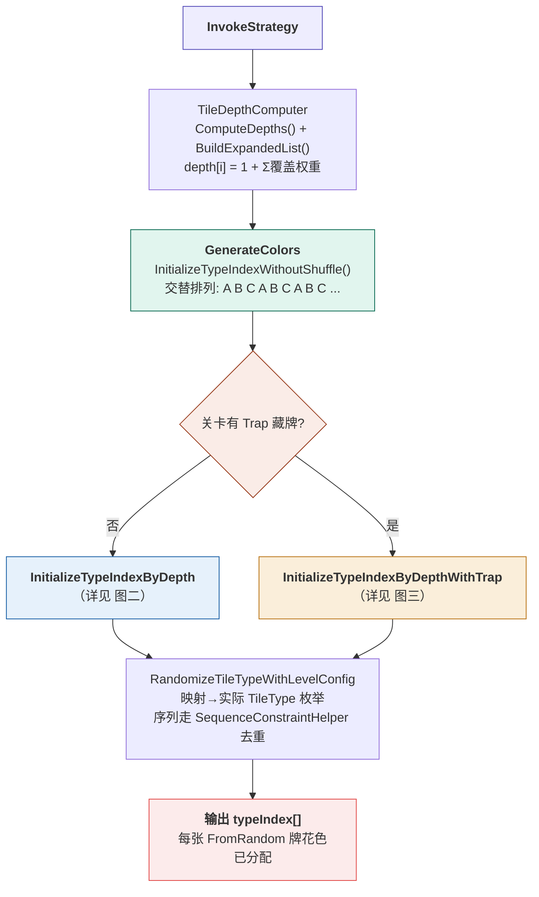

# AssignTileTypeByDepth 分池打乱策略

> **完整记录 `AssignTileTypeByDepthStrategy` 的算法逻辑、数据流、提交历史和深度映射原理。**
> 本文档是理解牌局花色分配规则的权威来源，覆盖所有路径和 fallback。

---

## 概述

`AssignTileTypeByDepthStrategy` 是 TileMatch 花色分配的核心策略类，在关卡初始化时决定每张 FromRandom 牌的花色。

**核心规则**：视觉最上层 25% 的牌的花色**轻量打乱**（Reserved 池，固定参数 step=1/times=1），保持基本交替排列；其余 75% 和所有序列子牌的花色用 ConfiguredRandom 步进打乱（Shuffle 池，参数来自关卡难度配置）。若关卡有 Trap 藏牌，还会从打乱池中藏掉 2 种花色到 NotVisible 深层位。

> 🔄 **2026-07-20 晚更新**：Shuffle 算法从 Fisher-Yates 全随机改为 ConfiguredRandom 步进随机（`ApplyRandomStepShuffle`）；分配方式从"按深度排序后分配"改为"预排序 + 位置直通"。详见第四章提交历史。
>
> 🔄 **2026-07-21 更新（14a62df458）**：Tail 池从"完全不打乱"改为"轻量打乱"——新增固定参数 `ReservedPoolRandomStep=1` / `ReservedPoolRandomTimes=1`，在 shufflePool 打乱后对 reservedPool 也做一次步进打乱。变量名 `deterministicPool`→`reservedPool` 全文件重命名。

**文件位置**：`client/Assets/Game/TileV2/Scripts/GameCore/Logic/GameLogic/Module/LevelTileType/Strategy/AssignTileTypeByDepthStrategy.cs`

**依赖**：

| 依赖类 | 作用 |
|--------|------|
| `TileDepthComputer` | 计算每张牌的覆盖深度 |
| `SequenceConstraintHelper` | 序列子牌去重约束 |
| `RandomService` | ConfiguredRandom 步进打乱（`ApplyRandomStepShuffle`） |
| `LevelConfig` | 关卡配置数据源 |

---

## 一、常量定义

| 常量 | 值 | 含义 |
|------|------|------|
| `MinElements` | 3 | 最少花色数，花色调整不能低于这个 |
| `ShufflePositionThreshold` | 0.75 | 归一化位置 ≤ 0.75 的 FromRandom 牌参与打乱；> 0.75 的超出部分使用固定参数轻量打乱 |
| `ReservedPoolRandomStep` | 1 | Reserved 池（Tail 25%）轻量打乱步长：每张牌最多右移 1 位（**14a62df458 新增**） |
| `ReservedPoolRandomTimes` | 1 | Reserved 池轻量打乱轮数：只打乱 1 轮（**14a62df458 新增**） |
| `TrapColorCount` | 2 | 藏 2 种花色（每种 3 张 = 6 张进 Trap） |
| `TrapGroupsPerColor` | 1 | 每种藏 1 组（3 张） |
| `TrapMinTileTypeCount` | 5 | 花色少于 5 种时不藏牌 |

### ShufflePositionThreshold 详解

```
targetCount = count1(FromRandom 牌数) + count2(序列子牌数)
threshold = 0.75

n2 = 3 * Ceil((count1 - 0.75 * count1) / 3)  ← Reserved 池（轻量打乱 step=1/times=1），向上取 3 的倍数
n1 = count1 - n2                                   ← Shuffle 打乱
mergedCount = n1 + count2                          ← Shuffle 合并池
```

| 变量 | 含义 | 举例（count1=60, count2=12）|
|------|------|-----|
| `n2` | Reserved 轻量打乱池大小 | `3 * Ceil((60-45)/3) = 3 * 5 = 15` |
| `n1` | Shuffle 普通牌数量 | `60 - 15 = 45` |
| `mergedCount` | Shuffle 合并池 = n1 + 全部序列子牌 | `45 + 12 = 57` |

---

## 二、深度映射原理

> 这是理解所有分池逻辑的前提。代码中的"浅/深"与玩家视角完全一致，没有反转。

### 视觉层叠由 Sorting Order 主导

```csharp
// BoardView.cs:126 — 真正控制视觉层叠的代码
order = pos.z * 160 + ...
```

### 完整映射链（3 层关卡为例）

| data `pos.z` | Sorting Order (`pos.z × 160`) | `TileDepthComputer` depth 值 | 编辑器显示 Layer | 玩家看到的 | 分池 |
|---|---|---|---|---|---|
| 2 | 最高（≈320） | **1**（无牌覆盖="最浅"） | Layer 1 | **最上层**（最先看到、最先消除） | **Reserved 轻量打乱** |
| 1 | 中（≈160） | 2~3 | Layer 2 | 中间层 | Shuffle 打乱 |
| 0 | 最低（≈-10400） | 4+（最多覆盖="最深"） | Layer 3 | **最底层**（最后看到） | Shuffle 打乱 |

### 关键代码

| 步骤 | 文件 | 详细 |
|---|---|---|
| 深度计算 | `TileDepthComputer.cs` | `depth[i] = 1 + Σ(上层牌覆盖权重)`，depth=1 = 无牌覆盖 = 视觉最上层 |
| 渲染排序 | `BoardView.cs:126` | `order = pos.z * 160 + ...`，pos.z 越大渲染越靠前 |
| 世界坐标偏移 | `LevelScalerService.cs:703` | `z = (_maxZ - pos.z) * 0.01f + 1`，层间仅 0.02，不影响视觉层叠 |
| 编辑器显示 | `LayerItem.cs:72-92` | `layerShowIndex = topLayerId - z + 1`，z=2 → Layer 1 |

> **世界 Z 反转不影响视觉层叠**。`LevelScalerService.cs:703` 只做微小坐标偏移（层间仅 0.02），`pos.z * 160` 的排序层才是硬件渲染顺序，绝对主导。

---

## 三、完整算法流程

### 3.1 入口 `InvokeStrategy`（L29-86）

```
入口
├─ count1 = LevelConfig.GetRandomTileCount()         // FromRandom 牌总数
├─ count2 = LevelConfig.GetSequenceRandomTileCount() // 序列子牌 FromRandom 总数
├─ targetCount = count1 + count2
│
├─ TileDepthComputer.BuildExpandedList()
│     → entries: 展开序列子牌后的完整列表
│     → randomAssignmentIndices: 需随机分配花色的 entry 下标
│     → entryCoverWeights + effectDepthGroups: 深度计算输入
│
├─ TileDepthComputer.ComputeWeightedDepths() → depth[]
│     depth[i] = 1 + Σ(覆盖 entry[i] 的上层牌权重)
│     depth 越大 = 被越多牌覆盖 = 越难被玩家看到
│
├─ 获取花色列表（Bonus / 普通关卡分别处理）
│
├─ 判断是否启用 Trap：
│   ├─ 无 Trap → InitializeTypeIndexByDepth()
│   └─ 有 Trap → InitializeTypeIndexByDepthWithTrap()
│
└─ RandomizeTileTypeWithLevelConfig(typeIndex, tileTypeList)
     把 typeIndex 里的花色索引映射到实际 TileType 枚举值
     序列子牌走 SequenceConstraintHelper 去重
```

### 3.2 非 Trap 路径 `InitializeTypeIndexByDepth`

> ⚠️ **472d672680 重写**：从"深度排序分配"改为"预排序 + 位置直通"。

```
第一层门禁：threshold >= 1 或 targetCount % 3 != 0？
  ├─ 是 → 退回旧逻辑 InitializeTypeIndexByDepthOriginal
  └─ 否 → 继续
        │
        ├─ 构建 ordinarySlots = SortByDepth([0..count1-1])  // 预排序，只排一次
        │
第二层门禁：n2 % 3 != 0 或 (n1 + count2) % 3 != 0？
  ├─ 是 → 退回旧逻辑
  └─ 否 → 继续
        │
        ├─ BuildColorPoolsInAssignmentOrder(colors, n1, count1, out shufflePool, out reservedPool)
        │     → shufflePool = colors[0..n1-1] + colors[count1..] (前 n1 + 序列)
        │     → reservedPool = colors[n1..count1-1] (后 n2 = Reserved 轻量打乱)
        │     ✅ 简单切片，保持交替排列（不再用贪心 3 组分配）
        │
第三层门禁：shufflePool.Count != mergedCount 或 reservedPool.Count != n2？
  ├─ 是 → 退回旧逻辑
  └─ 否 → 继续
        │
        ├─ ShuffleTileType(shufflePool, randomStep, randomTime)  ← 关卡参数步进打乱
        ├─ ShuffleTileType(reservedPool, ReservedPoolRandomStep, ReservedPoolRandomTimes)  ← 固定参数轻量打乱（step=1/times=1）
        │
        ├─ 槽位分组（基于预排序后的 ordinarySlots）：
        │   shuffleSlots = [ordinarySlots[0..n1-1]] + [count1..targetCount-1]
        │                   ↑ 前 n1 普通牌              ↑ 全部序列子牌
        │   reservedSlots = [ordinarySlots[n1..count1-1]]
        │                    ↑ 后 n2 普通牌 = Reserved 轻量打乱
        │
        ├─ AssignPoolToSlots(shuffleSlots, shufflePool, typeIndex)        ← 位置直通（不排序！）
        └─ AssignPoolToSlots(reservedSlots, reservedPool, typeIndex)
```

**关键变化**（对比 5885672785）：

| 维度 | 旧（5885672785） | 新（472d672680） |
|------|-----------------|-----------------|
| 花色切分 | `PartitionColorsByThrees` — 贪心 3 组分配 | `BuildColorPoolsInAssignmentOrder` — 按位置切片 |
| 槽位排序 | 分配时 `AssignPoolToSlotsByDepthRank` 每次排序 | 一次性 `SortSlotIndicesByDepth` 预排序 |
| 槽位分配 | 深度降序映射（pool[0]→最深位） | 位置直通（slot[i]→pool[i]） |
| Shuffle | `RandomService.Shuffle` Fisher-Yates | `ShuffleTileType` ConfiguredRandom 步进 |
| 花色排列 | 用贪心算法从各花色抽 3 张 | 保持 `GetColors` 交替排列 (A B C A B C) |

**效果**：
- Reserved 池（固定参数轻量打乱 step=1/times=1，基本交替）→ 视觉最上层 25% 普通牌
- Shuffle 池（关卡参数步进打乱后花色）→ 视觉下层 75% 普通牌 + 全部序列子牌
- 花色池内部始终保持交替排列（不再出现 AAA BBB CCC 聚集）

### 3.3 Trap 路径 `InitializeTypeIndexByDepthWithTrap`

> ⚠️ **472d672680 重写**：与非Trap路径同步改为"预排序 + 位置直通"。

```
阶段一：确定藏牌（与非Trap相同）
├─ BuildSlotSourceInfo() → slotInfos
├─ BuildSlotNotVisible() → 每个 slot 是否 NotVisible
├─ slotInfos 按 (NotVisible 优先, depth 降序, slotIndex 升序) 排序
├─ 随机选 trapColorCount 种花色 → 各 3 张到深层 NotVisible 位
└─ 剩余花色 = nonTrapColorIndices

阶段二：剩余花色分配
├─ nonTrapColorsRaw = InitializeTypeIndexWithoutShuffle(...)  ← 不打乱，暴露 randomStep/randomTime
│
├─ 构建槽位列表：
│   ordinaryNonTrapSlots = SortByDepth({idx < count1 且非Trap})  // 预排序
│   sequenceNonTrapSlots = {idx >= count1 且非Trap}             // 序列子牌不排序
│
├─ 第一层门禁：threshold >= 1 或 targetCount % 3 != 0？
│   └─ 是 → useOriginalStyle
│
├─ 计算 n2 (Tail 池大小，基于 count1)
│
├─ 第二层门禁：n2 % 3 != 0 或 ordinaryNonTrapSlots.Count < n2？
│   └─ 是 → useOriginalStyle
│
├─ useOriginalStyle → AssignNonTrapColorsByOriginalStyle()
│     SortByDepth(nonTrapSlotIndices) + Shuffle + 位置直通
│
└─ else → 新分池逻辑
      ├─ shuffledOrdinaryCount = ordinaryNonTrapSlots.Count - n2
      ├─ mergedCount = shuffledOrdinaryCount + sequenceNonTrapSlots.Count
      │
      ├─ BuildColorPoolsInAssignmentOrder(nonTrapColorsRaw, shuffledOrdinaryCount, ordinaryCount, ...)
      │     → mergedShufflePool = colors[0..shuffledOrdinaryCount-1] + colors[ordinaryCount..]
      │     → reservedPool = colors[shuffledOrdinaryCount..ordinaryCount-1]
      │
      ├─ 第三层门禁：池大小匹配校验
      │   └─ 否 → 退回 AssignNonTrapColorsByOriginalStyle
      │
      ├─ ShuffleTileType(mergedShufflePool, randomStep, randomTime)  ← 关卡参数步进打乱
      ├─ ShuffleTileType(reservedPool, ReservedPoolRandomStep, ReservedPoolRandomTimes)  ← 固定参数轻量打乱（step=1/times=1）
      │
      ├─ mergedShuffleSlots = ordinaryNonTrapSlots[0..shuffledOrdinaryCount-1] + sequenceNonTrapSlots
      ├─ reservedSlots = ordinaryNonTrapSlots[shuffledOrdinaryCount..]
      │
      ├─ MapPoolToRealColorIndices(shufflePool) + MapPoolToRealColorIndices(reservedPool)
      │
      ├─ AssignPoolToSlots(mergedShuffleSlots, shufflePoolMapped, typeIndex)   ← 位置直通
      └─ AssignPoolToSlots(reservedSlots, reservedPoolMapped, typeIndex)
```

**Trap 路径新旧对比**：

| 维度 | 旧（5885672785） | 新（472d672680） |
|------|-----------------|-----------------|
| 槽位分类 | 按原始下标范围切 s1/s2/s3 | 按实际槽位列表 + 预排序 |
| 花色切分 | `PartitionColorsByThrees` | `BuildColorPoolsInAssignmentOrder` |
| 槽位分配 | `AssignPoolToSlotsByDepthRank` 深度排序 | `AssignPoolToSlots` 位置直通 |
| reserved 不足 | 只判定 fail → fallback | baca100318 加了从 s1 补足的兜底 |
| Shuffle | Fisher-Yates | ConfiguredRandom 步进 |

### 3.4 旧路径 `InitializeTypeIndexByDepthOriginal`

当任何门禁触发 fallback 时，走这条旧路径：

```
1. randomAssignmentIndices 按 depth 降序排序（带 slotIndex tiebreaker）
2. InitializeTypeIndex() → colors（步频+ConfiguredRandom 步进打乱后的花色序列）
3. sortedIndices[i] = 第 i 深位的 entry 下标
4. typeIndex[i] = colors[rankByExpandedIndex[randomAssignmentIndices[i]]]
   → 按"最深层先匹配花色列表最前面"的规则 1:1 分配，不做分池
```

### 3.5 核心子方法详解

#### `SortSlotIndicesByDepth`（新增 · 472d672680）

```csharp
slotIndices.Sort((a, b) => {
    int depthComparison = depth[randomAssignmentIndices[b]].CompareTo(depth[randomAssignmentIndices[a]]);
    return depthComparison != 0 ? depthComparison : a.CompareTo(b);
});
```

- 按 depth **降序**排序（最深优先）
- tiebreaker：同深度按 slotIndex **升序**（保证确定性）
- 在新逻辑中**只调用一次**（预排序），后续不再排序

#### `BuildColorPoolsInAssignmentOrder`（新增 · 472d672680）

取代旧的 `PartitionColorsByThrees`。

```
输入: colors = InitializeTypeIndexWithoutShuffle 生成的交替花色列表
      shuffledOrdinaryCount = 打乱池中的普通牌数量
      ordinaryCount = 普通牌总数

输出:
  shufflePool = colors[0..shuffledOrdinaryCount-1] + colors[ordinaryCount..]
                ↑ 前 shuffledOrdinaryCount 张普通牌  ↑ 全部序列子牌
  reservedPool = colors[shuffledOrdinaryCount..ordinaryCount-1]
                 ↑ 后 n2 张普通牌 = Reserved 轻量打乱
```

**与 PartitionColorsByThrees 的核心差异**：

| 维度 | PartitionColorsByThrees (旧) | BuildColorPoolsInAssignmentOrder (新) |
|------|---------------------------|--------------------------------------|
| 分配方式 | 贪心算法：每种花色抽 3 张的倍数 | 按位置简单切片 |
| 花色排列 | 按花色类型聚合 → AAA BBB CCC（35383e5c6a 修复后交替） | 天然保持 GetColors 的交替排列 A B C A B C |
| 3 整除 | 必须保证每种花色分配量是 3 的倍数 | 不关心（由上游 GetColors 保证总牌数是 3 的倍数） |
| 复杂度 | O(tileTypeCount × N) 贪心循环 | O(N) 单次遍历 |

#### `AssignPoolToSlots`（新增 · 472d672680）

取代旧的 `AssignPoolToSlotsByDepthRank` 和 `AssignPoolByDepthRank`。

```csharp
// 简单位置直通，不排序
for (int i = 0; i < slotIndices.Count; i++)
    typeIndex[slotIndices[i]] = pool[i];
```

- 前提：槽位已在调用前预排序（`SortSlotIndicesByDepth`）
- slot[0]（最深槽位）→ pool[0]，slot[n-1]（最浅槽位）→ pool[n-1]

#### `ApplyRandomStepShuffle`（新增 · baca100318）

取代旧的 `RandomService.Shuffle`（Fisher-Yates）。

```csharp
for (int i = 0; i < colors.Count; i++) {
    if (colors[i].RandomTime <= 0) continue;  // 不参与打乱
    int offset = Range(1, randomStep);          // 右移 1~randomStep 步
    int target = Min(i + offset, Count - 1);
    Swap(colors[i], colors[target]);
    colors[i].RandomTime--;
}
```

- 每张牌最多右移 `randomStep` 步 × `randomTime` 轮
- `randomStep` / `randomTime` 来自 `LevelDiffRankConfig.randomIndex`（关卡难度配置）或 `CustomData` 覆盖
- 相比 Fisher-Yates：可控随机度，不会出现"完全打散"的情况

#### `InitializeTypeIndex` / `InitializeTypeIndexWithoutShuffle`（拆分 · baca100318）

`InitializeTypeIndex` → 生成花色 + 步进打乱；`InitializeTypeIndexWithoutShuffle` → 只生成花色，不打乱，暴露 randomStep/randomTime 供上游做分池后打乱。

#### `MapPoolToRealColorIndices`

Trap 路径专用。将池中的相对索引（0..nonTrapCount-1）映射回真实的全局花色索引。

#### 已删除的方法

| 方法 | 删除于 | 替代 |
|------|--------|------|
| `PartitionColorsByThrees` | 472d672680 | `BuildColorPoolsInAssignmentOrder` |
| `AssignPoolToSlotsByDepthRank` | 472d672680 | `SortSlotIndicesByDepth` + `AssignPoolToSlots` |
| `AssignPoolByDepthRank` | 472d672680 | `SortSlotIndicesByDepth` + `AssignPoolToSlots` |

---


### 3.6 流程可视化

#### 图一：全景总览（入口 → 分支 → 输出）



#### 图二：非Trap 路径详细流程

```mermaid
flowchart TD
    subgraph prep["前置准备"]
        C1["count1 = FromRandom 普通牌数<br/>count2 = 序列子牌数<br/>targetCount = count1 + count2"]
        C2["n2 = 3 × ceil&#40;count1 × 0.25 / 3&#41;  ← Reserved 轻量打乱<br/>n1 = count1 - n2  ← 参与打乱<br/>mergedCount = n1 + count2  ← 合并池"]
        C1 --> C2
    end

    prep --> SORT["<b>① SortSlotIndicesByDepth</b><br/>ordinarySlots = &#91;0..count1-1&#93; 按 depth 降序<br/>带 slotIndex tiebreaker，只排一次"]

    SORT --> G1{"<b>Gate 1</b><br/>threshold &lt; 1<br/>AND targetCount % 3 == 0 ?"}
    G1 -->|"否"| FB1["↳ Fallback"]
    G1 -->|"是"| G2{"<b>Gate 2</b><br/>n2 % 3 == 0<br/>AND mergedCount % 3 == 0 ?"}
    G2 -->|"否"| FB1

    G2 -->|"是"| SLICE["<b>② BuildColorPoolsInAssignmentOrder</b><br/>按位置直接切片：<br/>shufflePool = colors&#91;0..n1-1&#93; + colors&#91;count1..&#93;<br/>reservedPool = colors&#91;n1..count1-1&#93;"]

    SLICE --> G3{"<b>Gate 3</b><br/>shufflePool.Count == mergedCount<br/>AND reservedPool.Count == n2 ?"}
    G3 -->|"否"| FB1

    G3 -->|"是"| SHUFFLE["<b>③ ApplyRandomStepShuffle</b><br/>shufflePool: 关卡参数步进打乱<br/>for each i: offset = Random&#40;1, randomStep&#41;<br/>Swap&#40;i, Min&#40;i+offset, N-1&#41;&#41; × randomTime 轮<br/><br/>reservedPool: 固定参数轻量打乱<br/>step=1 / times=1（仅相邻可能交换）"]

    SHUFFLE --> ASSIGN["<b>④ AssignPoolToSlots</b><br/>位置直通，不排序<br/><br/>shuffleSlots = ordinarySlots&#91;0..n1-1&#93; + &#91;count1..targetCount-1&#93;<br/>　→ slot&#91;i&#93; = shufflePool&#91;i&#93;<br/><br/>reservedSlots = ordinarySlots&#91;n1..count1-1&#93;<br/>　→ slot&#91;i&#93; = reservedPool&#91;i&#93;"]

    ASSIGN --> OUT["<b>完成</b>"]

    FB1["<b>Fallback</b><br/>InitializeTypeIndexByDepthOriginal<br/>全量 depth 降序 + 步进打乱<br/>1:1 分配，不分池"] --> OUT

    style C1 fill:#EEEDFE,stroke:#534AB7
    style C2 fill:#EEEDFE,stroke:#534AB7
    style SORT fill:#E1F5EE,stroke:#1D9E75
    style G1 fill:#FAEEDA,stroke:#BA7517
    style G2 fill:#FAEEDA,stroke:#BA7517
    style G3 fill:#FAEEDA,stroke:#BA7517
    style SLICE fill:#FAEEDA,stroke:#BA7517
    style SHUFFLE fill:#FAECE7,stroke:#D85A30
    style ASSIGN fill:#E6F1FB,stroke:#185FA5
    style FB1 fill:#FCEBEB,stroke:#E24B4A
    style OUT fill:#FCEBEB,stroke:#E24B4A
```



#### 图三：Trap 路径详细流程

```mermaid
flowchart TD
    subgraph phase1["阶段一：藏牌"]
        H1["BuildSlotSourceInfo()<br/>→ 每个 slot 的来源 Tile 和 slotInTile"]
        H2["BuildSlotNotVisible()<br/>→ 每个 slot 是否 NotVisible<br/>&#40;被遮挡 或 序列非首位子牌&#41;"]
        H3["slotInfos 排序:<br/>① NotVisible 优先<br/>② depth 降序<br/>③ slotIndex 升序"]
        H4["随机选 2 种花色<br/>各 3 张 = 共 6 张<br/>藏到深层 NotVisible 位"]
        H1 --> H2 --> H3 --> H4
    end

    phase1 --> REMAIN["<b>阶段二：剩余花色分配</b><br/>InitializeTypeIndexWithoutShuffle&#40;nonTrapCount&#41;<br/>→ 交替排列，不打乱"]

    REMAIN --> SORT_T["① SortSlotIndicesByDepth<br/>ordinaryNonTrapSlots 按 depth 降序<br/>sequenceNonTrapSlots 不排序"]

    SORT_T --> TG1{"<b>Gate 1</b><br/>threshold &lt; 1 AND targetCount%3==0?"}
    TG1 -->|"否"| T_FB["AssignNonTrapColors<br/>ByOriginalStyle"]
    TG1 -->|"是"| TG2{"<b>Gate 2</b><br/>n2%3==0 AND ordinaryNonTrapSlots≥n2?"}
    TG2 -->|"否"| T_FB

    TG2 -->|"是"| T_SLICE["② BuildColorPoolsInAssignmentOrder<br/>shufflePool = colors&#91;0..shuffledOrdCount-1&#93; + colors&#91;ordCount..&#93;<br/>reservedPool = colors&#91;shuffledOrdCount..ordCount-1&#93;"]

    T_SLICE --> TG3{"<b>Gate 3</b><br/>池大小匹配?"}
    TG3 -->|"否"| T_FB

    TG3 -->|"是"| T_SHUF["③ ApplyRandomStepShuffle<br/>shufflePool: 关卡参数步进打乱<br/>reservedPool: 固定参数轻量打乱 step=1/times=1"]

    T_SHUF --> T_MAP["④ MapPoolToRealColorIndices<br/>相对索引→全局花色索引<br/>&#40;因为藏牌后花色列表是子集&#41;"]

    T_MAP --> T_ASGN["⑤ AssignPoolToSlots<br/>位置直通<br/>mergedShuffleSlots = ordinaryNonTrap&#91;..shuffled&#93; + sequenceNonTrap<br/>reservedSlots = ordinaryNonTrap&#91;shuffled..&#93;"]

    T_ASGN --> T_OUT["<b>完成</b>"]
    T_FB --> T_OUT

    style H4 fill:#FAECE7,stroke:#D85A30
    style REMAIN fill:#EEEDFE,stroke:#534AB7
    style SORT_T fill:#E1F5EE,stroke:#1D9E75
    style TG1 fill:#FAEEDA,stroke:#BA7517
    style TG2 fill:#FAEEDA,stroke:#BA7517
    style TG3 fill:#FAEEDA,stroke:#BA7517
    style T_SLICE fill:#FAEEDA,stroke:#BA7517
    style T_SHUF fill:#FAECE7,stroke:#D85A30
    style T_MAP fill:#E6F1FB,stroke:#185FA5
    style T_ASGN fill:#E6F1FB,stroke:#185FA5
    style T_FB fill:#FCEBEB,stroke:#E24B4A
    style T_OUT fill:#FCEBEB,stroke:#E24B4A
```



#### 图四：核心四步管线（新旧对比）

```mermaid
flowchart LR
    IN["<b>输入</b><br/>colors<br/>A B C A B C..."] --> S1

    subgraph pipeline["新管线（472d672680）"]
        direction LR
        S1["<b>① 预排序</b><br/>SortSlot<br/>IndicesByDepth<br/>O&#40;N log N&#41; × 1"]
        S2["<b>② 切片</b><br/>BuildColor<br/>PoolsInAssign<br/>mentOrder<br/>O&#40;N&#41;"]
        S3["<b>③ 步进打乱</b><br/>ApplyRandom<br/>StepShuffle<br/>仅 shufflePool"]
        S4["<b>④ 位置直通</b><br/>AssignPool<br/>ToSlots<br/>slot&#91;i&#93;=pool&#91;i&#93;"]
        S1 --> S2 --> S3 --> S4
    end

    S4 --> OUT["<b>输出</b><br/>typeIndex&#91;&#93;"]

    subgraph old["旧管线（5885672785）"]
        direction LR
        O1["PartitionColors<br/>ByThrees<br/>贪心 3 组"]
        O2["AssignPoolTo<br/>SlotsByDepthRank<br/>每次排序"]
        O1 --> O2
    end

    style IN fill:#EEEDFE,stroke:#534AB7
    style S1 fill:#E1F5EE,stroke:#1D9E75
    style S2 fill:#FAEEDA,stroke:#BA7517
    style S3 fill:#FAECE7,stroke:#D85A30
    style S4 fill:#E6F1FB,stroke:#185FA5
    style OUT fill:#FCEBEB,stroke:#E24B4A
    style O1 fill:#F1EFE8,stroke:#D3D1C7
    style O2 fill:#F1EFE8,stroke:#D3D1C7
```



#### 数据流速查

| 步骤 | 输入 | 输出 | 关键方法 |
|------|------|------|----------|
| ① 预排序 | `depth[]` + `randomAssignmentIndices[]` | `ordinarySlots` 按 depth 降序 | `SortSlotIndicesByDepth` |
| ② 切片 | `colors` (交替排列) + `n1`, `count1` | `shufflePool` + `reservedPool` | `BuildColorPoolsInAssignmentOrder` |
| ③ 步进打乱 | `shufflePool` + 关卡参数 randomStep/randomTime<br/>`reservedPool` + 固定参数 1/1 | 打乱后的两个池 | `ApplyRandomStepShuffle` |
| ④ 位置直通 | 预排序槽位 + 花色池 | `typeIndex[]` | `AssignPoolToSlots` |

> **颜色说明**：🟣紫 = 准备/初始化 🟢绿 = 预排序 🟡黄 = 切片/门禁 🟠橙 = 打乱 🔵蓝 = 槽位分配 🔴红 = Fallback/输出  ⬜灰 = 旧管线（已废弃）

## 四、提交历史与版本演进

| 提交 | 日期 | 变更摘要 |
|------|------|---------|
| 3107ca66d5 | — | 初版，去除 LevelDataBase.asset |
| 3f6a2f31f2 | — | 初始分池设计："Sequence 段合成一段随机分配" |
| 7ef0557ded | — | 删除"序列尽量不一致"配置，仅保留 Flip 去重 |
| 8a42d60c9f | — | ⚠️ 尝试修复"前 25% 不打乱"，但引入 slot 索引切分 bug + Shuffle 对象错误 |
| dd08dfd927 | 2026-07-20 | 还原逻辑，修正 25% 不打乱（本地修复） |
| **5885672785** | 2026-07-20 | 整除放宽 + 两池合并 + 一次 Shuffle |
| **baca100318** | 2026-07-20 21:41 | Fisher-Yates → ConfiguredRandom 步进 Shuffle；拆分 InitializeTypeIndex；Trap deterministic 槽位补足 |
| **35383e5c6a** | 2026-07-20 22:05 | 修复 PartitionColorsByThrees 花色聚集（AAA BBB CCC → A B C A B C 交替） |
| **472d672680** | 2026-07-20 22:26 | **重构**：预排序 + 位置直通；删除 PartitionColorsByThrees/AssignPoolToSlotsByDepthRank/AssignPoolByDepthRank；新增 BuildColorPoolsInAssignmentOrder/SortSlotIndicesByDepth/AssignPoolToSlots |
| **14a62df458** | 2026-07-21 16:29 | **Tail 轻量打乱**：Reserved 池从完全不打乱改为固定参数 step=1/times=1 轻量打乱；`deterministicPool`→`reservedPool` 全文件重命名 |

### 5885672785 详细变更

**标题**：去除了 Sequence 和 75% 必须单独是 3 的倍数的判定，两个池子合计 Shuffle 一次。

| 维度 | 改前（dd08dfd927） | 改后（5885672785） |
|------|-------------------|-------------------|
| **整除校验** | `count1 % 3 != 0 \|\| count2 % 3 != 0` — 序列和随机牌各自独立整除 | `targetCount % 3 != 0` — **只看总数** |
| **池数量** | `PartitionColorsByThrees(..., n1, n2, s, ...)` 分三独立池 | `PartitionColorsByThrees(..., mergedCount, n2, 0, ...)` **两池** |
| **序列合并** | 先分三池 → `shufflePool.AddRange(sequencePool)` → Shuffle | `mergedCount = n1 + count2` → 分池时已合并 → **一次 Shuffle** |
| **Tail 计算** | `n1`(shuffle) 先算，`n2`(Tail)=count1-n1 | `n2`(Tail) 先算 = `3*ceil(25%*count1/3)`，`n1`=count1-n2 |
| **Trap 路径** | s1/s2/s3 各自判整除 | s2 独立判整除，s1+s3 合并判整除 |

### baca100318 详细变更

**标题**：修复 75% 和 Sequence 部分 只 Shuffle 一次 根据我们配置的 RandomStep 和 RandomTimes。

| 维度 | 改前（5885672785） | 改后 |
|------|-------------------|------|
| **Shuffle 算法** | `RandomService.Shuffle()` Fisher-Yates | `ShuffleTileType()` ConfiguredRandom 步进（ApplyRandomStepShuffle） |
| **花色初始化** | 单一 `InitializeTypeIndex` 生成+打乱 | 拆分为两个：带打乱 / 不带打乱（暴露 randomStep/randomTime） |
| **新方法** | — | `GetRandomStepAndTime()`、`LogRandomStepAndTime()`、`ShuffleTileType(List<int>)` |
| **Trap fallback** | 内联代码 | 提取 `AssignNonTrapColorsByOriginalStyle`（含 shuffle） |
| **确定性槽位不足** | 只判断失败 | 从 s1 末尾补足到 s2 |

### 35383e5c6a 详细变更

**标题**：花色分配去除 重建时的 同一种花色 聚集到一起。

`PartitionColorsByThrees` 的池构建顺序：按花色类型迭代 → 按 colors 原始列表迭代，消除 AAA BBB CCC 的聚集问题。

### 472d672680 详细变更

**标题**：分配花色池 25% 75% 按深度先排序，后面不再按深度排序。

| 维度 | 改前（35383e5c6a） | 改后 |
|------|-------------------|------|
| **花色切分** | `PartitionColorsByThrees` 贪心 3 组 | `BuildColorPoolsInAssignmentOrder` 位置切片 |
| **槽位排序** | 分配时每次深度排序 | 一次性 `SortSlotIndicesByDepth` 预排序（带 tiebreaker） |
| **槽位分配** | `AssignPoolToSlotsByDepthRank` 深度映射 | `AssignPoolToSlots` 位置直通 |
| **非Trap槽位** | 按下标范围 [0,n1) / [n1,count1) | 按预排序后切片 ordinarySlots[0..n1-1] / [n1..count1-1] |
| **Trap槽位** | 按下标分类 s1/s2/s3 | 按实际列表 ordinaryNonTrapSlots + sequenceNonTrapSlots |
| **fallback** | 多层内联代码 | 统一用 `AssignNonTrapColorsByOriginalStyle` |
| **删除方法** | — | `PartitionColorsByThrees`、`AssignPoolToSlotsByDepthRank`、`AssignPoolByDepthRank` |

**影响**：
- 代码更简洁（删除 3 个旧方法，新增 3 个更简单的方法）
- 花色排列天然保持交替（不再依赖 PartitionColorsByThrees 内部处理）
- 深度排序从 O(N log N)×多次 → O(N log N)×1 次
- Shuffle 可控度提升（randomStep/randomTime 来自关卡难度配置）

### 14a62df458 详细变更

**标题**：25% 部分轻量打乱 参数可以配置。

| 维度 | 改前（472d672680） | 改后 |
|------|-------------------|------|
| **Reserved 池处理** | `deterministicPool` 完全不打乱，保持交替排列 | `reservedPool` 轻量打乱：`ShuffleTileType(reservedPool, 1, 1)` |
| **新增常量** | — | `ReservedPoolRandomStep = 1`、`ReservedPoolRandomTimes = 1` |
| **变量重命名** | `deterministicPool` / `deterministicSlots` | `reservedPool` / `reservedSlots`（全文件） |
| **注释更新** | "归一化位置大于此值的 FromRandom 不参与打乱" | "超出部分使用固定参数轻量打乱" |
| **影响范围** | 非Trap + Trap 两条路径 | 各新增一行 `ShuffleTileType(reservedPool, ...)` 调用 |

**实际效果**：
- 旧：最上层 25% 严格交替 (A B C A B C)
- 新：最上层 25% 轻微扰动（相邻花色可能交换，但不完全打散）
- step=1 意味着每张牌最多右移 1 位，times=1 只做 1 轮 → 扰动非常轻微

---

## 五、关键代码引用

| 功能 | 文件 | 方法 |
|------|------|--------|
| **入口** | `AssignTileTypeByDepthStrategy.cs` | `InvokeStrategy` |
| 非Trap路径 | 同上 | `InitializeTypeIndexByDepth` — 预排序 + 位置直通 |
| Trap路径 | 同上 | `InitializeTypeIndexByDepthWithTrap` — 藏牌 + 预排序 + 位置直通 |
| 旧fallback | 同上 | `InitializeTypeIndexByDepthOriginal` |
| 步进打乱 | 同上 | `ApplyRandomStepShuffle` — ConfiguredRandom（baca100318 新增） |
| 预排序 | 同上 | `SortSlotIndicesByDepth` — 深度降序 + tiebreaker（472d672680 新增） |
| 花色切片 | 同上 | `BuildColorPoolsInAssignmentOrder` — 位置直通（472d672680 新增） |
| 槽位直通 | 同上 | `AssignPoolToSlots` — slot[i] = pool[i]（472d672680 新增） |
| 花色初始化 | 同上 | `InitializeTypeIndex` / `InitializeTypeIndexWithoutShuffle`（baca100318 拆分） |
| 难度配置 | 同上 | `GetRandomStepAndTime` — 从 LevelDiffRankConfig 读 randomStep/randomTime |
| 深度计算 | `TileDepthComputer.cs` | `ComputeWeightedDepths()` → `depth[i] = 1 + Σ覆盖权重` |
| 展开序列 | `TileDepthComputer.cs` | `BuildExpandedList()` |
| 渲染排序 | `BoardView.cs:126` | `order = pos.z * 160 + ...` |
| 世界坐标 | `LevelScalerService.cs:703` | `z = (_maxZ - pos.z) * 0.01f + 1` |
| 编辑器Layer | `LayerItem.cs:72-92` | `layerShowIndex = topLayerId - z + 1` |
| 序列去重 | `SequenceConstraintHelper.cs` | `PrefersDistinctTypes`, `PrepareNextRandomTypeForSequence` |

### 已删除的旧方法

| 方法 | 删除于 | 替代 |
|------|--------|------|
| `PartitionColorsByThrees` | 472d672680 | `BuildColorPoolsInAssignmentOrder` |
| `AssignPoolToSlotsByDepthRank` | 472d672680 | `SortSlotIndicesByDepth` + `AssignPoolToSlots` |
| `AssignPoolByDepthRank` | 472d672680 | `SortSlotIndicesByDepth` + `AssignPoolToSlots` |

---

## 六、关联文档

- [[工具-牌局生成深度显示-v1|牌局生成深度显示工具]] — Scene Gizmos + Console 统计，验证分池规则
- [[分析-障碍Tile生成与序列逻辑-v1|障碍Tile生成与序列逻辑]] — 序列容器类型全览、DDA 调控
- [[分析-死局逻辑与改进方案-v1|死局逻辑与改进方案]]
- [[_MOC|TileMatch 知识库 MOC]] — 项目总入口
