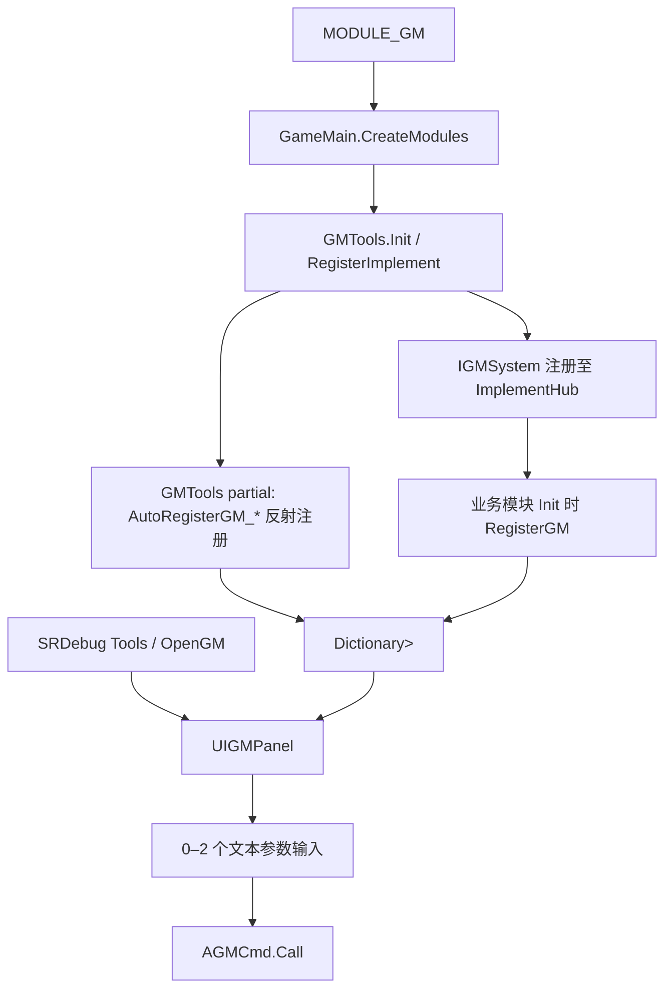

# TileScape GM 工具注册与扩展链路

> 用于定位 GM 面板、新增调试工具和排查命令未出现的问题。本文只确认静态代码事实；Unity 面板表现、编译符号在各构建渠道的最终结果、异步工具的真机行为均未验证。

## 状态与范围

| 分类 | 结论 |
|---|---|
| 已确认 | GM 主体和面板代码受 `MODULE_GM` 包裹；`ProjectSettings/ProjectSettings.asset` 的 Android、Standalone、iPhone 当前均配置该符号。 |
| 已确认 | `GameMain.CreateModules` 最先加入 `Module.GM.GMTools`，之后才加入业务模块；注释说明此顺序用于保证业务模块注册时可取得 `IGMSystem`。 |
| 已确认 | 现有命令均为进程内调试入口，注册后只保存在 `GMTools` 内存字典；无远程 GM、持久化命令表或权限系统。 |
| 待验证 | 各目标构建实际是否保留 `MODULE_GM`，以及 SRDebug 菜单是否能稳定打开面板。 |

## 已确认主链路

### 入口与职责

| 环节 | 位置 | 职责 |
|---|---|---|
| 组合根 | `Assets/Scripts/GameMain.cs` | `MODULE_GM` 下最先构造 `GMTools`。 |
| 公共契约 | `Packages/BettaInterface/GM/IGMSystem.cs` | 开面板，以及 0、1、2 参数的 `RegisterGM` 重载。 |
| 注册中心 | `Assets/Module/GM/Scripts/Logic/GMTools.cs` | 初始化、`IGMSystem` 注册、命令缓存、同 Tab 同标题替换、打开面板。 |
| GM 内置工具 | `Assets/Module/GM/Scripts/Logic/GMTools.*.cs` | 通过 `AutoRegisterGM_` 前缀反射发现；覆盖 Common、SDK、Notice、DLC、Adaptive UI 与账号绑定。 |
| 外部业务工具 | 各业务模块的 `Init` 或明确注册方法 | 通过 `IGMSystem` 直接注册，GM 模块不反向依赖业务实现。 |
| 展示与执行 | `Assets/Module/GM/Scripts/UI/UIGMPanel.cs`、`CellGMContent.cs`、`CellGMInputParameter.cs` | 读取缓存创建 Tab/按钮/输入框，收集参数后直接调用命令。 |
| 打开入口 | `Assets/Module/GM/Scripts/Logic/GMTools.SRDebug.cs` | `MODULE_SRDEBUG` 下将 `OpenGM` 加入 SRDebug 的 Tools 分类。 |

## 当前注册位置

| 域 / Tab | 主要注册位置 | 典型用途 |
|---|---|---|
| `Common` | `GMTools.Common.cs`、`AudioModule.cs`、`PlayerInfoModule.GM.cs`、`ItemSystem.GM.cs` | 时间、缓存、音频、玩家资料、道具等通用调试。Item 额外要求 `(DEBUG || DEVELOPMENT_BUILD) && MODULE_GM`。 |
| `Tile` | `Game/TileV2/Scripts/Entry/TileMatch.GM.cs` | 回放、关卡/无尽进度、统计、成就、断线点及 Tile 教程。 |
| `AD` / `Purchase` / `Reward` | `AdModule.GMTools.cs`、`Purchase/GMTools.Purchase.cs`、`Reward/GM/RewardGMRegister.cs` | 广告策略与展示、购买测试、奖励展示/发放。 |
| `Activity` / `Tutorial` / `UserLayer` | `ActivityModule.GM.cs`、`TutorialModule.cs`、`UserLayerSystem.GM.cs` | 活动购买记录、引导状态、分层调试属性。 |
| `SDK` / `Notice` / `DLC` | `GMTools.SDK.cs`、`GMTools.Notice.cs`、`GMTools.DownloadableContent.cs`、`Notification/GMTools_Notification.cs` | SDK、通知弹窗、本地通知、下载与删除 Package。 |
| `Mail` / `ConfigOverride` | `MailModule.cs`、`ConfigOverrideSystem.cs` | 本地/服务器邮件与配置重载重启。 |

### `Tile`：切换屏蔽关卡动更

- **定义与实际引用**：`Assets/Game/TileV2/Scripts/Entry/TileMatch.GM.cs` 注册命令，并通过公开的 `DynamicLevelConfigManager.ToggleDynamicLevelConfigForDebug()` 跨程序集调用；内部状态仍由 `Assets/Game/TileV2/Scripts/DynamicLevelConfig/DynamicLevelConfigUtils.cs` 持久化并读取。
- **作用与触发条件**：点击后翻转并立即保存本机 `PlayerPrefs` 键 `TileV2.DisableDynamicLevelConfig`。开关开启后，`UseDynamicLevelConfig()` 在读取 FeatureSettings 配置前返回 `false`。
- **实际效果**：下一次新建关卡配置加载时，`DynamicLevelConfigManager` 跳过动态缓存读取，`LevelConfigLoader` 取得空动态 JSON 后立即回退本地 `Config/LevelConfig/*.json`；当前局不会中途替换配置，不需为该加载分支专门重启。
- **边界**：状态只在 `MODULE_GM` 编译下存在，非 GM 构建仍只受 `dynamiclevelcfg.bytes` 的正式配置控制。当前命令不删除已下载缓存，也不隔离已在途的 manifest 回调；关闭即取消请求并清缓存仍是待实施修正。详见 [[02-PROJECTS/TileScape/GM工具/工具-屏蔽关卡动更开关|屏蔽关卡动更开关]]。

## 当前数据与执行语义

- `GMTools.AddCmd` 以 `Tab + Title` 定位命令；同名命令会静默删除旧项并替换，新项附加在该 Tab 的末尾。
- 面板 Tab 按名称排序，但 `Tile` 会被固定移到最前；色彩规则也在 `UIGMPanel.GetTabColors` 按 Tab 名硬编码，未知 Tab 使用默认蓝色。
- `IGMSystem` 只公开 0、1、2 参数注册。参数元数据是 `Type + Desc + DefaultValue`，输入 UI 支持字符串和基础整数/浮点类型。
- 面板在 `OnOpen` 时根据当前字典创建 Tab 与命令 cell；本次打开后新增的 Tab/命令不会自动刷新到已打开面板。
- 执行时 UI 把字符串转为对象后直接调用 `AGMCmd.Call`；GM 核心不提供统一的校验结果、命令异常隔离、执行日志或命令权限语义。

## 静态审计注意事项

| 项目 | 证据 | 状态 / 影响 |
|---|---|---|
| 参数数量上限 | `IGMSystem` 与 `GMCmd` 只有 0/1/2 参数重载 | 已确认；第 3 个及之后的业务参数只能自行拼接/解析字符串。 |
| 解析失败语义 | `CellGMInputParameter.GetValue` 记录日志后返回数值 `0` | 已确认；调用者无法区分“用户输入 0”和“解析失败”。对于 `uint`/`ulong` 的失败分支返回的是装箱 `int` 零，而 `GMCmd<T>.Call` 进行 `(T)args[0]` 强转；传入这两种命令时会触发类型转换异常。 |
| 命令身份 | 去重仅用展示标题 | 已确认；标题改名会形成新命令，同 Tab 同标题会覆盖，均没有诊断日志。 |
| 生命周期 | 注册中心没有命令注销/owner 概念 | 已确认；当前应用模块启动后长期存在可正常工作。若未来出现运行时装卸模块或短生命周期工具，需要先补注册释放协议，避免委托保留已释放对象。 |
| UI 监听清理 | `UIGMPanel.OnClose` 仅移除时间按钮监听 | 静态风险，尚未运行验证；应在复用窗口时检查关闭/调用按钮是否重复订阅。 |

## 后续新增工具的建议（未实施）

### 最小新增规范

1. 工具代码放在业务 owner 内，沿用 `#if MODULE_GM`；不要让 `GMTools` 反向引用 Tile、Activity、广告或商城实现。
2. 复用已有 Tab；确有独立领域时新增 Tab，并接受默认色，除非产品/测试明确要求专属视觉。
3. 标题仅作展示；新增命令应预留稳定逻辑 ID，例如 `tile.debug.set-level`，不要把标题作为长期身份。
4. 任何修改 Profile、进度、配置、下载文件、购买或外部 SDK 状态的工具，必须在标题/描述中说明副作用，并在执行端做业务校验与日志。
5. 多参数或复合输入优先由业务工具自身明确解析并输出错误；在 GM 核心完成统一参数模型前，不要继续添加更多泛型重载。`切换屏蔽关卡动更` 是无参数、明确副作用的参考实现；当前局不变、下次进关生效。

### 推荐演进顺序

1. 新增 `GMCommandDefinition`（稳定 ID、Tab 元数据、标题、危险样式、任意参数列表）和统一 `TryInvoke` 结果；旧 `RegisterGM` 保留为兼容包装，不批量迁移现有工具。
2. 将参数解析从 `CellGMInputParameter` 收敛到注册中心，返回“成功 / 字段错误 / 执行异常”的可展示结果；先覆盖基础数值与字符串，复合参数仍由工具侧解析。
3. UI 改为读取 Tab/命令描述数据：Tab 顺序和主题不再写死在 `UIGMPanel`，错误结果在当前面板显示。
4. 仅当出现真正的动态装卸模块时，再增加带 `Dispose` 的注册句柄；当前没有证据要求提前实现插件扫描或权限体系。

## 最小验证路径

- EditMode：覆盖 0、1、2、3 参数命令；无效 `int`/`uint`/`ulong` 输入；同 ID、同标题和跨 Tab 命令；危险样式；执行异常。
- Unity PlayMode：打开 SRDebug → GM 面板，切换 Tab、输入参数、自动关闭命令和重复开关面板。
- 业务冒烟：分别选一个只读工具、Profile 修改工具、异步 DLC/通知工具，确认日志、状态变化和错误反馈一致。

## 关联

- [[02-PROJECTS/TileScape/_MOC|TileScape 知识库 MOC]]
- [[02-PROJECTS/TileScape/代码框架/代码框架总览|TileScape 代码框架总览]]
- [[02-PROJECTS/TileScape/参考/快速定位与资源替换索引|TileScape 快速定位与资源替换索引]]
- `Assets/Module/GM/Scripts/Logic/GMTools.cs`
- `Packages/BettaInterface/GM/IGMSystem.cs`
