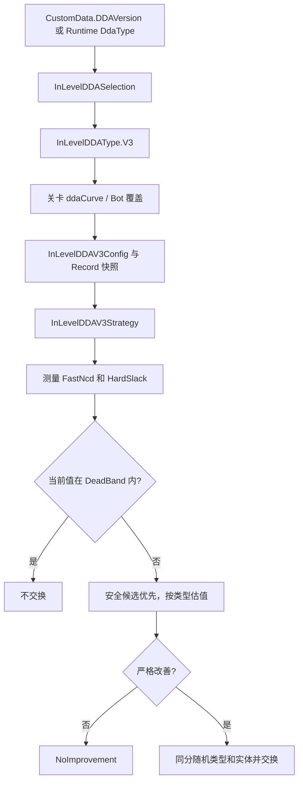

# DDAV3 旧文档与 dev 实现核对

## 范围

本次以 `dev@842093623` 为现行基准，逐段核对三份旧材料：9 月 11 日首版评估、9 月 13 日反例矩阵和持续研究主档。旧材料没有删除，均保留来源版本和推导过程；本文只决定它们能否继续用于判断当前实现。

## 结论总表

| 主题 | 旧版状态 | 当前 dev 状态 | 文档处理 |
|---|---|---|---|
| 实现入口 | V2 命名空间内 Slack 开关 | 独立 `InLevelDDAType.V3` / `InLevelDDAV3Strategy` | 首版评估标为历史。 |
| 曲线 | 写死三档曲线 | `ddaCurve → ddav3basecurve`，Bot 可覆盖，Curve0 兜底 | 旧曲线表失效。 |
| 无路线 | `HardSlack=-2` 截断 | 无路线为 null | 所有 `-2` 反例须重算。 |
| OverBar | 不参与 FastNcd | 按列前缀成本参与路线 | M07 失效，转为回归测试。 |
| 共享遮挡 | 可能重复计费 | 已用共享路径合并 | M05 从缺陷假设降为回归点。 |
| 不换牌 | 只在死区退出 | 非严格改善返回 `NoImprovement` | D01–D03 已修复为不交换。 |
| 安全候选 | V2 下限和 fallback 标记 | 安全候选优先；无安全解可 `UnsafeFallback` | 风险仍在，需统计比例与结果。 |
| 回放 | 无 Slack 参数冻结 | `DDAV3RecordConfig` 保存完整运行参数 | 从架构缺口转为运行验证项。 |
| 候选粒度 | 同类型算一次，实体随机 | 仍按类型计算，实体随机 | M10 仍是现行风险。 |
| 多目标 | 顺序贪心 | 仍逐个目标重算 | D09 仍是现行边界。 |

## 当前调用与策略链

## 仍需验证的现行问题

1. `UnsafeFallback` 是否在真实关卡中出现，以及是否真正改善后续可消除机会。
2. 同花色候选的不同遮挡/序列拓扑是否会因“按类型估值、按实体随机”产生明显分叉。
3. 多个揭牌目标的顺序贪心是否显著偏离批次内更优的组合。
4. `ddav3basecurve` 的导表、运行时版本选择和录像重连是否与源码快照一致。
5. 全局压力快照与候选评估在真实牌量下的 P50/P95 耗时和分配量。

## 文档路由

- 现行策略：[[02-PROJECTS/TileScape/游戏逻辑/更新-DDAV3-dev逻辑与策略评估-2026-09-20|dev 逻辑与策略评估]]
- 持续任务：[[02-PROJECTS/TileScape/游戏逻辑/任务-DDAV3逻辑策略持续研究|DDAV3 持续研究主档]]
- 历史首版：[[02-PROJECTS/TileScape/游戏逻辑/评估-DDAV3逻辑与实现策略-2026-09-11|9 月 11 日评估]]
- 历史反例：[[02-PROJECTS/TileScape/游戏逻辑/分析-DDAV3场景反例与迭代选项-2026-09-13|9 月 13 日反例矩阵]]
