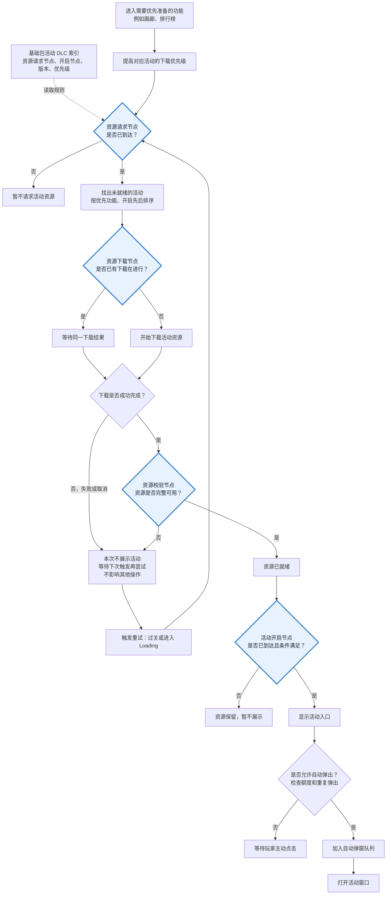

# Activity DLC 扩展框架

> **状态**：设计讨论稿。本文记录当前已达成的内容与待落地项；尚未包含代码、资源配置、构建或设备验证结论。

## 目录

- [1. 设计目标与分包](#1-设计目标与分包)
- [2. 活动索引与资源控制](#2-活动索引与资源控制)
- [3. 完整内容包与版本切换](#3-完整内容包与版本切换)
- [4. 活动展示与入口](#4-活动展示与入口)
- [5. 职责、落地与验收](#5-职责落地与验收)

## 1. 设计目标与分包

每个活动由配置选择投递形态：基础包完整活动、DLC 完整活动，或“基础包界面外壳 + DLC 内容”。

### 基础规则

- 基础包可持有从资源请求、下载调度、资源校验到活动展示的完整控制链及其触发规则。
- DLC 当前用于拉取未开启活动的活动内容与资源；活动内容未就绪时暂不显示正式活动窗口。
- 内容完成加载并通过校验后，再允许活动创建入口、打开窗口和参加受上限保护的自动弹窗。
- 大部分未开启活动暂按**非必要资源**讨论：下载失败、取消或长期不可用时，不影响关卡、首页、商店或其他基础功能；预期降级结果是该活动暂不创建入口、不显示正式窗口，后续可再次尝试下载。
- 进行中的活动可按索引选择是否属于 **Loading 必要资源**：默认不纳入；仅配置为 `true` 的活动才要求在 Loading 阶段完成下载与校验，避免必要资源集合持续膨胀。
- 当前 DLC 主要负责活动内容的拉取、校验完成后的可用性，以及活动的开启展示；版本内更改配置、替换资源等仍由热更功能负责。

### 分包形态

> **基础包职责**：整体固定包含 DLC 索引、活动通用框架，以及被选择为基础包完整活动的少部分活动内容；同时持有所有节点的触发时机和功能规则。DLC 不参与决定何时下载、何时校验或何时显示。

| 投递形态 | 基础包 | DLC | 适用说明 |
|---|---|---|---|
| `EmbeddedFull` | 活动完整流程、完整配置、全部资源 | 无 | 用于需要随包可用的少部分活动；礼包、画廊/排行榜等常驻活动是当前例子，不是框架固定白名单。 |
| `DlcFull` | 活动索引、通用框架、开启/请求判断与配置规则 | 该活动当前版本的完整活动内容与资源 | 常规未开启活动。 |
| `EmbeddedShellDlcContent` | 主界面外壳、通用导航/入口与配置规则 | 活动内容、主题资源 | 用于排行榜等需要基础包保留主界面结构的活动。 |

活动专属的可执行代码如何随版本交付，取决于项目既有程序集/热更新能力；本框架只定义活动配置与资源的 DLC 边界，不能默认 DLC 可以动态提供新的 C# 类型。

## 2. 活动索引与资源控制

### 基础包控制节点

> **控制原则**：将“资源请求、下载、校验、正式开启”拆为基础包控制链，不由 DLC 内配置决定下载与展示时机。

| 节点 | 基础包职责与触发时机 | 功能规则 | 玩家可见结果 |
|---|---|---|---|
| 资源请求节点 | `resourceRequestNode` 满足时 | 根据索引计算 `packageId`、内容版本与默认优先级，创建下载请求。 | 不显示正式活动窗口，也不占自动弹窗额度。 |
| 资源下载节点 | 请求已创建，或玩家进入配置的优先功能时 | 基础包下载协调器决定后台/前台优先级、同包去重、确认、进度、取消与重试。仅“进行中且配置为 Loading 必要”的活动在 Loading 阶段进入必要资源集合。 | 常规活动下载不阻塞基础操作；被配置为必要资源的进行中活动未 Ready 时按 Loading 门禁处理。 |
| 资源校验节点 | 下载完成、已有本地缓存、应用恢复或版本切换时 | 基础包调用系统校验，并仅以 `CanUsePackageAssets(packageId)` 为 Ready 依据。 | 未通过校验等同未就绪：不显示活动入口或正式窗口。 |
| 活动开启节点 | `activityOpenNode` 满足时 | 基础包同时检查活动生命周期、活动条件和已校验的 Ready 状态。 | 全部满足后才显示入口/窗口，并参加弹窗上限保护。 |

资源请求与活动开启节点可暂时以关卡为表达方式，但模型应保留节点类型，以便后续扩展为时间、用户分层、活动期、服务器开关或其他条件。

`resourceRequestNode` 必须不晚于 `activityOpenNode`；相等时允许，但失去预下载缓冲。资源下载与资源校验是基础包运行时规则，不应由每个活动 DLC 自行实现。

### 基础包活动索引

> **索引边界**：下载与展示所需的最小信息、活动配置规则及其热更新仍由基础包/既有配置链路负责；DLC 不用于修改这些配置。

建议将以下轻量索引随基础包或可在启动阶段安全读取的远端配置发布：

| 字段 | 含义 |
|---|---|
| `activityName` | 对应活动唯一名称。 |
| `deliveryMode` | 三种投递形态之一。 |
| `contentVersion` | 当前要使用的活动内容版本。 |
| `packageId` | 当前内容包标识；`EmbeddedFull` 可为空。 |
| `resourceRequestNode` | 达到后允许基础包创建资源请求。 |
| `activityOpenNode` | 达到后允许正式展示活动。 |
| `downloadPriority` | 默认请求优先级，以及玩家处于指定基础功能时的优先级规则。 |
| `priorityFunction` | 需要优先准备内容的基础功能标识，例如画廊、排行榜；可为空。 |
| `autoPopupEnabled` | 该活动是否可参加自动弹窗。 |
| `previewEnabled` | 是否支持活动预告 Icon；默认 `false`。 |
| `previewHint` | 初版为预告 Icon 点击后的提示规则，例如“第 N 关开启”；关卡型活动可由 `activityOpenNode` 生成。 |
| `displayOrder` | 活动在主界面入口列表中的固定排序；预告与正式入口共用。 |
| `loadingRequiredWhenActive` | 可选。活动进行中时，是否将当前内容包列入 Loading 必要资源；默认 `false`。由活动配置决定，不以活动是否进行中自动推导。 |

索引只描述 DLC 内容的拉取与开启，不复制奖励、排行榜、活动规则等完整业务配置；这些配置仍属于既有配置/热更新边界。

#### 资源请求节点：默认顺序与重试

1. 基础包收集所有已达到 `resourceRequestNode`、但尚未通过资源校验的活动内容包。
2. 默认按活动即将开启的先后顺序下载：优先使用较小的 `activityOpenNode`；如未配置则使用较小的 `resourceRequestNode`；仍相同则以稳定的活动标识作为兜底，保证排序可复现。
3. 玩家进入画廊、排行榜等 `priorityFunction` 指定的基础功能时，对应内容包可临时提升优先级；该提升只影响当前调度顺序，不改变默认顺序。
4. 请求下载失败、取消或校验未通过时，不阻塞当前操作，也不展示正式活动窗口；该 Package 保持“待重试”。
5. 每次**后续关卡完成**和每次**后续 Loading** 都重新触发上述收集与排序，并对待重试 Package 再次请求下载，直到下载完成且通过校验。
6. 同一个 Package 已在下载时复用现有会话；同一次触发不重复创建并行请求。活动版本切换后，仅当前版本仍可进入队列。

> **重试边界**：“每关 / 每次 Loading 重试”是业务事件触发重试，不是循环轮询；没有新的过关或 Loading 事件时不反复发起请求。

### 活动预告（初版）

活动预告不是独立的固定关卡节点，而是“当前版本内容已经 Ready、正式活动尚未开启”时的动态入口状态。初版仅提供一个主界面 Icon；点击后飘字提示开启关卡，不打开预告页、正式活动窗口或奖励内容。

#### 预告展示资格

预告 Icon 仅在以下条件同时满足时出现：

1. 已达到 `resourceRequestNode`。
2. 当前 `activityName + contentVersion` 已下载并通过资源校验。
3. 尚未达到 `activityOpenNode`。
4. 活动仍处于可预告生命周期，未取消、结束或被新版替换。
5. `previewEnabled = true`。

资源 Ready 的时刻就是预告入口可出现的时刻。未 Ready 时，即使已达到资源请求节点，也不显示预告 Icon；若资源完成时正式活动已经开启，则跳过预告，直接按正式活动入口处理。

#### 与既有规则的边界

- 预告不新增资源请求或优先级规则：下载仍从 `resourceRequestNode` 开始，仍使用默认排序、`priorityFunction` 提权与每关 / Loading 重试。
- 预告 Icon 不触发前台下载；它只会在资源 Ready 后出现。
- 预告不进入自动弹窗队列，不消耗自动弹窗额度，也不允许打开正式活动内容。
- 预告不改变 `loadingRequiredWhenActive`：尚未正式开启的活动不会因为预告而进入 Loading 必要资源集合。
- 预告与正式活动共用同一个 `displayOrder` 和入口位置。预告首次出现时按主界面入口插入规则排版；正式开启时原地切换为正式入口，不再次插入、不再次挤动其他 Icon。
- 版本切换、活动取消或结束后，旧版本预告资格立即失效；完成回调必须核验活动名、内容版本和生命周期。

> **初版文案边界**：当前只定义“第 N 关开启”。当 `activityOpenNode` 未来支持时间、用户分层等非关卡条件时，预告提示需由 `previewHint` 提供明确文案，不能强行沿用关卡表达。

### 可配置的进行中活动 Loading 门禁

不是所有进行中活动都必须阻塞 Loading。进入 Loading 时，基础包识别当前仍在进行的活动，并只将 `loadingRequiredWhenActive = true` 的当前内容包加入必要资源集合；这些包完成下载和校验前，Loading 不进入主场景。

- 该开关默认关闭。活动“正在进行”本身不自动开启门禁；由每个活动的配置决定是否要求进入主场景前已具备完整内容。
- 进行中但未开启该开关的活动，仍按普通 DLC 在进入主场景后请求、下载和校验；未 Ready 期间允许暂不显示其入口或正式窗口。
- Loading 必要资源的收集只读取已安全可用的活动状态和索引配置，并提交 Package ID；不在该阶段加载活动资源、创建 UI 或改变活动状态。
- 被列入必要资源的活动若下载或校验失败，沿用应用 Loading 的失败、重试或退出策略；不能以未校验内容进入主场景。

未开启活动不进入该集合，仍在进入主场景后按默认顺序后台准备。

## 3. 完整内容包与版本切换

每个活动版本都上传一个新的、完整的 DLC 内容包。新包可以包含与旧版本相同的资源，但这些资源仍作为新完整包的一部分重新上传和校验；当前不依赖旧包与新包之间的资源复用或差异补丁。

> **版本边界**：DLC 内容包只服务于活动内容的拉取和开启，不作为修改活动配置、替换业务规则或执行其他热更新的载体。

```text
基础包索引指向：活动 A / 内容版本 V1 / 完整内容包 V1
                             │
                 基础包下载并校验 Ready
                             │
                   才允许开启 V1 活动内容

迭代后：基础包索引指向 活动 A / 内容版本 V2 / 完整内容包 V2
                             │
                 基础包下载并校验 V2 Ready
                             │
                   开启 V2 活动内容；V2 可包含旧资源副本
```

每版是否使用新的 `packageId`，或沿用稳定 ID 但由内容清单标识新版本，仍需与发布系统确认。

无论 ID 策略如何，每次发布均提供完整内容包。旧内容在新包 Ready 前的保留和可见界面收尾策略，也需在实现阶段明确。

## 4. 活动展示与入口

### 运行时展示门禁

```text
达到资源请求节点
    → 基础包创建请求并调度下载（通常为后台）
    → 基础包校验内容是否 Ready
    → 未 Ready：不显示正式窗口

玩家进入画廊、排行榜等配置的基础功能
    → 对应活动内容包提升为前台优先下载
    → 失败只保留基础功能，不阻塞其他操作

达到活动开启节点
    → 内容 Ready？
        ├─ 否：不创建入口、不进入自动弹窗；主动进入时可前台下载
        └─ 是：创建入口，并由统一弹窗队列决定是否自动展示
```

实际资源加载前必须以 `CanUsePackageAssets(packageId)` 或等价 Ready 判定为准，不能以“已经发起下载”“下载进度到 100%”替代。



| 场景 | 处理 |
|---|---|
| 后台下载成功 | 仅刷新活动可展示资格；不直接强制打开窗口。 |
| 玩家进入配置了优先下载的基础功能 | 例如画廊、排行榜：提升对应内容包下载优先级；基础功能外壳保持可用。 |
| 玩家主动请求未 Ready 内容 | 高优先级 Ensure，提供大小确认、进度、取消和失败重试；只在 Ready 后打开正式内容。 |
| 拒绝、取消、断网、校验失败 | 不创建正式窗口、不记录已弹窗、不阻塞任何后续基础操作；保留重试机会。 |
| 重复请求同一活动 | 复用底层同 Package 下载会话，不重复下载或累计进度。 |
| 下载或校验失败后的后续关卡/Loading | 按默认顺序重新收集待重试内容包并再次请求，直到校验通过；不做帧级轮询。 |
| 版本切换、账号切换、模块销毁 | 取消等待；完成回调必须核验活动名、内容版本和生命周期，丢弃过期结果。 |

### 自动弹窗保护

自动弹窗的前置条件为：活动自身可弹窗、达到 `activityOpenNode`、内容 Ready、且尚未超过统一上限。

- 未 Ready 的活动不注册正式自动弹窗 FlowItem，不展示空窗口。
- 统一队列控制单次回到主页的自动活动弹窗数上限。
- 同一 `activityName + contentVersion` 在一个会话内最多自动弹一次。
- 下载完成只使活动“具备候选资格”；由下一次 Flow 调度决定是否展示，不抢占当前正在展示的窗口。
- 玩家主动进入与自动弹窗分开计数；前者不应消耗自动弹窗额度。

### 主界面活动入口插入

活动内容在主界面下载并校验成功后，入口按活动配置的固定顺序插入现有入口列表。若新入口的排序位于两个已显示图标之间：

1. 排在新入口之后的已有图标整体向下移动，为新入口腾出位置。
2. 新入口在目标位置以“闪出”表现出现。
3. 入口出现动画不等同于自动弹窗，是否弹窗仍单独受弹窗上限保护。

多个活动在同一时机就绪时，应先按最终顺序统一重新排版，再分别播放新入口的出现表现，避免图标逐个挤动或顺序跳变。

### 特殊活动：排行榜

排行榜可选择 `EmbeddedShellDlcContent`：例如到 N 关后，基础包具备画廊/排行榜主界面外壳、导航、入口及配置规则；实际排行榜内容和主题资源由 DLC 提供。玩家处于该基础功能时，索引可将对应内容包提升为优先下载。

仍遵循同一展示规则：内容未 Ready 时不打开“内容为空”的正式排行榜窗口。若产品需要让玩家立即看到状态，可打开明确的下载提示页或在已有基础页面中显示下载状态；它不等同于正式活动窗口，也不参与活动自动弹窗。

## 5. 职责、落地与验收

### 职责划分

| 组件 | 责任 |
|---|---|
| 活动 DLC 索引 | 给出投递形态、版本、内容包、资源请求节点、开启节点和优先级规则。 |
| `ActivityModule` | 在活动时序中计算节点资格，刷新活动能力。 |
| `ActivityDlcCoordinator`（建议新增） | 基础包的下载/校验协调器：解析索引、发起后台/前台请求、去重、取消、版本代次校验，并提供 Ready 查询。 |
| 具体活动 | 继续处理活动生命周期、规则与 Profile；不得自行拼接 Package ID 或保存临时下载状态。 |
| Entry / FlowItem / Panel | 仅在协调器确认可展示后创建、执行或加载资源。 |
| 现有 DLC 服务 | 提供 Ensure、状态、进度、重试和底层下载会话复用。 |

### 落地顺序

1. 先确定索引表及三个投递形态；活动名单仍可为空或逐项选择，不随框架固定。
2. 实现基础包内的活动 DLC 索引解析和 `ActivityDlcCoordinator`，先覆盖“请求节点 → 下载调度 → 资源校验 → Ready 查询”的无 UI 链路。
3. 在入口、自动弹窗和所有资源加载点接入同一个 Ready 门禁及弹窗上限。
4. 选一个尚未确定为基础包的活动作试点，验证完整版本包、版本切换和设备下载闭环。
5. 再根据包体、活动节奏和资源依赖逐个决定活动的投递形态；排行榜按外壳/内容分离接入。

### 验收规则

- [ ] 活动的基础包/DLC 归属由索引配置决定，框架没有固定活动名单。
- [ ] 每次活动版本发布均提供新的完整内容包；即使含旧资源，也随新包重新上传和校验。
- [ ] DLC 只用于活动内容拉取与开启，不承担活动配置修改或热更新。
- [ ] 请求节点与开启节点可独立配置，且请求不会导致正式活动窗口出现。
- [ ] 资源请求、下载调度、资源校验和展示判断均由基础包执行，DLC 不持有这些控制规则。
- [ ] 大部分活动下载失败时，只隐藏该活动入口/窗口，不阻塞任何其他操作。
- [ ] 预告 Icon 只在当前版本内容 Ready、正式活动未开启且预告配置开启时出现；正式开启后原地切换为正式入口，不参与自动弹窗。
- [ ] 仅配置了 `loadingRequiredWhenActive` 的进行中活动进入 Loading 必要资源集合；默认关闭，防止因活动数量增加而扩大启动阻塞范围。
- [ ] 画廊、排行榜等基础功能可通过索引提升对应内容包的下载优先级，且外壳始终可用。
- [ ] 内容未 Ready 时，入口、自动窗口和实际资源加载均被阻止。
- [ ] 内容 Ready 后才允许活动窗口出现；自动弹窗遵守全局上限和活动版本去重。
- [ ] 排行榜主界面外壳可在基础包，但其 DLC 内容未 Ready 时不会显示空的正式活动界面。

## 关联

- `Doc/DownloadableContentUsageGuide.md` — Downloadable Content 使用与发布契约。
- `Assets/Module/DownloadableContent/DownloadableContentModule.cs` — 统一 DLC 服务。
- `Assets/Module/Activity/Core/ActivityModule.cs` — 活动初始化和时序入口。
- `Docs/Knowledge/TaskIndex.md` — 项目方案索引。
