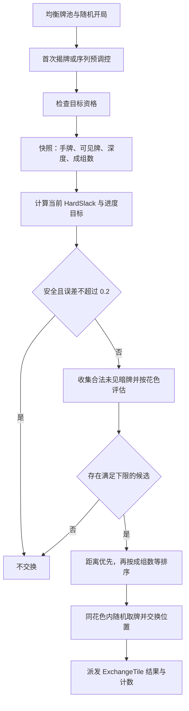

# DDAV3 逻辑与实现策略评估

> [!note] 后续版本与持续研究
> 本文正文绑定 9be729cb3。后续 cd3aea166 已将深度3可见不可点牌成本由2改为3；当前增量、六个目标及续跑断点见 [[02-PROJECTS/TileScape/游戏逻辑/任务-DDAV3逻辑策略持续研究|DDAV3 持续研究主档]]。旧公式仅适用于原基线。

## 1. 结论与适用边界

**V3 值得继续验证：它把局内调控改成了“观察当前局面 → 与目标曲线比较 → 选择换牌”的反馈控制，目标与结果比纯概率策略更容易解释。但当前实现尚不能作为可靠的难度或胜负控制器。优先补决策正确性与记录版本，再讨论曲线优劣。**

本次评估对象为 `DDA-V3-Test @ 9be729cb3` 的当前源码，重点是 `InLevelDDAV2SlackController` 及开局、揭牌、交换、回放调用链。V3 仍复用 V2 枚举、类名及记录入口。源码将其标为临时代码配置验证版。

| 评估项 | 判断 | 依据边界 |
|---|---|---|
| 调控方向 | 合理，可保留 | 目标曲线和局面指标形成反馈；属于设计判断 |
| 难度指标 | 可作局部压力代理，不能代表整局可解性 | 静态确认只估算下一组，不搜索路径 |
| 曲线策略 | 可表达松紧节奏，效果未证实 | 参数已确认，玩家体感、胜率未测 |
| 候选决策 | 存在需要修正的正确性缺口 | 没有“不换牌”基准；步长仅记日志 |
| 安全保护 | 候选指标下限已实现，保命不成立 | 估算误差、无合法候选、触发机会不足均可能限制调控 |
| 配置与回放 | 当前验证版可理解，正式复现存在缺口 | 没有 Slack 算法版本和参数快照 |
| 性能 | 有复用和按花色降维，但缺测量 | 深度计算与真实交换存在额外分配；未做 Profiler |

**本次只产出文档，没有修改业务代码，没有运行 Unity、自动化牌局或真机测试。** “已确认”指源码行为；“静态推演”指按实现得到的反例；“待验证”不代表已发生线上问题。未获取在线配置及实验分流结果，因此不推断所有玩家均启用 V3。

## 2. 当前逻辑：从开局到换牌

### 2.1 版本和难度入口

普通玩法读取运行配置 `DdaType`；Trial 指定 V2；Bot 读取自定义版本。V2 策略内 `EnableSlackController=true` 时使用 Slack，false 时回退旧阶段概率逻辑。[S1][S2]

`LevelDiff` 通常由关卡 `defaultDiff + dataBridge.LevelRegulationHard` 得到，新开局可被 GM 覆盖，再按难度表最大 rank 限制范围。Slack 将结果映射为三个档位：1–3 Easy、4–6 Normal、7 及以上 Hard。[S3]

因此，关外难度依然可以通过跨档位影响曲线；同一档内的相邻 rank 对 Slack 曲线没有区别。不能把它理解成 V3 完全不受关外策略影响，也不能把难度标签 `LevelHard` 直接当作曲线档位。

### 2.2 开局花色

`AssignTileTypeByDepthStrategy` 保留名字，但已取消按深度藏色。[S4]

1. 统计普通随机牌与随机序列牌。
2. 普通关使用关卡花色列表，并保留 `v2ElementAjust` 裁减。
3. 每种花色三张循环生成尽量均衡的牌池；Bonus 使用独立配置数量规则。
4. 统一洗牌后写回随机槽位，保留序列花色去重约束。

这使开局分布与局内反馈职责更清楚。但均衡花色数量不等于棋盘可解；序列约束修正也意味着不能把最终全部槽位简单称为无条件独立随机。

### 2.3 调控时机与执行顺序

未见牌第一次从 NotVisible 变为玩家可见的 Visible / Highlight 时收集调控目标；另有序列牌弹出前预调控。目标锁定、将销毁等条件会被拦截；普通入口另要求运行时深度不超过 3。[S5][S6]

Board 的无序集合入口先按 Tile ID 排序，逐个目标执行。每次真实交换后，后续目标重新计算局面，因此它是顺序贪心决策，不是一次为整批揭牌寻找全局最佳组合。[S6]



## 3. 难度指标和目标曲线

### 3.1 HardSlack 的实际含义

记空槽为 F，某花色凑成下一组的估算成本为 C：

```text
F = max(0, Bar.CurrentCapacity - Bar.UnmatchedCount)
need = MatchCount - (手牌该花色数 % MatchCount)
C = 使用的高亮可点牌数 × 1 + 使用的其他可见牌数 × 2
rawFastNCD = 所有数量足够的花色中最小的 C
FastNCD = min(rawFastNCD, F + 2)；无可行花色时取 F + 2
HardSlack = max(-2, F - FastNCD)
```

每种花色优先消耗高亮可点数量，再补其他可见数量。棋盘资源必须对玩家可见且运行时深度在 1–3；普通锁定牌可能仍作为不可点的可见资源参与估算，销毁锁与销毁状态排除。弃牌区不进入 FastNCD。Candy 排除，多数 Blocker 排除，Rocket 例外。[S7]

例如：F=3，手里有两张 A，还有一张高亮可点 A，则下一组成本为 1，HardSlack=2。如果缺的一张 A 只能作为普通可见牌计入，则估算成本为 2，HardSlack=1。

### 3.2 感知余量和直接成组数

```text
正确选项 = 属于最低估算成本花色的高亮可点牌数量
辨识惩罚 = 2 × (1 - 正确选项 / 可点选项)
PerceivedSlack = HardSlack - 辨识惩罚
```

没有可点选项时惩罚为 0。“正确”只是在该成本模型内最优，不是完整牌局的正确解。

**PerceivedSlack 目前只用于显示和日志，不参与候选排序。** 直接成组数则参与同距离候选排序：把高亮可点牌、手牌和弃牌区按花色合计，再分别除以 MatchCount 取整。它也只是数量意义上的成组数，不包含弃牌取回成本或完整动作模拟。[S7][S9]

### 3.3 当前曲线参数

进度 `p=clamp01(1-当前Board牌数/初始Board牌数)`。牌离开 Board 就推进进度，并不要求已匹配消除；若玩法增加或返还 Board 牌，公式本身也不保证单调。[S8]

| p | 0% | 15% | 30% | 45% | 60% | 75% | 90% | 100% |
|---|---:|---:|---:|---:|---:|---:|---:|---:|
| Easy | 3 | 0 | 3 | 0 | 3 | 0 | 3 | 0 |
| Normal | 2 | 0 | 1 | 0 | 1 | 0 | 1 | 0 |
| Hard | 4 | 3 | 0 | 0 | 2 | 3 | 0 | 0 |

相邻点线性插值。参数以当前数组为准，部分注释仍描述旧值。

| 配置 | 当前值 | 实际作用 |
|---|---:|---|
| EnableSlackController | true | V2 入口启用 Slack |
| DEAD_BAND | 0.2 | 已安全且误差在范围内时不交换 |
| MAX_SLACK_DELTA | 10 | 只参与 UsedFallback 判定 |
| EMERGENCY_MAX_SLACK_DELTA | 5 | 只参与 UsedFallback 判定；并非注释所称更大步长 |
| HARD_SLACK_FLOOR | -2 | 指标截断下限 |
| MAX_DIRECT_MATCH_GROUP_COUNT | 1 | 同距离候选偏好 1 组，不是硬上限 |
| ForcePlannedLose | false | 当前不启用计划输局 |

手动开启计划输局时，80% 开始，随后 10% 进度逐渐把目标与允许下限拉到 -1。这只是允许选择负余量候选，并不能保证按节奏输局。[S8]

## 4. 实现机制与约束

### 4.1 候选集合和排名

候选必须在 Board 中、NotVisible、HasSeen=false、未锁定、不同花色，且不是待销毁/手牌/弃牌/已匹配状态；必须满足压力花色资格、序列参与资格及交换后的花色去重约束。[S9]

同一花色只计算一次指标。排序为：

1. 替换后 HardSlack 距离目标最近。
2. 同距离时，直接成组数偏好顺序为 1、0、2、3……。
3. 同分时，该花色合法暗牌数越多越优先。
4. 再同分时，高亮可点花色种类越多越优先。
5. 完全同分使用本局 RandomService 抽取；选中花色内再随机抽具体牌。

成组数不是硬门槛，也不独立触发调控。死区提前返回时，即使成组数很多，也不会因为这个规则单独换牌。

### 4.2 真实交换和类型标签

控制器仅返回 ExchangeTarget 和评估结果。V2 策略调用 TileService 交换位置，使用 `TileExchangeHasSeenMode.Swap`，再派发 ExchangeTile ActionResult。金牌效果随牌，其他效果主要保持位置归属；交换不是重新生成花色。[S2][S10]

Boost / Trap / Normal 是**交换结果分类**：HardSlack 增加、减少、不变；不是事先随机选择的动作类型。Normal 也可能真实换牌。

### 4.3 与失败、道具、消费的关系

旧 V2 的阶段概率、afterFail、afterProp、afterPropLimit 初始化和回调仍保留，但 Slack 开启时跳过 SelectStrategy，因此这些概率不直接影响 V3 的候选决策。[S2]

道具改变手牌、Board、可见性后，仍会通过局面指标间接影响 Slack；关外难度改变也可能影响下一局曲线档位。**“消费后没有单独的 Slack 保护规则”不等于“消费或失败对游戏完全无影响”。**

### 4.4 调试、统计与复现

UI 已区分实时局面和最近一次调控，并按局面版本变化刷新，隐藏面板时不扫描。按钮监听有配对移除。[S11]

统计需要区分：单目标评估次数、单目标真实交换次数、整批至少一次评估、整批至少一次真实交换。Board/SequenceRegulationService 对整批计数，而策略内还存在逐牌计数。候选范围在安全筛选前累计，因此显示出的范围可能包含禁止选取的值。[S2][S6][S9]

记录中有旧 V2 的概率快照，但未见 Slack 算法标识、曲线或成本参数快照。回放和重连重放点击、道具等操作，仍重新执行当前逻辑。因此，固定种子并不足以保证不同 Slack 参数/算法版本之间一致。[S12]

## 5. 从逻辑上评估策略

### 5.1 优点：更容易建立“意图—动作—结果”的解释

相比只知道本次抽到 Trap/Boost，V3 可以回答：当前是多少、目标是多少、可选范围是多少、为什么选这张。这对调参、分关卡分析、复盘异常很有价值。按花色评估也适合做低成本在线近似。

建议保留“目标曲线 + 局部压力 + 候选比较”的主体；暂不引入完整路径搜索替换整个控制器。

### 5.2 局部成本不能承担“生存证明”

可见不可点牌统一成本 2，未模拟解锁、覆盖依赖、临时占槽或先消一组释放容量的过程。因此可能高估难度，也可能低估难度。例如被效果锁定的 A 被算作成本 2，但解除效果可能需要多次额外动作；同样，两张可见牌可能共享一个解锁动作，逐张计价又可能过高。

HardSlack≥0 表示模型中的最低成本不超过空槽，不能推出真实路径可走，更不能推出之后持续有解。只盯着最便宜的一组，也可能漏掉第二组之后的断档。

**建议**：保留指标名称和用途边界；先用实际牌局对照“估算成本”和“真实下一次消除前峰值占槽”。若误差集中在特定障碍或序列，再增加少量针对性资格或成本规则。不要直接把代理指标包装成必胜判定。

### 5.3 有节奏曲线，不等于玩家一定感到该节奏

目标是连续小数，实际 HardSlack 是整数，暗牌池又限制了可达集合。即使曲线合理，调控器也可能无法实现目标。后期暗牌减少时控制能力尤其有限；没有揭牌机会时也不会因为当前压力改变而立刻交换。

Hard 档开头的目标高于 Easy，三档差异应理解为不同形状，而非处处有序的难度等级。曲线以 Board 离开比例推进，也会受手套、收集、返牌等流程影响，和玩家“完成百分比”不完全相同。

**建议**：分别记录目标、可达安全候选范围、最终实际值和无候选比例，再评估曲线是否失败；不要把执行器够不到的目标归因为参数不够强。用“高压区持续多久、恢复后是否连续可消”评价节奏，不只看平均 Slack。

### 5.4 同分时压成一组，可能牺牲自然连消和选择感

一组偏好能降低多组同时暴露的概率，但玩家完成识别后仍可能觉得“永远只给一组”。它只在目标距离相同才生效，不会严格执行上限；弃牌区也被纳入数量，可能与直觉中的“现在就能消”不同。

另外，排序后段偏好多高亮花色，而感知公式会在正确选项占比低时扣分，这两者可能方向相反。目前感知值又没有反馈进决策。

**建议**：先做成组偏好开/关对照，观察连续消除、选择数和换牌频率。若主要目标是压力曲线，同距离优先维持现状应先于额外塑形；不要同时提高多个干预强度。

### 5.5 道具价值与曲线追踪可能冲突

玩家用道具腾出空间后，当前局面变松；接下来揭牌时，控制器可能又朝偏紧的曲线调回。代码没有 Slack 专属的消费后保护窗口。这可能削弱道具带来的持续收益，但是否实际发生、影响多大，需要轨迹对照。

**建议**：先明确产品目标：道具是否应购买一段宽松期，失败复活是否应降低后续压力。若需要，把保护表达为短期目标下限或暂停加压，而非重新叠加多层旧概率。时长、退出条件属于待确认设计，不在本次直接制定。

## 6. 从实现上评估：问题、证据和改进方向

### I1 [Critical / 必须修改] 候选没有与“不交换”比较

**已确认代码事实**：只在候选间比较 TargetDistance；存在安全候选就执行，没有要求优于 CurrentMetrics。[S9]

**静态推演**：当前 H=1，目标 T=1.3，当前误差 0.3，超过死区。若唯一安全替换结果为 H=2，则误差变为 0.7，仍会执行。此例是决策层输入反例，尚未构造 Unity 棋盘复现。

这违背“让局面更接近目标”的核心意图；并且该例方向是正向、幅度为 1，UsedFallback 也不会提示这种过冲。仅判断调整方向不足以判断是否改善目标误差。

**建议**：把不交换作为基准候选。正常调控只有达到最小改善量才换；等分优先不换，救场与明确的次级塑形规则单独处理。副作用是交换次数会下降，旧曲线和统计基线需要重测。

### I2 [Critical / 必须修改或明确取消约束] 最大步长只标日志

**已确认代码事实**：maxSlackDelta 在候选选定后仅计算 UsedFallback，未过滤候选、未限制执行。[S9]

因此参数名、注释和真实行为不一致。MAX=10、EMERGENCY=5 的关系也与“紧急允许更大步长”的注释相反。当前取值是否在常见容量下能触发，未测；代码层面它们不是上限。

**建议**：二选一：若需要限制突变，则候选阶段落实步长及改善量门槛，紧急救场显式放宽；若本就只为诊断，则改为诊断阈值并修正文案，避免调参者误以为有硬限制。不要仅调整数字掩盖语义问题。

### I3 [Critical / 正式版本前必须处理] Slack 版本和参数未进入回放契约

**已确认代码事实**：V2 类型不能区分旧概率策略和 Slack；开关与参数是当前代码常量；记录回放重新执行操作。[S1][S2][S12]

**推论**：升级曲线、同分规则或随机消费路径后，历史记录可能得到不同交换对象，进而点击相同 ID 时得到不同局面。当前没有证据证明每份旧记录都会失败，但也没有版本机制保证兼容。

**建议**：记录算法版本、有效 Slack 配置和所选档位；旧记录默认仍选原算法。参数快照只能固定数据变化，算法变化仍需兼容分支或明确拒绝不兼容记录。此项涉及记录结构与旧数据兼容，应单独实施和验证。

### I4 [Suggestion / 建议优化] 不可达安全线时，完全放弃局部改善

当前 H=-2，如果全部候选仍小于 0，即便其中有 H=-1，也会全部拒绝，不交换。[S8][S9]

这符合“结果必须安全”的筛选，但不符合通常理解的“尽可能救场”。它是产品策略取舍，不能直接认定必须允许负值候选。

**建议**：先明确是“只做达到安全线的交换”，还是“无安全解时允许严格改善”。若采用后者，需单列降级路径和日志，不将其计为成功保命。

### I5 [Suggestion / 建议优化] 整数输出、连续目标与死区不匹配

当目标落在整数之间，0.2 的死区经常无法被命中；当前又缺少不交换基准，可能持续触发无收益或等收益交换。[S8][S9]

**建议**：优先修 I1，再根据换牌轨迹考虑整数可达区间、最小改善量或迟滞。不应直接把死区改成更大常数并假定问题解决。

### I6 [Suggestion / 待专项验证] 虚拟替换与真实交换的等价范围需限定

候选按花色合并，计算保留目标当前状态、位置和效果；真实交换还处理候选的位置、序列、HasSeen 与随牌效果。[S7][S10] 序列预调控把目标视为 Highlight，但资源资格仍使用弹出前真实深度和锁定/效果检查。[S9]

因此，普通同质牌的花色级近似较自然；特殊效果或深层序列目标是否能正确预测实际揭出后的结果，尚未证明。

**建议**：对普通牌、Rocket、金牌效果、序列弹出分别比较“预估 SelectedMetrics”和交换/弹出稳定后的真实指标。若不一致再限制候选类别或补专门预测，避免先上完整棋盘复制。

### I7 [Suggestion / 建议测量] 总成本高于控制器注释中的简化表达

按花色去重、字典复用、不复制棋盘是优点。但单次目标还要批量计算全部深度，普通入口此前又做单牌深度检查；深度算法创建空间索引与覆盖集合并执行多层遍历。真实交换、ActionResult、OnStepEnd.ToArray 也会分配。[S2][S13]

更准确的描述为：单目标成本包含 `D(Board) + Board扫描 + 候选合法性检查 + 花色候选数×路线数 + 真实交换`，其中 D 是深度求解成本；整批 K 个目标按当前实现重复执行。不能把全部链路笼统当作线性扫描。

**建议**：先测高叠层、大棋盘、多目标同时揭出的耗时与 GC；只有证明瓶颈后，才按局面修订版本复用深度数据。真实交换改变了数据，禁止无条件跨目标复用旧快照。

### I8 [Suggestion / 建议优化] 可观测性还不能直接评价策略效果

当前候选范围包含安全筛选前结果，UsedFallback 合并方向与幅度，且不识别过冲后误差变大的情形。整批与逐牌次数也容易混淆。[S2][S6][S9]

**建议**：明确记录每次决策的当前误差、选中误差、是否改善、安全候选数、拒绝原因、算法版本；把“代理模型无解”“没有可交换牌”“目标不可达”拆开。先为分析保留少量必要字段，不要求每帧日志或大量上报。

## 7. 评审维度汇总

按项目 review-checklist 的七项及补充的策略有效性维度整理；规则正文只有 §1–§7，以下 §8 为本报告扩展，不冒称原规则条款。

| 维度 | 亮点与问题 → 原因 → 建议 |
|---|---|
| §1 需求与上下文 | 曲线追踪目的清楚，但保命/消费保护目标不明确 → 验收目标不同会导致相反策略 → 明确压力追踪与胜负保护边界 |
| §2 设计与架构 | 控制器和执行分离；仍沿用 V2 标识并耦合静态参数 → 演进与回放版本难区分 → 保留简单结构，补有效配置及版本入口 |
| §3 风格与可读性 | 参数集中；注释与数组、步长语义不符 → 调参可能基于错误理解 → 同步名字、注释和真实约束 |
| §4 正确性与鲁棒性 | 资格检查和序列约束存在；I1/I2 为主要缺口 → 核心控制行为不满足宣称目标 → 先补基准与约束；UI 监听配对，未见此次新增的独立异步资源泄漏证据 |
| §5 性能与内存 | 按花色评估并复用容器；深度与交换仍分配 → 每次目标都可能叠加工作 → 用 Profiler 确认，不做无证据微优化 |
| §6 业务一致性 | 复用 TileService 与事件；旧保护概率被绕过，记录不区分 Slack → 容易与旧业务承诺、历史记录不一致 → 明确保护目标并补版本契约 |
| §7 测试 | 有压力资格、成组偏好和计数测试 → 尚不足证明完整决策 → 增加 I1、I2、回放及真实指标对照用例 |
| §8 策略有效性 | 可表达松紧节奏 → 尚无玩家或批量牌局证据 → 分离控制正确性、模型误差和体验收益三类验证 |

## 8. 实现顺序建议

以下是后续建议，不代表本次已实施或用户已批准改动。

### Step1：固定语义和可复现样本

保存当前算法/曲线、种子、初始牌面和操作序列；明确当前模式仅追踪局部压力。选择普通、深层覆盖、序列、道具后和尾局等代表样本，区分当前事实与期待行为。

### Step2：修候选基准与限幅语义

先落 I1：默认保留原局面，普通调整要求目标误差严格改善。随后落 I2：明确步长是硬限制还是诊断阈值；救场另设可解释的优先级。覆盖目标夹在整数之间、等收益和无改善候选等反例。

### Step3：建立算法版本和参数快照

在调参继续扩散前记录有效版本/参数。新旧记录分支清楚，历史概率 V2 与 Slack 不混用；验证同版本相同操作序列的结果与随机状态一致，再做版本升级兼容。

### Step4：校准指标，处理已证实的特殊场景误差

对比 FastNCD 和真实下一组所需动作/峰值占槽；核对虚拟选牌与真实交换结果。只修已证实的障碍、深度或序列误差；无安全候选时是否允许局部改善，作为显式策略决定。

### Step5：评估曲线与道具后的体验

在决策正确且模型误差可解释后，对照成组偏好开关、三档曲线、高压持续区间。若确认需要道具/复活保护，再增加有明确退出条件的短期目标规则，避免直接恢复多层概率叠加。

### Step6：性能与回归收尾

测量每批调控的耗时、深度计算占比、GC 和真实交换数；以数据决定缓存和分配优化。对照普通牌、序列、回放、重连、道具和初始花色生成，确认没有破坏牌池与已见状态。

## 9. 最小验证集与当前完成状态

| 用例 | 预期或要回答的问题 | 本次状态 |
|---|---|---|
| 当前1、目标1.3、候选2 | 正常调控应保留当前局面 | 静态反例，未运行 |
| 当前和候选同距离 | 是否优先不换，避免无收益干预 | 待实现后验证 |
| 候选超出步长 | 硬限制模式应拒绝；诊断模式须清楚标注 | 已确认现状不拦截 |
| 当前-2，仅有-1候选 | 显式决定局部改善或拒绝，不能标“保命成功” | 已确认现状拒绝 |
| 无暗牌、全部已见或受约束 | 不交换，原因准确，不能承诺救场 | 待运行 |
| 可见但锁定、共享覆盖、多层序列 | 估算和真实可行性误差有多大 | 待运行 |
| SelectedMetrics 与执行后稳定局面 | 花色级虚拟评估在何种牌型下等价 | 待运行 |
| 同种子同操作的回放/重连 | 牌型、位置、HasSeen、随机进度一致 | 待运行 |
| 参数变化后历史记录 | 使用记录版本，而非新全局参数 | 当前缺版本契约 |
| 多目标揭牌、大棋盘 | 整批耗时与GC是否满足项目预算 | 未测 |
| 道具后连续若干次调控 | 是否过快抵消道具收益 | 待体验/轨迹对照 |

已读 `MeatloafDeltaDdaContractTests`，其中有深度资格、成组偏好、计数和相关服务边界用例。当前定向检索未发现针对完整 SelectExchangeTarget、FastNCD 预测准确性及整局曲线有效性的专门测试；不据此断言其他通用测试完全没有间接覆盖。[S14]

本次完成静态源码评估与文档核查；未编译、未执行测试、未启动 Unity、未获取胜率或体感结论。

## 10. 源码证据索引

路径均相对 TileScape 仓库根目录；行号绑定本文 source_commit，后续改动应优先用方法名定位。

| 编号 | 文件与位置 | 核对内容 |
|---|---|---|
| S1 | `Assets/Game/TileV2/Scripts/GameCore/Game/TileMatchGame.cs:323`；`Assets/Game/TileV2/Scripts/GameCore/Logic/GameLogic/Module/InLevelDDA/InLevelDDA.cs:46` | 模式入口与 V2 分流 |
| S2 | `Assets/Game/TileV2/Scripts/GameCore/Logic/GameLogic/Module/InLevelDDA/V2/InLevelDDAV2Strategy.cs:119`、`:312`、`:433` | Slack 分流、交换、道具与旧概率 |
| S3 | `Assets/Game/TileV2/Scripts/GameCore/Game/TileMatchGame.LevelDiff.cs:26` | LevelDiff 原始值与范围 |
| S4 | `Assets/Game/TileV2/Scripts/GameCore/Logic/GameLogic/Module/LevelTileType/Strategy/AssignTileTypeByDepthStrategy.cs:21` | 均衡开局与裁减 |
| S5 | `Assets/Game/TileV2/Scripts/GameCore/Logic/GameLogic/Data/TileData.cs:263` | 首次可见触发 |
| S6 | `Assets/Game/TileV2/Scripts/GameCore/Logic/GameLogic/Entity/Board.cs:416`；`Assets/Game/TileV2/Scripts/GameCore/Logic/GameLogic/Services/SequenceRegulationService.cs:204` | 调控批次与顺序 |
| S7 | `Assets/Game/TileV2/Scripts/GameCore/Logic/GameLogic/Module/InLevelDDA/V2/InLevelDDAV2SlackController.cs:359`、`:485`、`:605` | 快照、指标、花色成本 |
| S8 | 同 S7 文件 `:17`、`:778`、`:839` | 参数、曲线、进度、输局控制 |
| S9 | 同 S7 文件 `:180`、`:679`、`:736`、`:876` | 候选合法性、虚拟资格、选择和排序 |
| S10 | `Assets/Game/TileV2/Scripts/GameCore/Logic/GameLogic/Services/TileService.cs:148` | 位置、HasSeen 与效果交换 |
| S11 | `Assets/Game/TileV2/Scripts/UI/UIGamePanel/DDA/DDADisplayControl.cs:31`；S7 `:275` | UI 生命周期与按版本刷新 |
| S12 | `Assets/Game/TileV2/Scripts/Config/Record/TileMatchGameRecord.cs:100`；`Assets/Game/TileV2/Scripts/GameCore/Logic/GameLogic/TileMatchGameLogic.cs:129`；`Assets/Game/TileV2/Scripts/GameRecord/Module/TileMatchGameRecordPlayer.cs:83`、`Assets/Game/TileV2/Scripts/GameRecord/Module/TileMatchGameReconnector.cs:261` | 记录字段、配置恢复与操作重放 |
| S13 | `Assets/Game/TileV2/Scripts/GameCore/Logic/GameLogic/Module/LevelDepth/TileDepthComputer.cs:140`、`:519` | 深度计算与覆盖集合 |
| S14 | `Assets/Game/TileV2/Tests/EditMode/DataCenter/MeatloafDeltaDdaContractTests.cs:19` | 既有测试边界 |

评估方法：code-reviewer 与 obsidian-markdown。遵循项目 review-checklist、架构、编码、性能及 Tile 规则；源码事实优先于旧注释与上轮对话表述。本次未引用外部研究，未把理论推演写成玩家实验结果。

## 关联

- [[02-PROJECTS/TileScape/_MOC|TileScape 项目入口]]
- [[02-PROJECTS/TileScape/游戏逻辑/设计-风车Shuffle单组保底-v1|风车 Shuffle 单组保底设计]] — 相关道具设计，需区分其历史来源与本报告当前源码范围。
- [[01-DAILY/2026-09-11|2026-09-11 工作记录]]
