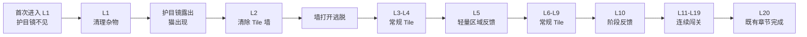

# Chapter0 前期剧情与 Tile 玩法承接需求方案

> [!warning] 已归档
> 本稿基于“固定在 L1/L2 接入剧情”的假设整理，现不再作为当前需求依据。当前方案见 [[00-INBOX/2026-09-21 - Chapter0关卡后可配置视频剧情方案|Chapter0 关卡后可配置视频剧情方案]] 与 [[02-PROJECTS/TileScape/游戏逻辑/任务-买量承接与章节拆分长期任务|长期任务主档]]；本稿仅保留原始流程、资源与讨论边界供追溯。

> [!abstract] 一句话定义
> 在 Chapter0 前两关建立“角色遇到问题 → 玩家用标准 Tile 三消解决 → 场景即时变化 → 产生下一关动机”的因果链；L3 起回到连续闯关，L20 保持既有章节闭环。

## 1. 背景与目标

新玩家初次接触 Tile 时，剧情目标、三消操作和通关后的世界变化容易割裂：玩家会操作，却未必理解自己为什么继续。前期剧情的作用不是增加玩法，而是让玩家感到“我刚才的操作改变了场景”。

### 本期目标

- 在 L1 内建立标准 Tile 的点击、收集、三消认知。
- 在 L1、L2 各完成一次“清除牌面 → 场景问题被解决”的因果学习。
- L3 起恢复连续闯关；L5/L10 只作低频章节反馈。
- 不影响 L20 的宝箱、地图/区域推进和 Chapter1 入口。

### 不在范围

- 不新增 Tile 规则、特殊目标、攻击/血量、步数或奖励机制。
- 不改变 Chapter0/Chapter1 的关卡范围、Forest 地图拆分或存档字段。
- 不以剧情资源替代 L20 的既有章节完成流程。
- 不预设剧情必然改善留存，效果以后续数据验证。

## 2. 核心规则

| 规则 | 含义 |
| --- | --- |
| 剧情只提出一个问题 | L1 前只交代护目镜不见；猫、追逐和 Tile 墙留到 L1 完成后。 |
| Tile 保持标准玩法 | 所有关键节点仍由既有胜利条件完成；剧情不成为新玩法或替代目标。 |
| 先展示操作结果 | L1/L2 通关后先看到剧情结果，再进入下一关或常规结算。 |
| 强承接只出现两次 | L1 找护目镜、L2 开墙逃脱；L3 后不继续用长剧情切断心流。 |
| 表现可降级，流程不可断裂 | 资源缺失、加载失败或中断时跳过表现并续接原流程，不锁输入、不丢进度。 |

## 3. 玩家流程

| 阶段 | 玩家理解 | 节奏规则 |
| --- | --- | --- |
| L1 前至 L2 后 | “消除 Tile 能帮助角色脱困。” | 短关、强结果反馈；底层胜利、进度和奖励照常完成。 |
| L3-L10 | “持续闯关是核心，章节会随之推进。” | 从 L3 恢复标准结算；L5/L10 仅作短反馈。 |
| L11-L20 | “完成一段关卡会进入新阶段。” | 按既有 Chapter0 节奏推进；L20 完全保留原链路。 |

## 4. 流程依赖

模块和资源是流程成立的依赖，不代表职责分配。

| 流程节点 | 功能模块 | 表现资源 / 场景语义 | 节点结果 |
| --- | --- | --- | --- |
| 首次进入 L1 | 首次门禁、关卡进入、全屏表现、输入控制 | `Chapter0Opening` | 建立护目镜丢失的问题后进入 L1。 |
| L1 标准 Tile | 既有 Tile 教学、胜利、进度/奖励 | 杂物主题牌面/场景、护目镜场景物 | 玩家完成标准三消。 |
| L1 通关反馈 | 胜利结果、剧情调度、流程续接 | `Chapter0L1GogglesReveal`、`Chapter0L1CatChase` | 护目镜被找到，Tile 墙成为 L2 目标。 |
| L2 标准 Tile | 既有 Tile、胜利、进度/奖励 | Tile 墙棋盘/场景构图 | 玩家以标准三消解决阻挡。 |
| L2 通关反馈 | 剧情调度、流程续接 | `Chapter0L2WallEscape` | 墙被打开，回到常规循环。 |
| L3-L4 | 既有结算、下一关进入 | 常规关卡资源 | 稳定核心 Tile 循环。 |
| L5 / L10 | 既有结算、短反馈调度 | `Chapter0L5AreaAdvance`、`Chapter0L10StageFeedback` | 感知章节推进，不改变循环。 |
| L20 | 既有章节宝箱、地图、章节解锁 | 既有章节资源 | 进入既有 Chapter1 链路。 |

### 贯穿规则

- **首次门禁**：只对首次进入 L1 生效；重进、恢复或异常后不得重复展示。
- **胜利与进度**：剧情不能替代关卡胜利；进度、奖励和结果写入必须先完成。
- **表现调度**：只改变表现顺序，不新增独立玩法流程；结束后回到既有流程。
- **输入与回调**：播放时锁定对应输入；正常结束、超时、缺失和中断均只结束一次并解除锁定。
- **资源与配置**：节点资源 ID、时长、启用条件和安全超时可单独替换或关闭，不影响主流程。
- **数据**：记录到达、播放完成/降级、L1→L2→L3、L5/L10 与 20→21；口径确认后再观察效果。

## 5. 按流程节点的需求规则

### 首次进入 L1：建立问题

- **触发**：符合首次进入 L1 条件，且关卡已准备进入。
- **表现**：播放 `Chapter0Opening`；只交代老鼠准备出发、护目镜缺失和杂物区。
- **规则**：播放 5–7 秒期间不可操作棋盘；不出现猫、追逐或 Tile 墙。
- **结束**：自然结束或安全超时后进入 L1；资源不可用时直接进入 L1。

### L1：清理杂物，得到结果

- **触发**：开场结束或降级跳过后进入 L1。
- **玩法**：保持标准点击、收集、三消和原有胜利条件；护目镜是牌堆下的场景结果，不是新目标或可收集 Tile。
- **结果**：胜利、进度和奖励按既有规则完成后，播放护目镜露出与猫追逐。
- **降级**：任一表现资源不可用时跳过表现并进入 L2；不重放 L1，不停留在 Home。

### L1 结果：护目镜与追逐

| 表现 | 时长 | 必须传达的结果 | 下一步 |
| --- | --- | --- | --- |
| `Chapter0L1GogglesReveal` | 约 2 秒 | 清理杂物后护目镜显露，老鼠拾取。 | 接猫出现，形成新的即时压力。 |
| `Chapter0L1CatChase` | 3–4 秒 | 猫追逐，Tile 墙挡住去路。 | 结束帧与 L2 首帧在主体、构图、色彩上连续。 |

- 两段表现期间不开放棋盘或 Home 交互。
- 可隐藏传统 L1 结算表现，但不得跳过胜利结果、进度、奖励或后续状态更新。
- 任一段缺失或中断时直接进入 L2，不退回 L1、不停留在 Home。

### L2：清除 Tile 墙，回归常规循环

- **触发**：追逐表现结束或降级结束后进入 L2。
- **玩法**：保持标准 Tile；Tile 的轮廓、排列、背景或首帧构图与追逐末尾的墙相连，但不要求点击墙体或新增破墙进度。
- **结果**：胜利、进度和奖励按既有规则完成后，播放 `Chapter0L2WallEscape`；墙打开、老鼠逃脱、猫扑空，约 2 秒后进入 L3。
- **降级**：资源缺失或中断时直接进入 L3；不遗留特殊结算、输入锁或重复播放状态。

### L3-L4：稳定核心循环

- L2 反馈或降级结束后恢复标准结算和下一关进入。
- 不再出现强制剧情，也不残留 L1/L2 的特殊门禁。
- 玩家从“解决剧情问题”自然转向“持续完成 Tile 关卡”。

### L5 与 L10：提醒章节推进

| 节点 | 表现 | 时长 | 规则 |
| --- | --- | --- | --- |
| L5 | `Chapter0L5AreaAdvance`：小范围区域推进/小事件。 | 约 1.5 秒 | 在常规结算后播放；不引入新玩法说明，不改变下一关条件。 |
| L10 | `Chapter0L10StageFeedback`：中段阶段达成。 | 约 2 秒 | 在常规结算后播放；不替代后续章节完成。 |

资源不可用时，这两处均直接回既有流程。

### L20：保留章节完成边界

- L20 不播放本需求中的任何特殊节点。
- 宝箱、地图/区域、章节解锁和 Chapter1 入口均沿用既有链路。
- 前期剧情只服务于进入循环，不能替代第一次章节完成的奖励与转场。

## 6. 表现承接与资源规则

### A 级基线：全屏叙事承接

这是本期 P0 的最低正式标准。每段表现资源需为可拉伸全屏的 `RectTransform` Prefab；动画不循环，可选音频同步播放；资源不得自行切场景、写进度、触发奖励或跳关。

| 资源 | 对应流程 | 时长 | 首尾画面规则 |
| --- | --- | --- | --- |
| `Chapter0Opening` | 首次进入 L1 | 5–7 秒 | 末帧停在杂物区；不出现猫或 Tile 墙。 |
| `Chapter0L1GogglesReveal` | L1 通关后 | 约 2 秒 | 明确“清理后的结果”，可接猫出现。 |
| `Chapter0L1CatChase` | 护目镜反馈后 | 3–4 秒 | 末帧指向 Tile 墙，并与 L2 首帧连续。 |
| `Chapter0L2WallEscape` | L2 通关后 | 约 2 秒 | 收束逃脱结果，进入 L3 常规节奏。 |
| `Chapter0L5AreaAdvance` | L5 结算后 | 约 1.5 秒 | 单一、低干扰的区域推进。 |
| `Chapter0L10StageFeedback` | L10 结算后 | 约 2 秒 | 简短、明确的中段达成。 |

每段交付需附资源 ID、版本、时长、音频说明和首尾帧截图；路径、命名和包归属见 [[00-INBOX/2026-09-20 - Chapter0前期剧情临时资源需求|临时资源需求卡]]。

### B 级扩展：局内视觉连续（待确认）

若将“护目镜随 Tile 清理显现”或“Tile 墙直接成为棋盘”作为上线门槛，除全屏资源外，还需补充棋面/场景对应、局内相机或元素表现等新规则。该等级不是当前默认范围，未确认前按 A 级评审和验收。

## 7. 异常、验证与待决项

### 异常规则

| 场景 | 期望行为 |
| --- | --- |
| 表现资源缺失、加载失败、播放中断 | 跳过该节点并续接原流程；不锁输入、不丢进度。 |
| 重复进入、重连、退后台/恢复 | 不重复展示首次节点；恢复后按当前流程安全继续。 |
| L1/L2 表现后流程异常 | 保留既有胜利、进度和奖励，避免重复触发。 |
| L5/L10 资源不可用 | 不显示短反馈，直接按常规结算继续。 |
| L20 | 不受任何前期节点影响。 |

### 验证口径

| 观察项 | 用途 |
| --- | --- |
| 开场完成率、L1 开局率 | 识别开场是否造成首局前流失。 |
| L1→L2、L2→L3 到达率 | 判断因果承接是否形成或损伤早期漏斗。 |
| L1/L2 时长、失败率、重试率 | 识别表现阻塞或短关难度异常。 |
| L5/L10 到达率 | 判断中段反馈覆盖范围。 |
| Chapter0 完成率、20→21 Start Rate | 验证首次章节闭环后的继续意愿。 |
| 节点降级/异常率 | 定位资源、流程或输入门禁问题。 |

### 待确认

| 项 | 未确认时的默认边界 |
| --- | --- |
| 视觉等级 | 按 A 级全屏承接推进；B 级不隐含进入开发范围。 |
| L1/L2 牌组、步数与教学强度 | 保持标准规则，仅定义体验约束。 |
| 跳过策略 | 本期不作为必需功能；先保证降级与中断恢复。 |
| 奖励表现 | 可隐藏传统结算表现，但底层奖励链路不得跳过。 |
| 数据分母、负责人、观察周期 | 确认前只保留观察项，不写效果 KPI。 |

## 关联

- [[00-INBOX/2026-09-20 - Chapter0前期剧情临时资源需求|Chapter0 前期剧情临时资源需求]] — Prefab/资源接口与占位替换任务。
- [[00-INBOX/2026-09-18 - 首章50关拆分为20+30的初始章节设计|Chapter0/Chapter1 拆分设计]] — 1–20 / 21–50 的章节边界。
- [[02-PROJECTS/TileScape/_MOC|TileScape 知识库 MOC]] — 方案确认后迁入项目正式目录并补入口。
