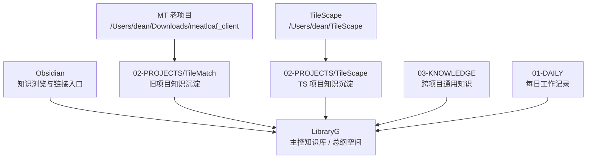
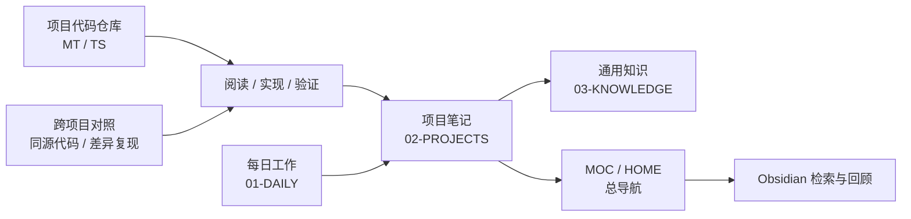

# 工作空间总纲

> 本文档定义当前机器上几个核心工作空间的职责边界。`LibraryG` 是唯一知识库与规范源；代码仓库和项目资料是执行空间与事实来源，必须被 LG 索引、吸收、沉淀并同步遵守 LG 的最新规范。

---

## 一句话定位

| 空间 | 本机路径 | 角色 | 主要用途 |
|---|---|---|---|
| LibraryG | `/Users/dean/LibraryG` | 唯一知识库 / 唯一规范源 | 汇总项目知识、日记、MOC、规范、复盘、长期记忆，作为 Obsidian vault 使用 |
| MT 老项目 | `/Users/dean/Downloads/meatloaf_client` | 项目执行空间 / 历史母体 | TileMatch / Meatloaf 旧代码、旧逻辑、迁移对照、历史行为来源；必须同步遵守 LG 规范 |
| TS 优化项目 | `/Users/dean/TileScape` | 项目执行空间 | TileV2 主干迁移、架构优化、玩法与工具链重构；必须同步遵守 LG 规范 |
| Obsidian | `/Users/dean/LibraryG/.obsidian` | 知识入口层 | 浏览、链接、检索、模板、Dataview、MOC 导航 |

项目之间不固定主次。哪个项目先读、先做，取决于当前任务、索引和已有工作记录；但知识库与规范主次固定：LG 是唯一来源，TS / MT 只能作为执行空间、事实来源和代码旁临时上下文。

---

## 目录关系图

---

## LibraryG 的职责

`LibraryG` 不直接承担大量业务代码开发，它的定位是唯一知识库与规范源：

- 做所有项目的主入口：通过 `HOME.md`、本文件、各项目 `_MOC.md` 组织导航。
- 做知识沉淀：把 MT 和 TS 中值得复用的代码理解、迁移结论、踩坑记录、设计决策沉淀为 Markdown；可保留基础、全面、纲领性的长文档。
- 做项目关系总账：记录 MT 和 TS 的来源、差异、复现关系和阶段性工作重心，不人为规定永久主次。
- 做 AI 协作上下文：让 Codex、WorkBuddy 或其他 Agent / AI 必须先从 LibraryG 读取纲领、规范和项目 MOC，再进入具体代码仓库。
- 做自动化规则源：每日闭环、周度巡检、WorkBuddy 或其他自动化都以 LG 当前规范为准，不从 TS / MT 项目目录自行派生规则。
- 做 Obsidian vault：保留 `.obsidian`、模板、日记、知识库目录，支持双链和 Dataview。

---

## 三个项目空间的边界

### 1. MT 老项目

- **路径**：`/Users/dean/Downloads/meatloaf_client`
- **性质**：旧项目代码与历史行为源。
- **使用方式**：查旧逻辑、查功能原貌、做迁移对照、定位 TS 与旧项目差异；执行前先按 LG MOC 与规范路由。
- **沉淀位置**：相关结论进入 `02-PROJECTS/TileMatch/`，必要时再提炼到 `03-KNOWLEDGE/`。
- **注意**：MT 内部资料以“事实来源”为主，不得作为独立知识库或规范源。

### 2. TileScape 优化项目

- **路径**：`/Users/dean/TileScape`
- **性质**：从 MT 分离出的独立优化项目，近期会承载更多优化和重构工作。
- **使用方式**：实现 TileV2 主干、迁移玩法和系统能力、优化架构、补齐验证。
- **沉淀位置**：项目级稳定文档进入 `02-PROJECTS/TileScape/`，代码仓库内大型设计文档可先保留在 `Docs/`，但必须由 LibraryG 建索引并沉淀稳定结论。
- **当前知识入口**：`02-PROJECTS/TileScape/_MOC.md`、`02-PROJECTS/TileScape/参考/Docs文档索引.md`。TS 内 `Docs/Knowledge` 只作为执行索引和代码旁上下文。

### 3. LibraryG 知识库

- **路径**：`/Users/dean/LibraryG`
- **性质**：总结空间、导航空间、长期知识库。
- **使用方式**：每日记录、跨项目总结、规范沉淀、项目 MOC、Obsidian 浏览。
- **维护原则**：只沉淀“可复用、可检索、可复盘”的内容；临时过程材料应进入日记或待整理区，再逐步归档。

---

## 推荐信息流

---

## 建议的使用规则

- 查“我现在从哪里开始”：先打开 `HOME.md` 或本文档。
- 做具体项目任务：先看对应项目 MOC，再读项目内规则和必要代码。
- 做跨项目复现：先看 LG 里的已有方案、工作记录、对位文件表和索引，再进入另一侧项目最小复现。
- 写工作过程：优先写入 `01-DAILY/YYYY-MM-DD.md`；DAILY 可以详细记录过程、备份追踪和稳定成功路径。
- 写项目结论：进入对应 `02-PROJECTS/<项目>/`。
- 写跨项目方法论：进入 `03-KNOWLEDGE/`。
- 写模板或固定流程：进入 `04-TEMPLATES/`、`02-PROJECTS/Agent/工作流/` 或项目内 `知识库/规范-*`。
- 写通用 Agent / AI 记忆：优先维护 `AGENTS.md` 和 `02-PROJECTS/Agent/Memory.md`；`.workbuddy/` 仅作为历史兼容路径。
- 更新自动化：自动化提示、队列规则和巡检口径必须从 LG 当前规范同步；不得从 TS / MT 的本地记忆或源码旁文档自行生成规范。

---

## 当前应补齐的结构

- [x] 已补建 `00-INBOX/` 与 `00-INBOX/attachments/`，对齐 `HOME.md` 的临时捕获区设计。
- [x] 已补充多项目工作流：`02-PROJECTS/Agent/工作流/规范-多项目工作流与复现.md`。
- [x] 已补充 MT 老项目入口：`02-PROJECTS/TileMatch/参考/MT老项目路径索引.md`。
- [x] 已补充 MOC 命名与导航规范：`02-PROJECTS/Agent/工作流/规范-MOC命名与导航层级.md`。
- [ ] 定期把 `/Users/dean/TileScape/Docs/` 中稳定的设计文档整理进 `02-PROJECTS/TileScape/参考/Docs文档索引.md`。
- [ ] 在日记中记录每次 MT / TS 迁移或对照工作的结论入口。

---

## 关联

- [[HOME|LibraryG 主入口]]
- [[02-PROJECTS/Agent/Memory|Agent Memory]]
- [[HOME-冷启动指南|冷启动指南]]
- [[02-PROJECTS/TileMatch/_MOC|TileMatch 知识库 MOC]]
- [[02-PROJECTS/TileScape/_MOC|TileScape 知识库 MOC]]
- [[02-PROJECTS/Agent/工作流/规范-多项目工作流与复现|多项目工作流与复现]]
- [[02-PROJECTS/Agent/工作流/规范-MOC命名与导航层级|MOC 命名与导航层级规范]]
- [[02-PROJECTS/TileMatch/参考/MT老项目路径索引|MT 老项目路径索引]]
- [[02-PROJECTS/TileScape/参考/Docs文档索引|TileScape Docs 文档索引]]
